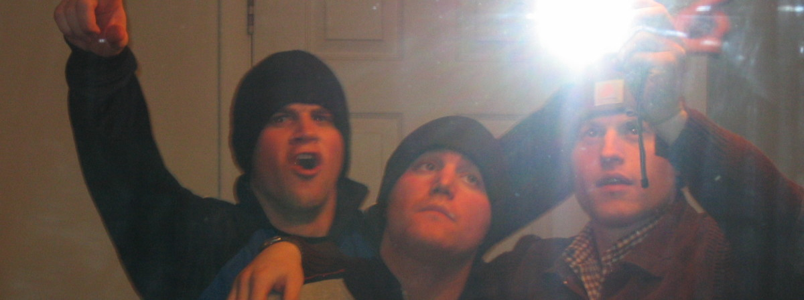
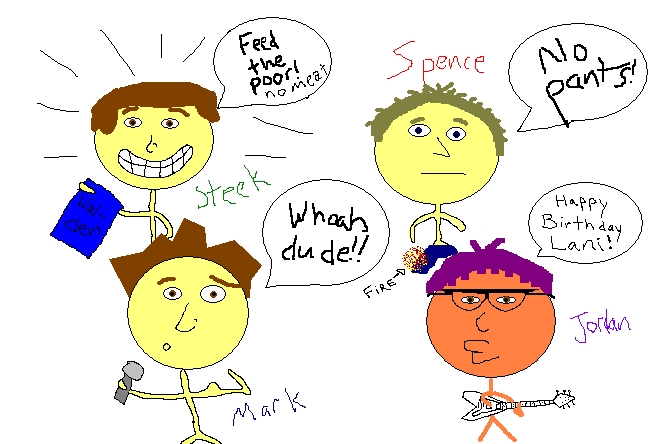

<figure class="align-right"><figcaption>Mark, Myself, and Matt Howard (L-R), sometime during college</figcaption></figure>

When I was a freshman in college, my best friend was Mark Eliason. He and I went almost everywhere together, and so nearly imitated one another's mannerisms, speech patterns, and stock phrases that we'd regularly have other people ask us if we were brothers. We usually lied and said yes. After our freshman year, each of us left the country for two years to serve missions for the LDS Church--I went to Leeds, England and he went to Sao Paolo, Brazil. At some point before I left the country, I wrote him a huge letter filled with quotations that I had found significant or personally meaningful. Most were about voluntary poverty, anarchism, love, poetry, or vegetarianism--my biggest obsessions as an 18-year old. I'm reminded of this letter because I've recently been in contact with Mark again. He's now married and living in Utah, where he and his wife are attending law school. He's leaving to work on behalf of AIDS victims in Uganda for much of his summer, and wrote me an email in which he wrote:

> "It's late, but I've been digging through some old stuff looking for my immunization records (I've got two weeks before I go to Africa, and I've got to get a ton of shots...).  Anyway, I found them buried deep inside of my old missionary journal.  ... as I was looking through my journal, I realized that I started every day off with a quote, and they were all from a list of quotes that you had sent me!  What inspiration those quotes were to me during that time.  But as I read, I found some quotes from my man Steel Wagstaff!  Here are a few of the classics: "The surest guard against theft is poverty." "What have I to fear against a thief or a robber.  He cannot steal that which I would gladly give him at his asking." Oh, and don't worry.  There were a couple of quotes from Donovan in there as well.  Classic: "Happiness runs in a circular motion."  Occasionally, there'd be a great quote from myself (ridiculous).  Here's a personal favorite--"I'm thinking about making an EFY album with this title: 'You must have the heart of a child and the soul of a bluesman.'" This is my favorite Steel quote, by far, however.  I remember often times repeating this to myself to draw strength and courage: "Always remember that there is no limit to human strength ... only a hold on courage and will."

I was really touched to receive this email from an old friend, and it made me think about who I was as a younger man--how in many ways I was quite probably a better human being, a better brother, a better friend, a kinder and more compassionate person, more deeply imbued with ideals and principles, more ready to forgive and to laugh, quicker to love and to embrace. I've been thinking a lot in the last few days about how I can re-enchant the current version of myself with some aspects of past Steels that I admire and have forgotten to cultivate and would benefit from developing afresh. Part of that process was digging through the record of my life that I kept from that time. I've spent a fair amount of time in the last few days reading through old files that I wrote at the time (research papers, poetry, journal writing, college applications, letters home from my mission) for clues as to my values, beliefs, attitudes, and orientation to the world. A lot of it was embarrassing, some was impressive, and much of it surprised me--I have forgotten so much of my own past.

<figure class="align-left"><figcaption>Portrait of Spence, Mark, Steel and Jordan, made with MS Paint by Jordan Faux, polymath and genius.</figcaption></figure>

The best part of this recovery of my teenage past has been the accidental discovery of the document that I mailed to Mark, full of inspiring quotations. I've mounted it [here](https://mywebspace.wisc.edu/swagstaff/Readings/quotes%20for%20mark.doc) if you'd like to read it. Here are some highlights (sorry in advance for the length--I found as I was weeding through them that I still loved so many of the same things more than 10 years later that it was hard to cut much of the first list): **Leo Tolstoy (author, philosopher, moral conscience, rad dude)** --It is the confession, not the priest, that gives us absolution. --To live is the rarest thing in the world. Most people exist, that is all. --To say that a work of art is good, but incomprehensible to the majority of men, is the same as saying of some kind of food that it is very good but that most people can’t eat it. --But the peasants—how do the _peasants_ die?--Tolstoy’s last words --The changes in our life must come from the impossibility to live otherwise than according to the demands of our conscience . . . not from our mental resolution to try a new form of life. --Love is life. All, everything that I understand, I understand only because I love. Everything is, everything exists, only because I love. Everything is united by it alone. Love is God, and to die means that I, a particle of love, shall return to the general and eternal source. **Henry David Thoreau (you know what I think of Thoreau, I’m sure)** --We are not what we are, nor do we treat or esteem each other for such, but for what we are capable of being. --Measure your health by your sympathy with morning and spring. If there is no response in you to the awakening of nature—if the prospect of an early morning walk does not banish sleep, if the warble of the first bluebird does not thrill you—know that the morning and spring of your life are past. Thus may you feel your pulse. --I say, beware of all enterprises that require new clothes, and not rather a new wearer of clothes. --To be a philosopher is not merely to have subtle thoughts, nor even to found a school, but so to love wisdom as to live according to its dictates a life of simplicity, independence, magnanimity, and trust. It is to solve some of the problems of life, not only theoretically, but practically. --I respect not his labors, his farm where everything has its price, who would carry the landscape, who would carry his God, to market, if he could get anything for him; who goes to market _for_ his god as it is; on whose farm nothing grows free, whose fields bear no crops, whose meadows no flowers, whose trees no fruits, but dollars. --Every generation laughs at the old fashions, but follows religiously the new. --The cost of a thing is the amount of what I will call life which is required to be exchanged for it, immediately or in the long run. --Superfluous wealth can buy superfluities only. Money is not required to buy one necessary of the soul. --One farmer says to me, “You cannot live on vegetable food solely, for it furnishes nothing to make bones with”; and so he religiously devotes a part of his day to supplying his system with the raw material of bones; walking all the while he talks behind his oxen, which, with vegetable-made bones, jerk him and his lumbering plow along in spite of every obstacle. --The youth gets together his materials to build a bridge to the moon, or, perchance, a palace or temple on the earth, and, at length, the middle-aged man concludes to build a woodshed with them. --As to conforming outwardly, and living your own life inwardly, I have not a very high opinion of that course. --The rich man . . . is always sold to the institution which makes him rich. Absolutely speaking, the more money, the less virtue. **Mohandas K. Gandhi (world conscience and instigator of non-violent change)** --What is a man if he is not a thief who openly charges as much as he can for the goods he sells? --Mental violence has no potency and injures only the person whose thoughts are violent. It is otherwise with mental non-violence. It has potency which the world does not yet know. --Prayer is not asking. It is a longing of the soul. It is daily admission of one’s weakness. . . . It is better in prayer to have a heart without words than words without a heart. --Must I do all the evil I can before I learn to shun it? Is it not enough to know the evil to shun it? If not, we should be sincere enough to admit that we love evil too well to give it up. --It is easy enough to be friendly to one’s friends. But to befriend the one who regards himself as your enemy is the quintessence of true religion. The other is mere business. --Truth never damages a cause that is just. **George Bernard Shaw (he wrote Pygmalion, the inspiration for my fair lady, and other plays)** **\--**This is the true joy in life, the being used for a purpose recognized by yourself as a mighty one; the being thoroughly worn out before you are thrown on the scrap heap; the being a force of Nature instead of a feverish selfish little clod of ailments and grievances complaining that the world will not devote itself to making you happy. --A man of my spiritual intensity does not eat corpses. --The odd thing about being a vegetarian is, not that the things that happen to other people don’t happen to me—they all do—but that they happen differently: pain is different, pleasure different, fever different, cold different, even love different.” --He knows nothing and he thinks he knows everything. That points clearly to a political career. --We have no more right to consume happiness without producing it than to consume wealth without producing it. --I am afraid we must make the world honest before we can honestly say to our children that honesty is the best policy. --The worst sin towards our fellow creatures is not to hate them, but to be indifferent to them; that’s the essence of inhumanity. --When a man wants to murder a tiger he calls it sport; when a tiger wants to murder him he calls it ferocity. QUIZ TIME!!!  What do the first four men all have in common?  (still wondering? …They were all vegetarians!) **Mother Teresa (true Christian)** --If sometimes our poor people have had to die of starvation, it is not that God didn’t care for them, but because you and I didn’t give, were not an instrument of love in the hands of God, to give them that bread, to give them that clothing; because we did not recognize him, when once more Christ came in distressing disguise, in the hungry man, in the lonely man, in the homeless child, and seeking for shelter. --Even the rich are hungry for love, for being cared for, for being wanted, for having someone to call their own. **Miguel de Unamuno (spanish philosopher)** --Man dies of cold, not of darkness. --There is no true love save in suffering, and in this world we have to choose either love, which is suffering, or happiness. . . . Man is the more man—that is, the more divine—the greater his capacity for suffering, or rather, for anguish. **Elie Wiesel (survivor of concentration camps, author, moral voice)** Once you bring life into the world, you must protect it. We must protect it by changing the world. **Kahlil Gibran (lebanese poet, wrote The Prophet, a beautiful book)** --Life is indeed darkness save when there is urge, And all urge is blind save when there is knowledge, And all knowledge is vain save when there is work, And all work is empty save when there is love. **Bob Dylan (folk singer, presidential candidate… maybe he’ll win in ’04?)** --Money doesn’t talk, it swears. --This land is your land & this land is my land—sure—but the world is run by those that never listen to music anyway. **Mikhail Bakunin (anarchist)** **\--**I am truly free only when all human beings, men and women, are equally free. The freedom of other men, far from negating or limiting my freedom, is, on the contrary, its necessary premise and confirmation. **Emma Goldman (anarchist, women’s suffragette)** The demand for equal rights in every vocation of life is just and fair; but, after all, the most vital right is the right to love and be loved. **William James (philosopher, genius)** --We have grown literally afraid to be poor. We despise anyone who elects to be poor in order to simplify and save his inner life. If he does not join the general scramble and pant with the money-making street, we deem him spiritless and lacking in ambition. --The prevalent fear of poverty among the educated classes is the worst moral disease from which our civilization suffers. --When we of the so-called better classes are scared as men were never scared in history at material ugliness and hardship; when we put off marriage until our house can be artistic, and quake at the thought of having a child without a bank-account and doomed to manual labor, it is time for thinking men to protest against so unmanly and irreligious a state of opinion. **John Ashbery (poet)** There is the view that poetry should improve your life. I think people confuse it with the Salvation Army. **Albert Camus (author, nihilist)** --We all carry within us our places of exile, our crimes, and our ravages. But our task is not to unleash them on the world; it is to fight them in ourselves and in others. --Real generosity towards the future lies in giving all to the present. --The society based on production is only productive, not creative. --To insure the adoration of a theorem for any length of time, faith is not enough, a police force is needed as well. --Men are never really willing to die except for the sake of freedom: therefore they do not believe in dying completely. We used to wonder where war lived, what it was that made it so vile. And now we realize that we know where it lives, that it is inside ourselves.—7 sept 1939 --To assert in any case that a man must be absolutely cut off from society because he is absolutely evil amounts to saying that society is absolutely good, and no-one in his right mind will believe this today. **Jorge Luis Borges (argentinan poet, rad dude)** The truth is that we live out our lives putting off all that can be put off; perhaps we all know deep down that we are immortal and that sooner or later all men will do and know all things. **John Stuart Mill (philosopher, kind of crazy but has some beautiful ideas)** --If all mankind minus one, were of one opinion, and only one person were of the contrary opinion, mankind would be no more justified in silencing that one person, than he, if he had the power, would be justified in silencing mankind. --The peculiar evil of silencing the expression of an opinion is, that it is robbing the human race; posterity as well as the existing generation; those who dissent from the opinion, still more than those who hold it. If the opinion is right, they are deprived of the opportunity of exchanging error for truth: if wrong, they lose, what is almost as great a benefit, the clearer perception and livelier impression of truth, produced by its collision with error. (I think he makes a beautiful argument for non-violent resistance) --A man who has nothing which he cares about more than he does about his personal safety is a miserable creature who has no chance of being free, unless made and kept so by the existing of better men than himself. **Antoine de Saint-Expury (french aviator and author of the Little Prince, died young in plane crash)** --One can be a brother only _in_ something. Where there is no tie that binds men, men are not united but merely lined up. --Each man must look to himself to teach him the meaning of life. It is not something discovered: it is something moulded. --When the body sinks into death, the essense of man is revealed. Man is a knot, a web, a mesh into which relationships are tied. Only those relationships matter. The body is an old crock that nobody will miss. I have never known a man to think of himself when dying. Never. --Love does not consist in gazing at each other but in looking together in the same direction. --Only he can understand what a farm is, what a country is, who shall have sacrificed part of himself to his farm or country, fought to save it, struggled to make it beautiful. Only then will the love of farm or country fill his heart. --On a day of burial there is no perspective—for space itself is annihilated. Your dead friend is still a fragmentary being. The day you bury him is a day of chores and crowds, of hands false or true to be shaken, of the immediate cares of mourning. The dead friend will not really die until tomorrow, when silence is round you again. Then he will show himself complete, as he was—to tear himself away, as he was, from the substantial you. Only then will you cry out because of him who is leaving and whom you cannot detain. **Alexander Solzhenitsyn (russian author, won 1970 nobel prize in literature but soviet authorities refused to let him receive the award, rad dude)** --Justice _is_ conscience, not a personal conscience but the conscience of the whole of humanity. Those who clearly recognize the voice of their own conscience usually recognize also the voice of justice. --Violence can only be concealed by a lie, and the lie can only be maintained by violence. Any man who has once proclaimed violence as his method is inevitably forced to take the lie as his principle. **Fidel Castro (communist revolutionary leader, island dictator)** --I began revolution with 82 men. If I had \[to\] do it again, I do it with 10 or 15 and absolute faith. It does not matter how small you are if you have faith and plan of action. --I feel my belief in sacrifice and struggle getting stronger. I despise the kind of existence that clings to the miserly trifles of comfort and self-interest. I think that a man should not live beyond the age when he begins to deteriorate, when the flame that lighted the brightest moment of his life has weakened. **Noam Chomsky (linguist and wacky guy)** --Suppose that humans happen to be so constructed that they desire the opportunity for freely undertaken productive work. Suppose that they want to be free from the meddling of technocrats and commissars, bankers and tycoons, mad bombers who engage in psychological tests of will with peasants defending their homes, behavioral scientists who can’t tell a pigeon from a poet, or anyone else who tries to wish freedom and dignity out of existence or beat them into oblivion. **Salmon Rushdie (you know him)** Our lives teach us who we are. **George Santayana (philosopher, seems rad but I know little of him)** --Fun is a good thing but only when it spoils nothing better. --It is veneer, rouge, aetheticism, art museums, new theaters, etc. that makeAmericaimpotent. The good things are football, kindness, and jazz bands. **Unknown origin (motto of various rad religious leaders)** In necessary things, unity; in disputed things, liberty; in all things, charity. **John Berger (author)** Compassion has no place in the natural order of the world which operates on the basis of necessity. Compassion opposes this order and is therefore best thought of as being in some way supernatural. **Lillian Hellman (american screenwriter)** I cannot and will not cut my conscience to fit this year’s fashions. (when refusing to testify against suspected Communists before the House Committee on Un-American Activites during the 2nd Red Scare) **Thomas Szasz (american psychiatrist, reminds me a lot of my uncle)** **\--**When a man says that he is Jesus or Napoleon, or that the Martians are after him, or claims something else that seems outrageous to common sense, he is labeled psychotic and locked up in a madhouse. Freedom of speech is only for normal people. --The proverb warns that “You should not bite the hand that feeds you.” But maybe you should, if it prevents you from feeding yourself. --People often say that this or that person has not yet found himself. But the self is not something one finds; it is something one creates. --The stupid neither forgive nor forget; the naïve forgive and forget; the wise forgive but do not forget. --When a person can no longer laugh at himself, it is time for others to laugh at him. --Every act of conscious learning requires the willingness to suffer an injury to one’s self-esteem. That is why young children, before they are aware of their own self-importance, learn so easily; and why older persons, especially if vain or important, cannot learn at all. --If someone does something we disapprove of, we regard him as bad if we believe we can deter him from persisting in his conduct, but we regard him as mad if we believe we cannot. In either case, the crucial issue is our control of the other: the more we lose control over him, and the more he assumes control over himself, the more, in case of conflict, we are likely to consider him mad rather than just bad. **Vaclav Havel (czech playwright, president)** --The dissident does not operate in the realm of genuine power at all. He is not seeking power. He has no desire for office and does not gather votes. He does not attempt to charm the public, he offers nothing and promises nothing. He can offer, if anything, only his own skin—and he offers it solely because he has no other way of affirming the truth he stands for. His actions simply articulate his dignity as a citizen, regardless of the cost. **Eugene** **v. Debs (american socialist, in 1920 he received over 1 million presidential votes while in prison for speaking against World War One)** While there is a lower class, I am in it; while there is a criminal element, I am of it; and while there is a soul in prison, I am not free. **Martin Luther King Jr. (I’m not sure who he is, but I think Bono wrote some songs about him +-)** --It may be true that the law cannot make a man love me, but it can keep him from lynching me, and I think that’s pretty important. --There can be no deep disappointment where there is not deep love. --It is my hope that as the Negro plunges deeper into the quest for freedom and justice he will plunge even deeper into the philosophy of non-violence. The Negro all over the South must come to the point that he can say to his white brother: “We will match your capacity to inflict suffering with our capacity to endure suffering. We will meet your physical force with soul force. We will not hate you, but we will not obey your evil laws. We will soon wear you down by pure capacity to suffer.” --One who breaks an unjust law that conscience tells him is unjust, and who willingly accepts the penalty of imprisonment in order to arouse the conscience of the community over its injustice, is in reality expressing the highest respect for law. **Natalie Clifford Barney (author)** Why grab possessions like thieves, or divide them like socialists when you can ignore them like wise men? **Søren Kierkegaard** **(danish religious existentialist philosopher, troubled genius)** --This is what is sad when one contemplates human life, that so many live out their lives in quiet lostness . . . they live, as it were, away from themselves and vanish like shadows. Their immortal souls are blown away, and they are not disquieted by the question of its immortality, because they are already disintegrated before they die. **Martin Amis (contemporary British author)** Bullets cannot be recalled. They cannot be uninvented. But they can be taken out of the gun. **Vera Brittain (author, pacifist)** All that a pacifist can undertake—but it is a very great deal—is to refuse to kill, injure or otherwise cause suffering to another human creature, and untiringly to order his life by the rule of love though others may be captured by hate. **Bertrand Russell (philosopher, mathematician, social critic, writer)** This idea of weapons of mass extermination s utterly horrible and is something which no one with one spark of humanity can tolerate. I will not pretend to obey a government which is organising a mass massacre of mankind. **Victor Hugo (author, revolutionary sympathizer)** --Do not ask the name of the person who seeks a bed for the night. He who is reluctant to give his name is the one who most needs shelter. **Milan** **Kundera (author)** Mankind’s true moral test, its fundamental test (which lies deeply buried from view), consists of its attitude towards those who are at its mercy: animals. And in this respect mankind has suffered a fundamental debacle, a debacle so fundamental that all others stem from it. **Mark Twain (rad dude)** The fact that man knows right from wrong proves his _intellectual_ superiority to the other creatures; but the fact that he can _do_ wrong proves his _moral_ inferiority to any creatures that _cannot._ **Lydia** **M. Child (abolitionist, writer, optimist)** **\--**That man’s best works should be such bungling imitations of Nature’s infinite perfection, matters not much; but that he should make himself an imitation, this is the fact which Nature moans over, and deprecates beseechingly. Be spontaneous, be truthful, be free, and thus be individuals! is the song she sings through warbling birds, and whispering pines, and roaring waves, and screeching winds. --The nearer society approaches to divine order, the less separation will there be in the characters, duties, and pursuits of men and women. Women will not become less gentle and graceful, but men will become more so. Women will not neglect the care and education of their children, but men will find themselves ennobled and refined by sharing those duties with them; and will receive, in return, co-operation and sympathy in the discharge of various other duties, now deemed inappropriate to women. The more women become rational companions, partners in business and in thought, as well as in affection and amusement, the more highly will men appreciate home. **Don Marquis (rad poet)** Writing a book of poetry is like dropping a rose petal down the Grand Canyon and waiting for the echo.
