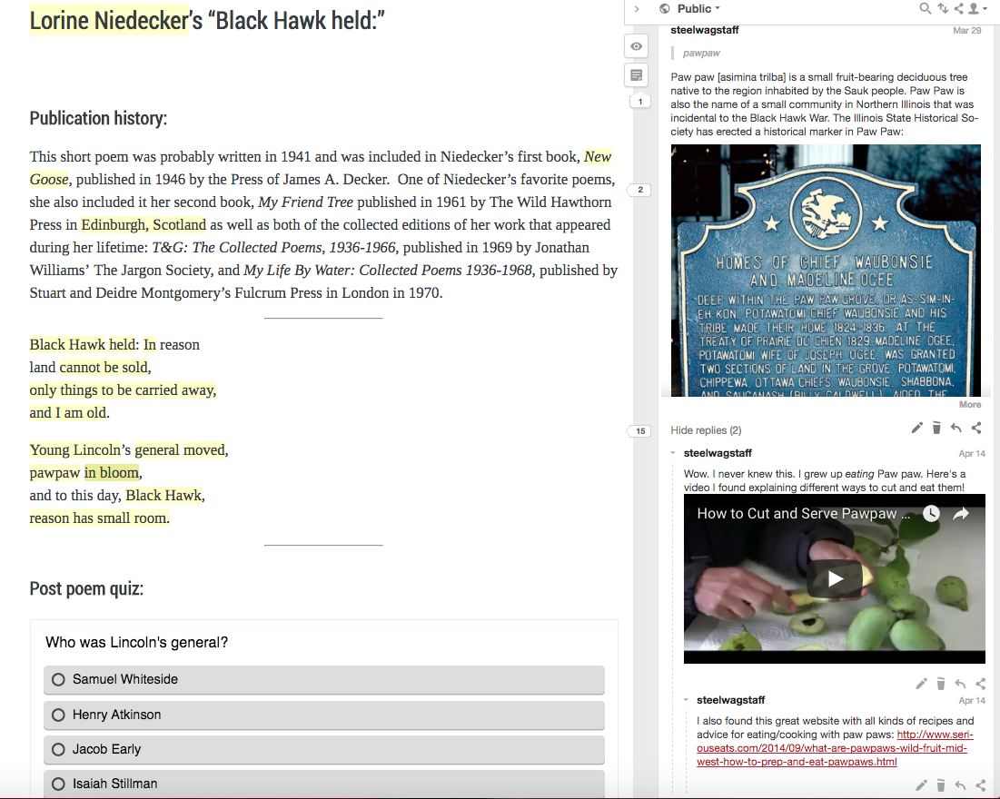
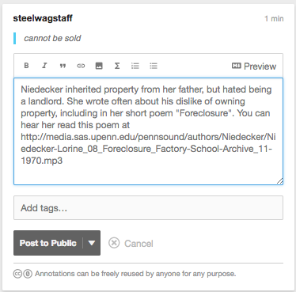
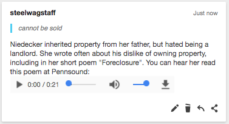

For the past few years, I've been working to improve how content experts at my university can write, develop, and publish open educational resources. Early in 2016, I published [my own set of core principles](https://medium.com/@steelwagstaff/core-principles-for-an-open-authoring-tool-db2df933dd8) for an authoring & publishing tool. I first began developing these principles in the summer of 2015, and after comparing a number of then-extant tools against them later that year, in late 2015, I adopted [Pressbooks](https://pressbooks.org/) as the preferred authoring platform for folks who wanted to publish open textbooks and other learning material at UW-Madison, where I work. For the last two years, I've spent a lot of time thinking about how to better accomplish the last two principles on that original list, namely how to incorporate multimedia, web annotation, and interactivity into our texts, and how to ensure that we can incorporate these texts into various learning management systems, complete with assessment and learning analytics capabilities. Earlier this month, [Hugh McGuire](http://hughmcguire.net/about-2/) (Pressbooks' founder) and I presented at the [Open Education conference](https://openedconference.org/2017/) in Anaheim about some recent Pressbooks development work and a roadmap for future possibilities around interactive elements, web annotation, and tighter integration with learning management systems and learning record stores. Our talk, which we called '[Pressbooks as a Platform: A Vision for the Future of OER Creation](https://docs.google.com/presentation/d/1JoWwyQMpX8ge9Oxk3o3reECVfiJJ6SvB6zPzUbgDDt8/edit?usp=sharing),' highlighted some of the exciting work that Hugh and his team have done to develop Pressbooks for educational use cases, as well as some experimental work we've done integrating several plugins (like [H5P](http://h5p.org/) for interactive elements and [Hypothesis](https://web.hypothes.is/) for web annotation) into the Pressbooks environment and connecting these products directly to our learning management system and a learning record store. After our talk, [Nate Angell](https://twitter.com/xolotl) from Hypothesis asked me if I'd be willing to write up a blog post describing in more detail what we're doing with web annotation specifically. And so here we are.

## Making Learning Activities Using Pressbooks, H5P, and Hypothesis

I'm a big fan of Hypothesis and the work that [the team](https://web.hypothes.is/team/) there has done to realize the rich potential of [standards-based web annotation](https://web.hypothes.is/blog/annotation-is-now-a-web-standard/), and am particularly excited about the many possibilities for annotation [in education](https://web.hypothes.is/education/). We started by installing and network activating the [Hypothesis WordPress plugin](https://wordpress.org/plugins/hypothesis/) on our instance of Pressbooks, which lets any of our authors choose to activate Hypothesis for their books by default, meaning that annotation capabilities would be baked into the book, and not require a specific browser-plugin for readers to add and view others annotations. We've written up more detailed instructions for activating and configuring the plugin for our individual authors [here](https://wisc.pb.unizin.org/pressbooks101/chapter/annotation-with-hypothesis/). Once the tools we use (the Pressbooks, H5P, and Hypothesis plugins) were all in place and properly configured, we began making learning activities. It's probably helpful at this point to share a simple demonstration of the kind of learning activities we're trying to make. Here's [a sample reading activity](https://wisc.pb.unizin.org/objectivists/chapter/lorine-niedeckers-blackhawk-held/) centered on a short poem by one of my life heroes, the Wisconsin poet [Lorine Niedecker](http://edgeeffects.net/lorine-niedecker-ecopoetics/):

<figure class="align-left"><figcaption>Sample reading activity (published at <a href="https://wisc.pb.unizin.org/objectivists/chapter/lorine-niedeckers-blackhawk-held/" target="_blank" rel="noopener">https://wisc.pb.unizin.org/objectivists/chapter/lorine-niedeckers-blackhawk-held/</a>)</figcaption></figure>

In this activity, we're making heavy use of the annotation pane to explain and explore the poem in greater detail. When we started building the activity, we were really excited by the fact that hypothesis allowed an instructor to provide [additional context](https://hyp.is/4iVcxhSWEeezumdVnIn5VA/wisc.pb.unizin.org/objectivists/chapter/lorine-niedeckers-blackhawk-held/) about the author, share [visual resources](https://hyp.is/6UhdEBSaEeefvUPFNrr6_A/wisc.pb.unizin.org/objectivists/chapter/lorine-niedeckers-blackhawk-held/), [Youtube and Vimeo videos](https://hyp.is/fMY-qBSNEeevDmMKP7T6xw/wisc.pb.unizin.org/objectivists/chapter/lorine-niedeckers-blackhawk-held/), and [web links](https://hyp.is/Wg_QohSUEee0WuNZyl6ghw/wisc.pb.unizin.org/objectivists/chapter/lorine-niedeckers-blackhawk-held/) related to the item under consideration, and prompt discussion by [asking questions of the students](https://hyp.is/cPaOEBSTEee8Flseb4B2ZQ/wisc.pb.unizin.org/objectivists/chapter/lorine-niedeckers-blackhawk-held/). While we were also able to add interactive H5P activities to the page (like the post poem quiz seen above), we wanted to have the ability to do even more with the annotation pane. There were two specific things that we wanted to do that would give us even more flexibility in designing good learning activities. First, we wanted to be able to drop a link to an audio file in the annotation pane and have it turn into a HTML5 audio player (instead of just a link to the file), roughly akin to the way that links for YouTube or Vimeo were automagically turned into embedded videos. Second, we wanted to be able to embed H5P activities (which are simply HTML5 and javascript in an iFrame) into the annotation pane. Doing this would let the instructor connect specific interactions with smaller pieces of the activity in the main page. They could ask questions about individual words, for example, and have a number of smaller, very specific formative assessment activities throughout the page, perhaps in preparation for a longer 'post poem quiz' or higher stakes assessment to be concluded after the activity was completed.

## Turning Links to Audio Files into a Lightweight HTML5 Audio Player

We loved how quick and simple it is to make an annotation in hypothesis, and love the clean Markdown-based capabilities, including the ability to add hyperlinks to annotations and have video links from YouTube and Vimeo automatically turned into embeds upon publishing an annotation. We wanted to do the same thing with audio files and H5P activities, and so I contacted the development team at Hypothesis a few months ago wondering how we could implement a similar solution for mp3 audio files and embeddable H5P activities. In the case of embeddable audio elements, [Robert Knight](https://twitter.com/robknight_) from Hypothesis went way above and beyond (thanks again Rob!) in helping me, a relative programming novice, understand the existing code base and how to submit my first [pull request](https://github.com/hypothesis/client/pull/508), which was accepted in August. The upshot: now, when you add a link to a published .mp3, .ogg, or .wav file to an annotation in hypothesis, the client will turn that link into a HTML5 audio player! Here's a simple demo:

<figure class="align-left"><figcaption>The text for an annotation with an audio file. Note the URL for an audio file in the last 3 lines.</figcaption></figure>

<figure class="align-left"><figcaption>Upon publication, the URL with reference to the audio file is automatically converted into an HTML5 audio element with a player, simple controls, and the option to download the file.</figcaption></figure>

Here's an [example of an embedded audio player](https://hyp.is/RmUKwLvpEeezPrvjHE4Lwg/wisc.pb.unizin.org/objectivists/chapter/lorine-niedeckers-blackhawk-held/) in a hypothesis annotation (it's taken from the Niedecker poetry reading activity referenced above).

* * *

## Embedding H5P Activities in the Annotation Pane

We also really love what our Norwegian friends at [Joubel](https://joubel.com/) are doing with [H5P](https://h5p.org/content-types-and-applications), and have been enthusiastically developing H5P activities for use throughout the open textbooks and other OER learning materials we're developing (you can see lots of H5P examples in [this Portuguese Language Textbook](https://wisc.pb.unizin.org/portuguese/) we've published). When I saw that the existing embedded video capabilities of hypothesis was already turning URLs into iFrames in the annotation pane, I began wondering whether it wouldn't be possible to do the same thing with our H5P activities, which are published to URLs and which can be embedded using a simple iFrame almost anywhere on the web. Once again, Rob Knight was a champion, and built for us [a working prototype](https://hypothesis-h5p.s3.us-east-2.amazonaws.com/index.html) which takes the embed code produced by a published H5P activity and allows it to be embedded in the annotation pane in Hypothesis (the code for this can be found on [GitHub](https://github.com/hypothesis/client/compare/h5p)). You can learn more about the prototype in the [page notes](https://hyp.is/iRIjMIiVEeebWX-QIRZ20w/hypothesis-h5p.s3.us-east-2.amazonaws.com/index.html) Rob wrote. We've been testing the prototype extensively on a Pressbooks development instance we're using, and are really excited by all the possibilities that including H5P interactive activities in the annotation layer opens us for education. For now, we've added it to our site by adding this line, pointing to Rob's boot.js file to our site's header: `<script type='text/javascript' src="https://hypothesis-h5p.s3.us-east-2.amazonaws.com/boot.js">` Here are two examples (in French, so sorry for you anglophiles out there), of what we're building with the new capabilities: a [close reading activity of a Ronsard sonnet](https://wisc-dev.pb.unizin.org/ronsnardvieille271dev/chapter/quand-vous-serez-bien-vieille-sonnets-pour-helene/) and another [reading activity centered on a passage from Molière's _École des femmes_](https://wisc-dev.pb.unizin.org/ronsnardvieille271dev/chapter/main-activity/).

## Next Steps

The most important thing for us would be to help turn Rob's working prototype into something that was stable, regularized, and in need of less custom configuration. Ideally, I'd like to help sponsor a pull request that adds the H5P embedding abilities into the core Hypothesis client, in much the same way that video and now audio file embeds occur automatically when certain types of links are published in an annotation. We know that there are few sticky security and implementation issues, but we have confidence in the Hypothesis dev team, and are really excited to add this functionality for all Hypothesis users and begin to reap some of the many teaching & learning benefits of having additional interactivity in a website's annotation layer. Featured image by [Provenance Online Project](http://www.flickr.com/photos/58558794@N07/9707006091) 
