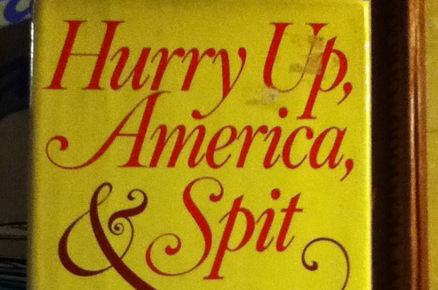

I have an approved dissertation proposal! What's its title, you ask? Get ready, because it's really sexy. _"Thinking with the things as they exist”: Ecocriticism and Objectivist Poetics._ Yeah. A thrilling tour through what I'm calling an "Objectivist" poetics (the writing of George Oppen, Lorine Niedecker, Louis Zukofsky, Charles Reznikoff, Basil Bunting, William Carlos Williams, and maybe, just maybe, a little Carl Rakosi!!!), ecocriticism, phenomenology, with a dash of animal-human relations and a pinch or two of what the kids are calling speculative materialism or OOO (Object-Oriented Ontology--not that so elegant intelligent Shakespehearean rag T.S. Eliot was on about in "The Wasteland"--that was O O O O, of course.) Hopefully you'll be able to read it within the next couple of years.

<figure class="align-none"><figcaption>Sadly, this title was already taken. It's a wonder my committee still approved the proposal.</figcaption></figure>
