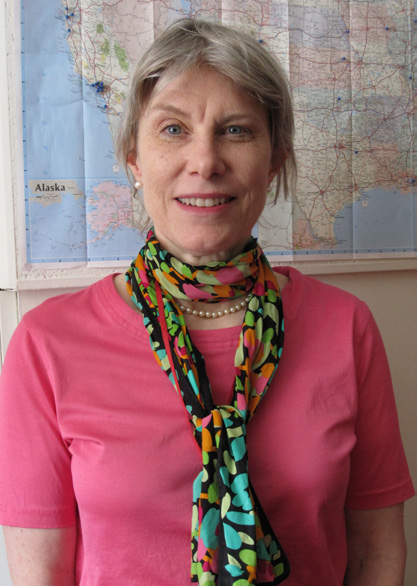

I can't remember exactly when I first read Belle Waring's poems. It probably would have been at least a decade ago, and I do remember that it was one of her poems about nursing, maybe even "It Was My First Nursing Job". What I remember most was feeling that I had discovered a voice that I trusted, a speaker that I respected, a sensibility that I wanted to befriend and follow. Her voice was human, riven with grief, honest and angry in equal measures, desirous of less pain but not deluded into thinking that suffering could be ended. It was my kind of voice.

* * *

When I was running the FELIX reading series several years ago, I used to make a list every couple of months of poets that I wanted to bring to read for us in Madison. Belle Waring's name was always on that list. I searched for her on the internet, learned that she had published two books in the 90s, _[Refuge](https://www.upress.pitt.edu/BookDetails.aspx?bookId=34877)_ and _[Dark Blonde](http://www.sarabandebooks.org/all-titles/dark-blonde-belle-waring)_, and even found that she was reading at a Split this Rock event in Washington, DC (this would have been in 2008, I think). While I found a now-defunct website that featured her work in 2008, I never got much further than that--I never could turn up an email address for her, for instance, so I never did extend an invitation to her to read for us. I just filed her away as a poet I admired and wanted to meet one day. I felt sure that the human being behind the poems would be one worth knowing, and that mattered to me tremendously.

* * *

I make a [podcast](http://otc.awesomecity.org/) now with a friend of mine who just finished his doctorate in nursing. We had a fellow nurse on as a guest, and I was thinking about what I could share for a segment at the end of the show where we read a piece of literature that has really moved us. Since they both worked as nurses, I thought of Belle Waring. It had been years since I'd done any searching, so I went to [WorldCat](http://www.worldcat.org/search?q=au%3AWaring%2C+Belle%2C&qt=hot_author#x0%253Abook-%2C%2528x0%253Abook%2Bx4%253Aprintbook%2529%2C%2528x0%253Abook%2Bx4%253Adigital%2529format) and found that she had no new book publications since Sarabande published _Dark Blonde_ in 1997. I checked out both of her books from the library. I read them, and was deeply moved, especially by the poems in _Dark Blonde_. Her writing voice reminded me in many ways of my wife's, and since she was working on retooling her manuscript, I shared both of the books with her as well. Here's a small taste of Ms. Waring's voice, which speaks to me most powerfully when she writes about her time in the caring profession. This is "Baby Random", the second poem in her first book, _[Refuge](http://www.amazon.com/Refuge-Poetry-Series-Belle-Waring/dp/0822954419):_

> tries a nosedive, kamikaze,
> when the intern flings open the isolette.

> The kid almost hits the floor. I can see the headline:
> DOC DUMPS AIDS TOT. Nice save, nurse,

> Why thanks. Young physician: "We have to change
> his tube." His voice trembles, six weeks

> out of school. I tell him: "Keep it to a handshake,
> you'll be OK." Our team resuscitated

> this Baby Random, birth weight
> one pound, eyelids still fused. Mother's

> a junkie with HIV. Never named him.
> Where I work we bring back terminal preemies,

> No Fetus Can Beat Us. That's our motto. I have
> a friend who was thrown into prison. Where do birds

> go when they die? Neruda wanted to know. Crows
> eat them. Bird heaven? Imagine the racket.

> When Random cries, petit fish on shore, nothing
> squeaks past the tube down his pipe. His ventilator's

> a high-tech bellows that kicks in & out. Not
> up to the nurses. Quiet: a pigeon's outside,

> color of graham crackers, throat oil on a wet street,
> wings spattered white, perched out of the rain.

> I have friends who were thrown into prison, Latin
> American. Tortured. Exiled. Some people have

> courage. Some people have heart. _Corazon._
> After a shift like tonight, I have the usual

> bad dreams. Some days I avoid my reflection in store
> windows. I just don't want anyone to look at me.

Here's "Nothing Happened," the first poem from _Refuge_'s second section:

> Tyler scuffs oak leaves to frisk
> the scent walking through Malcolm X Park.
> First date. The arms of our jackets
> graze, sweet puff of romance. Then boom
> I step on a syringe, the needle
> quick as a pit viper hits my boot.

> If this were a movie, I'd laugh, but I've got
> works stuck into my tread. "Jesus,
> don't touch it," says Tyler, and whips out
> his hankie to yank it.

> "Please,
> I'm fine," but he started to fuss,
> hailed a cab, told the hack to drive fast,
> got me home, sat me down to examine
> The Foot; a crap of red toe nail polish
> left over from August, skin intact. Then
> he held my foot in both hands.

> People say
> Nothing Happened when they mean No Sex,
> when the fact is every look counts. The sun
> quivered in the wind outside whaling
> the trees, and shimmered over the wall. When I met
> Tyler's eyes in that witchy light, I breathed
> off the beat and choked, like I was fourteen.

> I used to be depressed all the time,
> and romance, by the way was not the cure.
> I don't mind winter because I know
> what follows. There are laws.

This is "Country Life," the second-to-last poem in the book:

> You smell of ginger root
> and cedar and a child's
> Crayola crayons. From miles around
> people flock to admire us
> waltzing in our kitchen.

> Watch them get a little tight.
> The swans with necks entwined
> try to take the floor. The modest bull-
> dogs dance the time-step. Our mirrored
> globe whirls into the night,

> entincellating light up the scullery
> stairs, riding the notes up
> through the roof beams. Your hands are ten
> tiger's-eye butterflies. There is
> nothing I would not do for you.

* * *

A few months ago, I learned that Belle Waring was dead. After Laurel and I read her books, I decided that I wanted to send her a message to tell her a little about what her poetry had meant to me. I spent a few hours searching for anything I could find about her. I had to wade through a lot of disambiguation, since there's a prominent Crooked Timber blogger who shares her name, but I eventually I saw [this death notice](http://www.sarabandebooks.org/blog/2015/2/5/remembering-belle-waring) from Sarabande, her publisher, in February of this year, which simply stated that she had died and shared a poem from _Dark Blonde_ encouraging someone not to take their life. I did a bit more digging and found [this article](https://nihrecord.nih.gov/newsletters/2015/03_13_2015/milestones.htm#Waring) from a NIH newsletter which filled in a bit of the backstory. Ms. Waring had battled cancer for several years and had joined the NIH in 2002, before becoming a writer-editor for the _NIH Record_ in 2006.

<figure class="align-left"><figcaption>This is the photo of Belle used by the NIH in their notice of her death.</figcaption></figure>

Here's what her co-workers said about her following her death: "With the _NIH Record_, the stories Belle enjoyed the most were about the ordinary people that make this place run. Belle was also a great mentor to a lot of people around here. She took people under her wing and nurtured them. ... We spent hours talking about life in general, philosophy, my kids." -- Calvin Jackson "Her respect for its science and public health mission and her affection for its people were evident in every story she turned in. She wrote as if she were talking to an intelligent, sympathetic and curious friend. That's what she transformed all of us into." -- Rich McManus Belle was funny, lighthearted and selfless … Belle was a great listener and always saw the best in everybody … My kids—both aspiring writers—came to know her. She was a great teacher, empathetic and results-oriented. She got great joy from making things right. She was genuine and thoughtful; that's what I miss." -- Cyndi Burrus-Shaw

* * *

The final sentence of the NIH's notice of Waring's death stated that she was survived by her mother, Patricia Waring, of Chesterton, Maryland. When I searched to see if I could find contact information for her mother, I found [this story](http://www.nbcnews.com/id/15061701/ns/msnbc-hardball_with_chris_matthews/t/hardball-chris-matthews-sept/#.VfBYp51VhBc) from 2006, in which Mrs. Waring gave her account of George Allen's use of racist language as a young man. I have not found a way to contact Mrs. Waring, to describe my feelings about her daughter's writing, but I'd like to. You would too, if you'd read her poems.

* * *

Even though she is now dead, you can listen to [Belle Waring's voice](http://www.loc.gov/poetry/media/avfiles/waring_cybulski.mp3) (in a reading and interview she gave to Grace Cavalieri for her The Poet and the Poem series). You can even [watch her read from _Refuge_](https://www.youtube.com/watch?v=UFKPvALBLvA) (a video was made of her reading in Pennsylvania in 1993). You can do these things, of course, and you can read her poems. This is the last thing I will share with you about Belle Waring. It's from _[Dark Blonde](https://books.google.com/books?id=eFvLtrX2xPMC&lpg=PP1&pg=PP1#v=twopage&q&f=false)_. Find this book. It is a treasure.

* * *

### "Twenty-Four-Week Preemie, Change of Shift"

We're running out of O₂
screaming down the Southwest Freeway in the rain
the nurse-practitioner and me
rocking around in the back of an ambulance
trying to ventilate a preemie with junk for lungs
when we hit
rush hour

_Get us the hell out of here_

_You bet_ the driver said
and pulled right onto the median strip
with that maniacal glee they get

I was too scared for the kid and drunk with the speed
—the danger didn't feel like danger at all
it felt like love—to worry about _my_ life
Fuck that

_Get us back to Children's so we can put a chest tube in this kid_

And when we got to the unit
the attending physician—Loretta—was there
and the nurses
the residents
they save us

Loretta plants her stethoscope on the kid's chest
and here comes the tech driving the portable
like it's a Porsche
_Ah Jesus_ he says

The baby's so puny he could fit on your dinner plate

_X-ray_ says the tech
and everybody backs up
except for Loretta
so the tech drapes a lead shield over her chest

_X-RAY!_ says the tech

There's a moment after he cones down the lens
just before he shoots

You hold your breath
You forget
what's waiting
back at your house

Nobody blinks
poised for that sound
that radiological _meep_

And Loretta with her scrub top on backwards
so you can't peep down to her peanutty boobs
Loretta with her half-Chinese, half-Trinidadian
half-smile

Loretta, all right, ambu-baggin the kid
never misses a beat
calm and sharp as a mama-cat who's just kicked the dog's butt
now softjaws her kitten out of the ditch

There's a moment
you can't even hear the bag

puffing
quick quick quick

Before the tech shoots
for just that second
I quit being scared
I forget to be scared

God

How can people abandon each other?

* * *

Featured image by [The Library of Virginia](http://www.flickr.com/photos/30194653@N06/3005145811)
