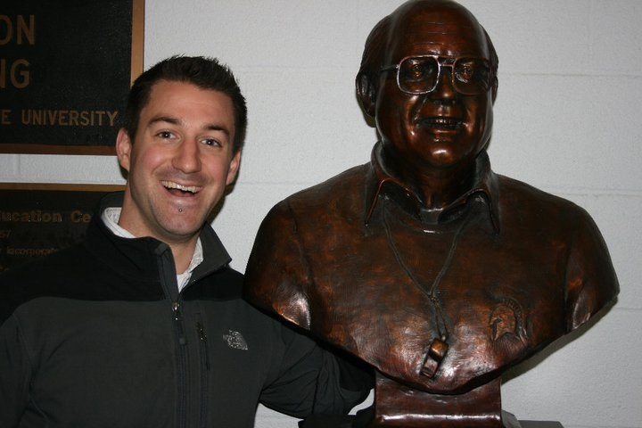
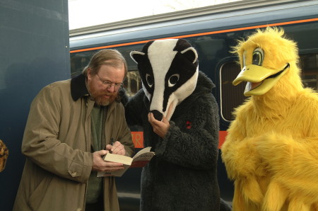

This is an odd choice, admittedly, for the Favorite Artists series I've started here on this blog. It's not much of a series yet, to be honest, since I've only [featured](https://steelwagstaff.wordpress.com/2011/05/02/my-favorite-artists-series-1-mark-nowak/) one other artist so far, documentary poet Mark Nowak. And Bill Bryson, while a cracking writer of popular non-fiction, isn't exactly what many people would call an 'artist.' 

As proof that I'm casting a wide net in my use of the word 'artist', here's the next entry in the series, a brief feature on the best-selling author [Bill Bryson](http://www.randomhouse.com/features/billbryson/index.html), [OBE](http://news.bbc.co.uk/2/hi/entertainment/6176363.stm).

<figure class="align-left"><figcaption>Bill Bryson, at home in the North of England</figcaption></figure>

Bryson was born in Iowa and attended college at [Drake University](http://www.drake.edu/about/) (where my cousin Rick earned his law degree) in Des Moines for a few years  before dropping out to backpack across Europe. He got a job in the UK, met his wife in Surrey, and they briefly returned to the States, where Bryson finished his undergraduate degree. He then moved to North Yorkshire (he lived in [Malham](http://www.malhamdale.com/), a lovely village in the Yorkshire Dales) where he worked as a journalist for more than a decade. 

In the late 80s he left journalism to write independently, in 1995 he moved back to the United States and in 2003 he returned to England, just around the time that I was leaving the country after completing my mission for the LDS church. It was actually in Yorkshire that I first heard about Bryson. I was shopping for groceries at an ASDA (a Walmart subsidiary and large supermarket/grocery chain in the UK) in Barnsley when I saw a copy of what was then his most recent book: _[A Short History of Nearly Everything](http://books.google.com/books?id=hQ1iRQd52kgC&printsec=frontcover#v=onepage&q&f=false)._ 

<figure class="align-left"><figcaption>Front cover of the UK edition of A Short History of Nearly Everything</figcaption></figure>

At the time, I wasn't permitted to read anything outside of what was known as the "missionary library", which was comprised of the standard works of the LDS church, official church publications, and a small list of semi-canonical books (very safe, tame stuff, the most intellectually engaging of which were former LDS Apostle James Talmage's _Articles of Faith_ and _Jesus the Christ_). I was (and am) a voracious reader, and this restriction was difficult for me to abide, but for two years, I did my best to obey the constraints, though I was nearly always hungry for good literature (especially poetry) and intelligent creative non-fiction. 

On that particular Monday in ASDA, Bryson's book caught my eye, and I remember taking it off the shelf to skim the dust jacket. I was carefully not to actually read the book, but I remember thinking that they book definitely looked like something I'd want to read when I again had the liberty to do so (however, I was so starved for interesting reading material that I probably would have felt this way about just about anything). I wheeled my cart of groceries to the checkout, paid for them, and promptly forgot all about the book.

<figure class="align-right"><figcaption>Front cover of the US edition of A Short History of Nearly Everything</figcaption></figure>

A few years later, after finishing my undergraduate degree and just before coming to Madison to start working on a Ph.D. in English, I was working as a land surveyor in Boise, Idaho. I had evenings and weekends off, which meant I had a lot of time to read. I started going to a small branch of the Boise Public Library! (more on the exclamation mark in a future post) just inside the Boise Mall a couple of times a week to find interesting books. One week, I saw a copy of _A Short History of Nearly Everything_. Even though the US edition came equipped with a different cover, the name clicked and I checked out the book. 

It was a fantastic book, that rarest of things, a lucid, readable, but eminently intelligent introduction to just about every branch of science currently practiced in the West. Bryson is one of the best popularizers of detailed, scholarly knowledge that I know, and in many ways reminds me stylistically of Michael Pollan, in that both have a sharp eye for compelling, engaging narrative supported by a broad range of relevant information. In both cases, I come away feeling like I'm reading someone who has engaged with and synthesized a vast amount of detailed scholarly information, who is immensely learned and widely read, but who is capable of mastering their material rather than letting their material master them. 

It's really a treat to read writers who can tell captivating stories while simultaneously summarizing a vast body of richly detailed information in a style that is both inviting and accessible. _A Short History of Nearly Everything_ was the best thing I read that whole year summer, and when I finished it I decided to dig in to other books by Bryson. I got a copy of his book about trekking the Appalachian Trail, _A Walk in the Woods: Rediscovering America on the Appalachian Trail_ on CD from the library, and starting playing the discs on the drive to and from work. 

Withing a couple of weeks it became the first (and only) book I've ever listened to from beginning to end on compact discs. I liked the book, but didn't rate it as highly as _A Short History_, and so was a little less enthusiastic when it came to the rest of his back catalog. I decided to skip his travel writing (_In A Sunburned Country_) and his notes on American culture  started his memoir (_I'm a Stranger Here Myself_, which actually looks quite interesting_)_, but did check out his memoir: _The Life and Times of the Thunderbolt Kid_, but I was reading about 6 other books at the time, and I ended up moving before I finished it. I found the 'book trailer' for this book to give you a taste for what it was like. \[youtube=http://www.youtube.com/watch?v=FRHXfzJ10gM&w=640&h=390\] 

A little more than a year into graduate school, I was browsing the new arrivals shelf at College Library (the same place that I first found Mark Nowak's poetry, actually) when I saw a small slim volume on William Shakespeare. Picking it up, I noticed two things: first, that it was part of a series of biographies called "Eminent Lives" and more intriguingly, that the author of the book was Bill Bryson, the [ginger-bearded imp](http://images.smh.com.au/2010/07/02/1671404/bill-bryson-420-420x0.jpg) himself. I was a little dubious at first glance--Bryson was a popular writer, and I generally regard books about Shakespeare as guilty until proven innocent of all kinds of crimes against historicity, hyperbole, and perspective. 

I trusted Bryson more than the average bear, however, and the book was small, so I decided to check it out. I started reading it, and couldn't stop. I finished in a couple of days and was massively impressed. I decided to look up what Bryson was doing, and discovered that he had been recently appointed to serve as the [Chancellor of Durham University](http://www.dur.ac.uk/bill.bryson/), which is home to the [Basil Bunting Poetry Centre](http://www.dur.ac.uk/basil-bunting-poetry.centre/) (more on Bunting in a future post in this series) and housed in one of the most impressive cities I visited during the whole of my mission.

<figure class="align-left"><figcaption>Bronze statue of the top third of a ex-MSU football coach, with my friend Eric. Is he a hermaphrodite? You decide.</figcaption></figure>

After finishing the biography, I enthusiastically recommended the book to my friend Eric, who is writing a dissertation on satire in early modern English drama. Despite his passionately held belief that Francis Bacon is solely responsible for all of Shakespeare's plays (as well as Jethro Tull's entire discography, many of the Lumière brothers' films, and approximately 90% of the furniture you can buy at IKEA), Eric also enjoyed Bryson's biography and later lent me a copy of Bryson's much earlier book on the history of the English language: _Mother Tongue_. 

I just finished _Mother Tongue_ last week. Here are some highlights:

> English is unique in possessing a synonym for each level of our culture: popular, literary, and scholarly--so that we can, according to our background and cerebral attainments, rise, mount, or ascend a stairway, shrink in fear, terror, or trepidation, and think, ponder, or cogitate upon a problem. ... We have a strange ... tendency to load a single word with a whole galaxy of meanings. _Fine_, for instance has fourteen definitions as an adjective, six as a noun, and two as an adverb. In the OED it fills two full pages and takes 5,000 words of description. We can talk about fine art, fine gold, a fine edge, feeling fine, fine hair, and a court fine and mean quite separate things. The condition of having many meanings is known as polysemy, and it is very common. ... In the OED, _round_ alone (that is without variants like _rounded_ and _roundup_) takes 7 1/2 pages to define or about 15,000 words of text. ... Even when you strip out its obsolete senses, _round_ still has twelve uses as an adjective, nineteen as a noun, seven as a transitive verb, five as an intransitive verb, one as an adverb, and two as a preposition. But the polysemic champion must be _set_. Superficially it looks a wholly unseeming monosyllable, the verbal equivalent of the single-celled organism. Yet it has 58 uses as a noun, 126 as a verb, and 10 as a participal adjective. Its meanings are so various and scattered that it takes the OED 60,000 words--the length of a short novel--to discuss them all.

I love the OED. Also on the subject of etymology, I learned about words that seem to appear out of nowhere:

> For centuries the word in English \[for dog\] was hound (or hund). Then suddenly in the late Middle Ages, dog--a word etymologically unrelated to any other known word--displaced it. No one has any idea why. ... Among others without known pedigree are jaw, jam, bad, big, gloat, fun, crease, pour, put, niblick (the golf club), noisome, numskull, jalopy, and countless others. Blizzard suddenly appeared in the nineteenth century in America (the earliest use is attributed to Davy Crockett) and rowdy appeared at about the same time.

Bryson tells a couple of funny, though possibly fanciful stories (he's been taken to task in some of his books for repeating folk tales and urban legends as true), including the following: "The U.S. Army in 1974 devised a food called funistrada as a test word during a survey of soldiers' dietary preferences. Although no such food existed, funistrada ranked higher in the survey than lima beans and eggplant", and in the nineteenth century "one lady was reported to have dressed her goldfish in miniature suits for the sake of propriety and a certain Madame de la Bresse left her fortune to provide clothing for the snowmen of Paris". 

At one point, Bryson quotes the great Danish linguist Otto Jespersen as likening the French language to the severe and formal gardens of Louis XIV, but describing English as being "laid out seemingly without any definite plan, and in which you are allowed to walk everywhere according to your own fancy without having to fear a stern keeper enforcing rigorous regulations." Whether it's an accurate description or not, I liked the idea. 

I also learned more about two very interesting poetic forms: holorime--a poem that uses lines that are pronounced identically but spelled differently and clerihews, which Bryson describes as "pithy poems that start with someone's name and purport, in just four lines, to convey the salient facts of the subject's life". There was a lot more of interest in the book. It's a good one, like everything by Bryson that I've read. 

What I'm trying to say is that he's a gem--read his books. Also, if you dress up in an awesome costume, he just might sign your copies of his work in a train station. And that's when you'll know you've made it to the big time.

<figure class="align-left"><figcaption>Bill Bryson, just doing his thang for some big animals who like his style</figcaption></figure>