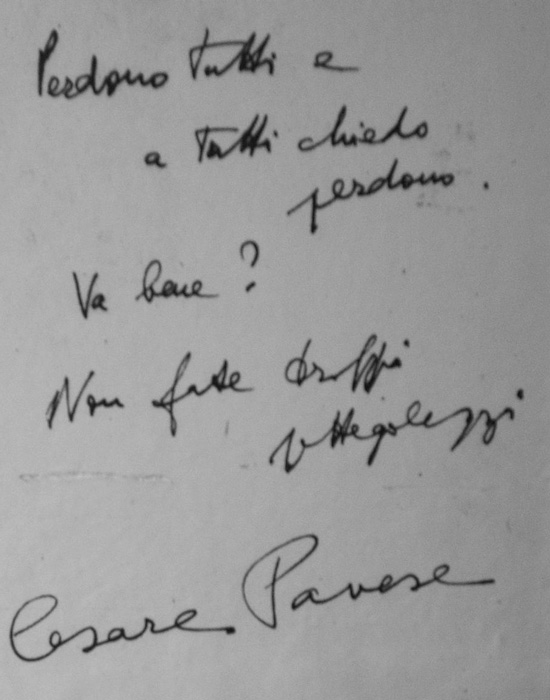

I just finished Geoffrey Brock's translation of Cesare Pavese's poetry: _[Disaffection: Complete Poems 1930-1950](https://www.coppercanyonpress.org/pages/browse/book.asp?bg=%7BA8FECCCA-1BF2-4E83-B0B9-5F1CE8FA145C%7D)_. It was outstanding. I think I had been vaguely aware of Pavese as a 20th century giant of Italian literature, but I had never read anything by or about him, apart from some long forgotten praise by Phil Levine, who was my favorite poet as a teenager. It was, strangely enough, in the poet Robert Bringhurst's _The Elements of Typographic Style_, a guide to print typography and book composition, that I read this epigraph from Pavese's _Dialogues with Leucò:_

> A true revelation, I am convinced, can only emerge from stubborn concentration on a single problem. I have nothing in common with experimentalists, adventurers, with those who travel in strange regions. The surest, and the quickest, way for us to arouse the sense of wonder is to stare, unafraid, at a single object. Suddenly—miraculously—it will look like something we have never seen before.

The quotation struck me with great force. It felt very 'Objectivist,' actually, like something that George Oppen might have written, a cousin in sentiment to these lines from "Of Being Numerous":

> one must not come to feel that he has a thousand threads in his hands,  
> He must somehow see the one thing;  
> This is the level of art  
> There are other levels  
> But there is no other level of art

Intrigued, I did a quick search for more information on Pavese and learned that he was a leftist (anti-fascist) writing in the 1930s and 40s, and hugely interested in American literature (Edgar Lee Master's _Spoon River Anthology_ was a large influence on Pavese's early poems). That was enough for me to head to the general UW library catalogue and order everything they had.

I read his poetry first. Geoffrey Brock has produced a fine translation of Pavese, published in 2002 by Copper Canyon press. Pavese published his first volume of poetry, _Work's Tiring_, in 1936, and published a second edition under the same title in 1943, dropping some poems from the first edition and adding several new poems. In the final years of his life (he committed suicide in 1950), he returned again to poetry, publishing _Death Will Come and Have Your Eyes_, poetry that is still well known and much beloved in Italy.

<figure class="wp-block-image alignwide size-large size-full wp-image-2249"></figure>

If you were to read just one Pavese poem to get a sense of his style, and concerns, I'd recommend "[Passion for Solitude](http://www.poetryfoundation.org/poem/180248)," but it'd really be very difficult to go wrong. His poems are filled with lone men ('un uomo solo'), a lot of hard working despair, a lot of sad women, many prostitutes, a deep longing for 'the hills' and distrust of the industrial city \[Turin\] where one makes a living. His poem "Summer (II)" closes with this phrase that seems emblematic of his style and concerns: "un duro inumano silenzio" (_a hard, inhuman silence_). If we were to look for an echo in American literature, maybe something that might come out of Jeffers, perhaps?

If you want more than just a little taste, I've been publishing some of the original Italian with my rough translations on [my tumblr](http://steelwagstaff.tumblr.com), and here's a larger, longer collection of some of my favorite passages from Brock's translation.

## from _Work's Tiring_ (1936)

### from “South Seas”

And since the last time  
I went down to swim in dangerous waters  
and followed a playmate up into a tree,  
splitting its beautiful branches, and since  
I bashed the head of a rival and got punched—  
so much life has gone by. Other days, other games,  
other spillings of blood in conflicts with rivals  
of a more elusive kind: thoughts and dreams.  
The city taught me an infinite number of fears:  
a crowd or street could make me afraid,  
or sometimes a thought, glimpsed on a face.  
I still see the light from the thousands of streetlamps  
that mocked the great shuffling beneath them.

### From “Ancestors”

Finding companions, I found my own land—  
a hard-hearted land, where it’s a privilege  
to do nothing and think of the future.  
Because work alone isn’t enough for me and mine;  
we know how to break our backs, but the great dream  
of my fathers was to be good at doing nothing.  
We are all of us born to wander these hills,  
without women, clasping our hands at our backs.

### from “Landholders”

The hospital has a garden that smells of earth mixed  
with hard work—it’s good air for the sick.  
My priest knows the plants and the bushes  
better than even his dead, whose faces change,  
while the plants and the bushes are always the same.

### from “Landscape (III)”

At night the fields and countryside melt  
into heavy shadow; vineyards and trees  
are swallowed—only a hand can know fruit.  
In this dark, the rag man could pass for a peasant,  
except that he steals and even the dogs don’t hear him.  
At night the land no longer has owners,  
except for inhuman voices. Sweat doesn’t count.  
In this dark, the plants have their own cold sweat,  
and the fields are one field, and each man’s, and none’s.

### from “Grappa in September”

The moment has come when everything stops  
to ripen. The trees in the distance are quiet,  
growing darker and darker, concealing fruit  
that would fall at a touch. The scattered clouds  
are pulpy and ripe. On the distant boulevards,  
houses are ripening beneath the mild sky. …

This is the time when each person should pause  
in the street to see how everything ripens.

### from “Ancient Civilization”

People with bodies should let them be seen. The boy  
isn’t sure that everyone has one. The craggy old man  
who passed this morning can’t have a body  
as pale and sad as his face, couldn’t have anything  
as frightening as that. No adults, not even  
a young wife giving her breast to her baby,  
are really naked. Only children have bodies.

### from “Nocturnal Pleasures”

It washes us clean, this wind, it reaches the ends  
of streets that open on darkness; the lights  
that shimmer and the nostrils that flare  
are struggling, naked. Each odor’s a memory.  
It came a long way, through darkness, this wind  
that dies in the city: down hills and through fields  
where the grasses are warmed by the sun  
and the earth is blackened by humors. Our memory  
is a sour scent, barely a trace of sweetness  
in the deep breath exhaled from the gutted earth  
in winter. Each odor fades in the darkness;  
nothing reaches us here in the city but wind.

### from “Landscape (V)”

The unfeeling hills that fill up the sky  
come alive at dawn, then hold still, it seems,  
for centuries, as the sun watches them.  
Such a joy it would be to wrap them in green again,  
and to scatter the green with houses and fruit.  
Each plant would be a miraculous life  
at dawn, and the clouds would make sense. …

Do these slopes, slapped up in front of the sky  
like city buildings, make sense? They’re naked.  
A peasant up there, stark against the sky’s void,  
is absurd, as if her were taking a walk on a rooftop  
in the city. It brings to mind a sterile colossus  
of clustered houses: they get rained on, they dry  
in the sun, and not one blade of grass grows.

To cover the houses and the rocks with green—  
so the sky would make sense—you’d need  
black roots to sink deep in the darkness. At dawn  
the light would gush into the earth, with force.  
Everything’s blood would be more alive: bodies,  
too, are made of veins so dark they look black.  
Then the peasants who walk past would make sense. (109)

### from “Revolt”

That rag heap also looks dead, propped there  
in the blistering sun, agains that low wall. To sleep  
on the street, you have to have faith in the world.  
There’s a beard in those rags, and the gathering flies  
have plenty to do. People move down the street  
like flies—the beggar’s just part of the street.  
His miserable grimaces are hidden by beard;  
like grass, it imparts an air of serenity. He’s old  
and could die anytime, facedown in blood,  
yet he looks like an inanimate thing, and he lives.  
Except for the blood, everything’s part of the street.  
And stars have seen blood in the street before.

### from “Motherhood”

It’s strange for the boys, living without this woman,  
who none of them knew, who labored to make them,  
erased herself in them. The woman was young,  
she laughed and she talked, but to take part in life  
is a dangerous game. In the end, that’s how  
she wound up: staring in silence, undone, at her man.

### from “Atavism”

If the streets belong to us all, we should enjoy them  
without distraction, looking around as we walk—  
now in shade, now in sunlight—through the fresh air.

And every street opens wide like a door  
that nobody enters.

### from “Landscape (VI)” (the last poem in _Work’s Tiring_)

The streets, the pure lines of the houses,  
retain, in this fog, an ancient tremor:  
you can’t, once you feel it, give up on yourself. You can’t  
give up the gentle intoxication that comes  
from the things of a pregnant life, things discovered  
as you meet a house, or a tree, or a startling thought.  
Even the big horses, who will have passed,  
at dawn, through the fog, will speak of it.

Or maybe a runaway boy will return  
this very day to this home, as the fog rises  
to cover the river. Maybe he’ll forget his whole life,  
the hard times, the hunger, the betrayals of trust,  
as he stops on a corner, to drink in the morning.  
It’s worth going home—maybe everything’s different.

## from _Work’s Tiring_ (1943)

### from “Morning”

Each day is a miracle outside of time,  
beneath the hot sun: a salt light and the taste  
of what lives in the sea suffuse the day. (169)

### from “Summer (I)”

You move your head  
as if miracles of air were swirling around you,  
but the miracle’s you. Your eyes and the heat  
of memory: they taste just the same.

### from “A Memory”

Nor do the days collect  
on her face or diminish the easy smile  
she shines on the world. All that she does  
is done firmly, and every time seems like the first;  
she’s alive to the end of each moment. Her gaze  
is gathered, her body is firm, they unfold  
in a voice that’s soft, a bit hoarse: the voice  
of a tired man. And she is untouched by tiredness.

## from _Poems of Disaffection_

### from “Song”

Trees too bring together the sky and the earth. …  
Trees too suffer and die beneath clouds;  
man bleeds, and he dies—but he sings his joy  
between the earth and the sky, sings the great marvel  
of cities and forests.

### from “Sad Wine (I)”

It was beautiful how he cried as he told it,  
the way a drunk cries, his whole body in it,  
and he hung on my shoulder saying, _Between us_,  
_always respect_, and there I was, shaking with cold,  
wanting to leave, and helping him walk (247).

### from “The Boy Who Was in Me”

The air was fresh, the alfalfa as plush  
as deep velvet, sprinkled with redding gray flowers,  
and the clouds and the sky caught fire  
in the midst of those stalks. On his back, the boy stared  
at the sky he’d so often heard praised at the summerhouse.  
And the sunset astonished. I liked to half-close my eyes  
and enjoy the embrace of the plants; they held me like water.

### from “Imagination’s End”

We have only this single virtue: to begin,  
each morning, our life—in the face of the earth,  
beneath a hushed sky—awaiting an awakening.  
Some are amazed that dawn is such hard work;  
from making to waking a task is completed.  
But we live merely to give with a shudder  
to the future work and to wake up the earth once.  
And sometimes it wakes. Then returns to our silence.

### from “Reigning Peace”

one day  
even the young will grow old, and no one will know  
with what gaze strangers will knock against things.  
But a glance at the world will lay anyone out,  
and everything wakes in the morning.

### from “Poetics”

The boy is aware that the tree is alive.  
If the tender leaves force themselves open,  
bursting ruthlessly into the light, the hard bark  
must suffer extremely. And it lives in silence.  
The whole world is covered with plants that suffer  
in light, not daring even to breathe.

… The houses  
are dazzling, transparent in the bluish vapor,  
and the boy raises his eyes. The distant silence  
that can tighten a person’s breath has flowered  
in the sudden light. These are the boy’s  
ancient trees. And the light is the spell of that time.

## from _Earth and Death_

Red earth black earth  
you come from the sea,  
from the air green,  
place of ancient words  
bloodred weariness  
and geraniums among stones—  
you bear more than you know  
of sea and words and toil,  
you, rich as a memory,  
as the barren countryside,  
you, hard and honeyed  
word, old as the blood  
gathered in your eyes;  
and young, like a fruit  
that is memory and season—  
your breath rests  
beneath the August sky,  
the olives of your gaze  
calm the sea, you live  
and live again  
as expected, certain  
as the earth, dark  
as the earth, grinder  
of seasons and dreams  
that moonlight reveals  
to be ancient, like  
the hands of your mother,  
the hollow of the brazier.

\*

Your gaze is brine and earth.  
One day you dripped  
from the sea. There were  
plants alongside you,  
warm ones, they are  
marked by you still.  
Agave and oleander.  
Your eyes enclose everything.  
Your veins, your breath  
are brine and earth.

\*

You are the raspy voice  
of the countryside, the cry  
of the hidden quail,  
the warmth of the stone.  
The land is weariness,  
the land is sorrow.

\*

Like rock and grass,  
like earth, you are closed;  
you churn like the sea.  
No word can possess you  
or stand in your way.  
You gather wounds  
as the earth does  
and make of them life, breath  
that caresses, silence.

\*

And then we cowards  
who loved the whispering  
evening, the houses,  
the paths by the river,  
the dirty red lights  
of those places, the sweet  
soundless sorrow—  
we reached our hands out  
toward the living chain  
in silence, but our heart  
startled us with blood,  
and no more sweetness then,  
no more losing ourselves  
on the path by the river—  
no longer slaves, we knew  
we were alone and alive.

## from _Death will come and will have your eyes_

### from “I Will Pass through Piazza di Spagna”

That street will open,  
the stones will sing,  
my heart will pound, leaping  
like the water in the fountain—  
this will be the voice  
that climbs your stairs.  
The windows will know  
the smell of morning air  
and stone. A door will open.  
The clamor of streets  
will be my heart’s own clamor  
in the vanished light.

It will be you—still and clear.

\*

You lived in silence, life  
right before your eyes  
(no pain no fever no shadow)  
like a morning sea, clear.

…Not sorrow not fever then,  
not this leaden shadow of day,  
crowded and different. O light,  
distant clarity, difficult  
breath, turn again your clear  
and motionless eyes to us.

### from “The Cats Will Know”

There will be other days,  
there will be other voices.

… There will be other days,  
other voices and renewals.  
Face of springtime,  
we will suffer at daybreak.
