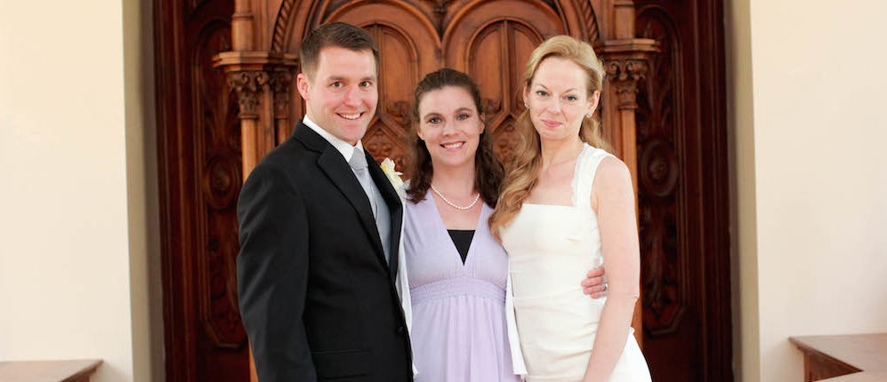

It's been a long time since I started these posts, but now's as good a time as any to finish them off. The details won't be as fresh, certainly, but those that remain will have survived three plus years' worth of memory-winnowing.

## Choosing an Officiant

When it came to selecting an officiant for our wedding, Laurel and I talked first about the kind of wedding we wanted. I was raised Mormon, and membership in the LDS church had been a formative part of my life, but I was no longer a believing member of that (or any other) faith. For Mormons, temple sealings are the gold standard for marriage, as they believe that these types of marriage have the capacity to endure beyond death (Mormons marry in their temples 'for time and all eternity', rather than 'until death do us part'). 

While it's a lovely idea, we both wanted a simple civil ceremony, without any religious trappings or significance. We first thought it might be nice to have my father perform the ceremony. At the time, he was a bishop in the LDS church, which gave him the ability to perform civil ceremonies, of which he had already performed a couple. However, we found he didn't have the authority to perform our wedding in Wisconsin, so far from his congregation, and so we asked him about the possibility of getting an online ordination from an essentially fake church in order to have the authority to perform a civil ceremony in Wisconsin. He looked into it, we discussed it, and ultimately decided we didn't feel comfortable with that option, so Laurel and I reopened the conversation about who we would like to have perform the ceremony. 

After discussing several more options, we eventually settled on one of Laurel's best friends from New Mexico (and Milwaukee), Jen Gilmour. Jen applied for a (free?) ministerial certificate from the [Universal Life Church](http://www.ulc.org/), which allowed her to officiate weddings in Wisconsin. We also spoke with Jen a few times about the type of wedding ceremony we wanted to have, made arrangements for our siblings to present a few short readings and sing a song. Jen wrote the ceremony out, in super-achiever fashion, and did a beautiful job of it. After the ceremony she gave us her notes and cards, and we were both blown away and moved by the amount of planning and preparation she had clearly done in advance of the ceremony. 

In hindsight, we felt enormously lucky at how well our choice had turned out, and would recommend that you select an officiant who not only knows you well and loves you deeply, but who has experience speaking publicly and can strike the right balance between the poise needed to officiate a public event and demonstrating emotion. Jen was all of that, and more, and as I said, we really lucked out.

<figure class="align-left"><figcaption>Steel, Jen, and Laurel in Gates of Heaven just after Jen finished officiating the wedding.</figcaption></figure>

## Getting the Marriage License

Getting a marriage license isn't particularly difficult, but it does take some planning and preparation. We ended up being married in Dane County (though we had initially planned to hold the wedding ceremony in Jefferson County). The rules for obtaining a marriage certificate in Dane County are posted [online](https://www.countyofdane.com/clerk/marriage_license.aspx), and differ from county to county and state to state, I imagine. In our case, we had to appear in person at the County Clerk's office in downtown Madison with $120 and lots of supporting documentation (proof of ID, proof of residency, birth certificate, and in my case, proof of divorce since I had been married previously). There was also a time window at play: we had to apply for the license at least six full calendar days prior to our planned ceremony, and once the license was granted, the ceremony had to take place within thirty days of its issuance. If I recall correctly, it was in applying for the marriage license that we decided definitively to hold the wedding at our backup location (at Gates of Heaven in Dane County), because the forecast called for rain on our wedding day, and our first choice (Lorine Niedecker's cabin in Fort Atkinson) did not have a covered shelter. Applying for the license meant sitting down with a county clerk employee for a few minutes, answering some questions, showing our documents, paying our fee, and signing some papers, then returning a few days later to pick up the marriage license. I think there was other paperwork (a marriage certificate?), that we had to mail in after the wedding ceremony, but my memory is fuzzy on this. I think Jen may have taken care of it for us, actually.
