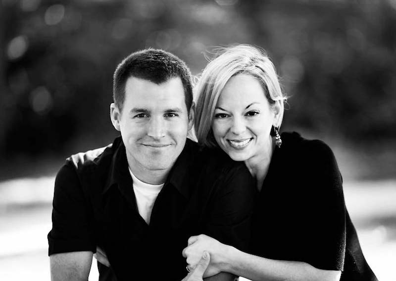
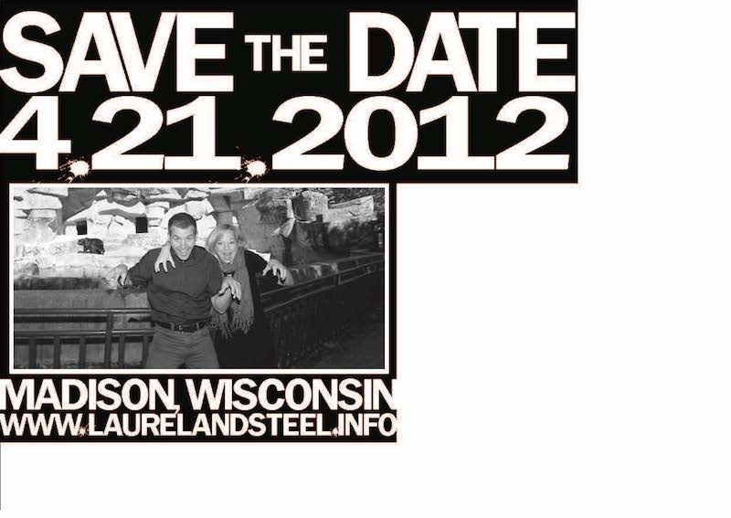
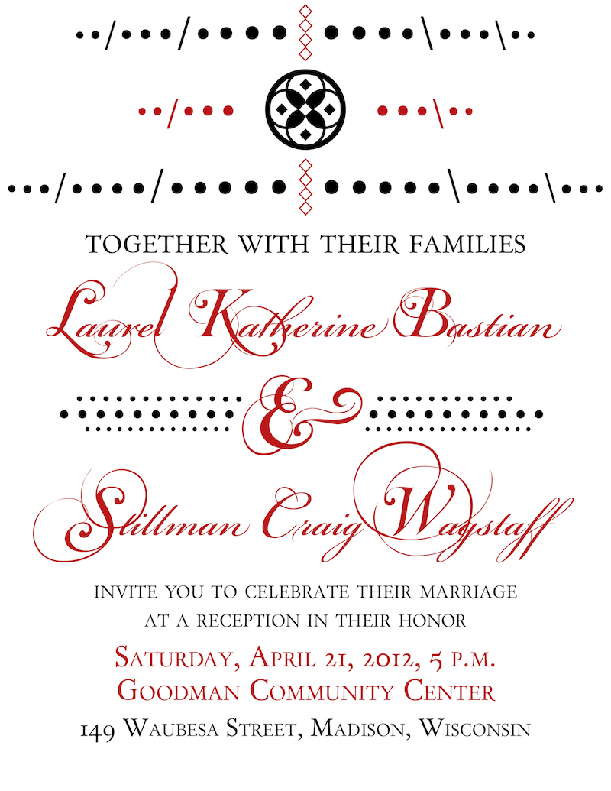
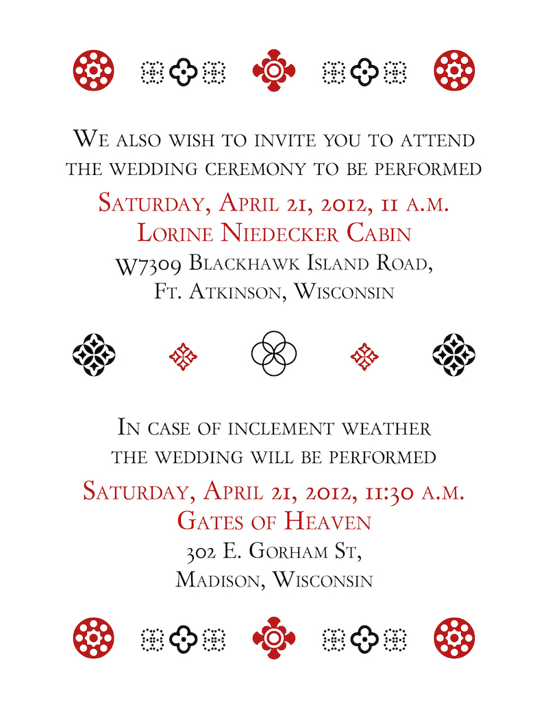
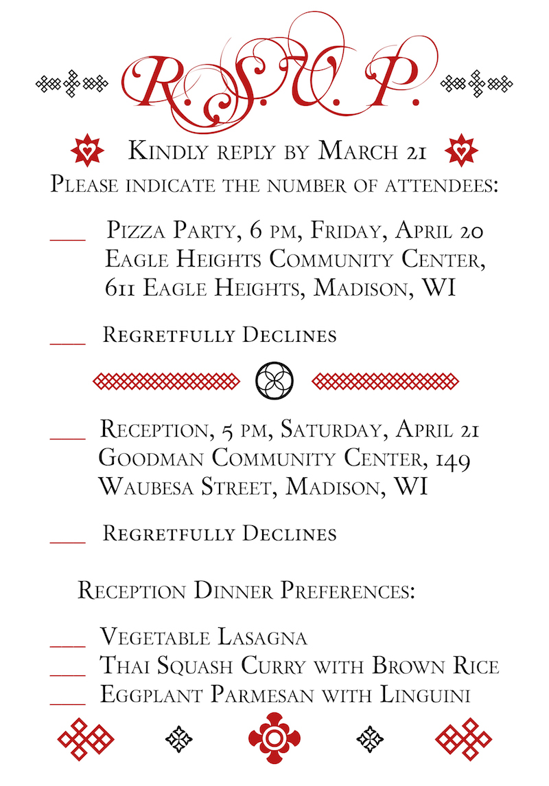

This is the next post in an ongoing [series](http://steelwagstaff.com/wedding-planning/) about Wedding Planning. In this post I'm going to describe the process by which we designed and made our wedding invitations--one of the most fun and exciting parts of the wedding planning process for me. Late last year, Laurel and I decided that we wanted to get married in the Spring, and I asked Laurel if she'd be OK if I designed and made our invitations by letter press. I'd never worked with a letter press, but I wanted to learn, and when Laurel gave her enthusiastic approval, I enrolled in Art 448 (Letter Press Printing), a special topics course taught by [Jim Escalante](http://jimescalante.net/teach/). Being a student in this course provided me with several important things, not least of which was regular access to a polymer plate machine, two Vandercook letter press printers, and a classroom full of type cabinets and other printing supplies. **Save the Date Cards:** The first thing that we made and mailed were Save the Date cards. Making these was fairly simple--I designed them as roughly 4"x6" postcards, and checked the [USPS web site](http://pe.usps.com/businessmail101/mailcharacteristics/cards.htm) to make sure that I adhered to all [the space requirements](http://pe.usps.gov/search/jsp/search/vv_docread.jsp?k2dockey=http%3A%2F%2Fpe.usps.com%2Ftext%2Fdmm300%2F201.htm%40PE_DMM300_HTML_5&serverSpec=56.0.145.56:9920&QueryParser=Simple&querytext=%28postcard%29&dtype=2#hit0) for sending them via US mail.

<figure class="align-left"><figcaption>Front of Save the Date cards. Photgraph by Sam Crowfoot.</figcaption></figure>

For the front of the postcard, I used a photograph taken in the fall of last year by our friend [Sam Crowfoot](http://www.samcrowfoot.com/index2.php).

<figure class="align-left"><figcaption>Back side of our Save the Date postcards.</figcaption></figure>

On the back, I set the text in [Franklin Demi Gothic](http://www.azfonts.net/load_font/fradm.html), a blocky sans-serif font that I liked the look of, especially when it came to numerals. I made the periods separating date/month/year and the url for [our wedding website](http://www.laurelandsteel.info) look like paint splotches for a bit of excitement, and we also featured a goofy picture of us making bear poses in front of a real bear at the Madison Zoo. I also made sure to leaving enough white space at the bottom of the back for postal barcodes, and the appropriate white space on the right for addresses and postage. Once the design was finished, I called various printing shops around Madison before settling on [SprintPrint](http://www.sprintprint.com/), who printed 100+ black and white postcards for something like $20. Black and white printing is far less expensive than color printing, so our greatest expense for these cards was postage, which we were able to keep down by mailing postcards instead of envelopes. **Invitations:** Once the Save the Dates were all mailed and we had a date and location confirmed, we started to plan the design for the invitations and RSVPs. I have some experience with InDesign and other tools in the Adobe Creative Suite, and I spent a couple of weeks working on a two-color design for wedding invitations and RSVP cards. We knew going in that we would be inviting roughly 100 guests to the reception and substantially fewer (between 30 and 40) people to the wedding ceremony itself, so I planned to design an invitation that could be printed two-sided for those few invitations that would feature both a reception and ceremony invitation. I went through dozens of drafts and spent way too long tweaking small elements of design (typeface, font size, kerning, spacing, etc.) and finally settled on the designs you see below.

<figure class="align-left"><figcaption>Design for Reception Invitation, printed from InDesign.</figcaption></figure>

For the wedding reception invitation, I used capital letters from [Day Roman](http://www.dafont.com/day-roman.font) as the serif type face and used [Bickham Script Pro](http://www.adobe.com/type/browser/landing/bickham.html) for our name lettering and [Mutlu](http://www.dafont.com/mutlu-ornamental.font) (a more expressive, ornamental font) for the initial letters in our names and the ampersand. I made the three lines at the top out of periods and forward and back slashes in the [Minion Pro](http://en.wikipedia.org/wiki/Minion_\(typeface\)) typeface, and designed the interlocking rings at the top and lines of dots surrounding the ampersand in Illustrator.

<figure class="align-left"><figcaption>Design for Ceremony Invitation, printed from InDesign.</figcaption></figure>

For the wedding invitations themselves, I used Day Roman for the text, and took the decorative designs from two different type faces, [Circle Things 2](http://www.dafont.com/circle-things-2.font) and [Italian Mosaic Ornaments](http://www.dafont.com/italian-mosaic-orna.font). The only one of the designs on this page that I made myself was the four interlocking ring pattern in the center of the invitation (made in Illustrator).

<figure class="align-left"><figcaption>Design for RSVP cards, printed from InDesign.</figcaption></figure>

On the RSVP, the title text was in Mutlu and the rest of the page was in Day Roman. The hearts in the starbursts were taken from a typeface called [Heart Things](http://www.dafont.com/search.php?q=heart+things). I designed the diamond-based patterns at the outside of the top and bottom of the RSVP as well as the divider pattern and interlocking circles in Indesign and took the other shapes on the bottom row from Circle Things 2 and Italian Mosaic Ornaments. Once I had finished the designs, I sent single color PDFs of the design away to a printing company who makes high quality negative transparencies. It took about 2 weeks to get the negatives back, and then I cut them out of the larger sheet, placed them on a photopolymer sheet, developed the image, washed and baked the plate and then cut out the finished polymer plate and stuck it to a thin adhesive backing so it could be mounted onto the press bed. If that sounds complicated, here's an accurate but slightly corny tutorial video. \[youtube http://www.youtube.com/watch?v=Y8hBGDhC0CE&w=500&h=375\] For the paper, I went to [Artist and Craftsman](http://www.artistcraftsman.com/) (an art supply shop off of State Street in Madison) and bought several 22"x30" sheets of [250 gsm Canson printmaking paper](http://www.danielsmith.com/Item--i-159-920-003) in a cream color that we really liked. The invitations were 4.25"x5.5" (made to fit inside A2 envelopes) and the RSVP cards were 3.5"x5" (made to fit A1 sized envelopes, the smallest permitted by the post office), and I cut the paper by hand on a paper cutter in my letter press classroom (unfortunately, I miscalculated the size for some of the pieces, which caused me to lose the deckled edge that I had hoped would be on the bottom of all of the invites and RSVPs on about a quarter of the total press run. I bought [100 square-flap red A2 envelopes](http://www.desktopsupplies.com/enrea243x53.html) and [100 square-flap cream A1 envelopes](http://www.desktopsupplies.com/cream-a1envelopes-100.html) online and printed our mailing address on the RSVP envelope and our return address in the top left and website on the flap of the outer envelope. I made several videos with my iPod documenting various stages of the letter press process, which I've embedded below. Cutting Paper: \[vimeo http://www.vimeo.com/43066467 w=500&h=889\] Printing Reception Invitations: \[vimeo http://www.vimeo.com/43066470 w=500&h=889\] Printing RSVP Cards: \[vimeo http://www.vimeo.com/43066468 w=500&h=889\] Printing Envelopes: \[vimeo http://www.vimeo.com/43066471 w=500&h=889\] Overall the process was time-consuming and tricky, but lots of fun. I learned a ton from the experience, both things to avoid in the future, and things I'd definitely do again. The biggest surprise for me in the design process was how much smaller the negatives and plates looked in real life as compared to their size on my computer screen. I suppose I should have known that 4"x6" wasn't going to be very large, but a lot of the detail that I could see on the digital scale wasn't exactly able to carry over all the way to the polymer plate (there was some blurring and smearing on small details, especially on the tiny diamond shape designs I made at the top of the RSVP card. In the future, I think I'd make my design a little bigger and less complicated--in such a small space I think the designs felt a little too busy and could have been given more white space to breathe in. Other tricky elements in the process were learning to do two-color printing--on a letter press, every color requires a separate run through the press, which makes for all kinds of challenges when it comes to registration and press set-up. When I first started on the invitations, I didn't know anything about mixing ink, and I somewhat stupidly printed the front twice (once in red and once in black) before turning it over and printing the back an additional two times (once in red and once in black). Doing it this way required me to ink and clean the rollers four separate times instead of doing all the black printing (front and back) first, and then cleaning the rollers and doing all of the red printing (front and back). This turned out to be a special problem in my case because the second time I went to ink the rollers in red, the person using the press before me hadn't done a thorough job cleaning off the rollers, which meant that the red color I mixed up was a little big darker than the first red I used. No one said anything about it, but I noticed the difference in color, and would have preferred a consistent shade of red on the front and back of all invitations. Total Cost: less than $100. Having free access to lots of supplies through my art class definitely helped (ink, photopolymer plates, Vandercook presses, etc.), so my primary expenses were for the negatives (around $20) and the paper (at roughly $2.30 for each 22"x30" sheet). If you have the time and the interest in design, we found that making the invitations yourself (even if you have them printed conventionally at your local print shop) is a great way to save lots of money. And it's really fun! Here's how the finished invitations and RSVP cards looked:
