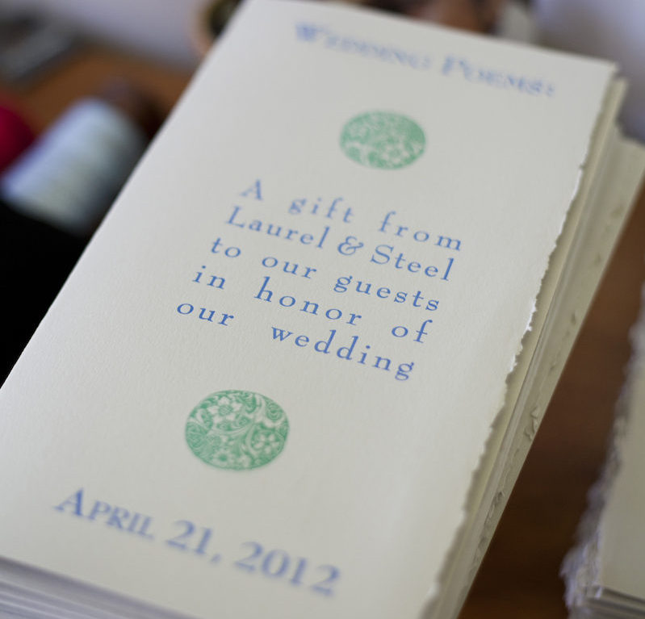
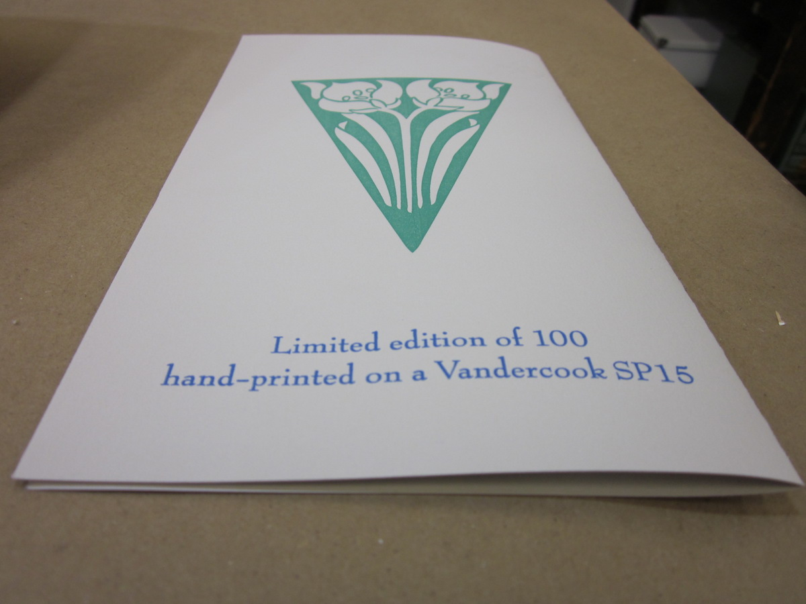

This is second half of a two part post on making and designing invitations. While this post isn't technically about invitations, it does involve design work and letter press printing, so I thought it would make a nice complement to yesterday's post.

<figure class="align-left"><figcaption>Stack of folded booklets on our dresser the morning of the wedding. Photograph by Jennie Bastian.</figcaption></figure>

Because Laurel and I are both poets, we decided that we wanted to make a highly personalized wedding favor for our guests: a small pamphlet which included two wedding poems (one written by each of us to the other) printed by hand on a letter press. Since this was my second major letter press project, I had a better idea of how to handle the design and prep work. Instead of sending the digital files off to be printed and waiting two weeks to receive the negatives, I had [AJ Nordhagen](http://art.wisc.edu/newsletter/post/2010-Grad-Student-Profile-AJ-Nordhagen.aspx), a grad student who was enrolled in my art class (check out some of his [recent work](http://jimescalante.photoshelter.com/gallery/A-J-Nordhagen/G0000Y3y9rcbOCgk)), print them in his lab (they looked great and were ready the next day), and then made the plates from his negatives. Based on my experience with the first letter press project, I chose the same style of paper (22"x30" 250 gsm Canson printmaking paper from my local Artist & Craftsman), only I selected light gray instead of cream, mostly because I liked its particular tone and thought it would pick up color well. I also made the overall design much larger (the sheets were roughly 11" square, with a vertical fold) and used fewer design elements and gave the text a lot more breathing space on the page.

<figure class="align-left"><figcaption>Poems at a table setting during the wedding reception. Photograph by Sarah Maughan.</figcaption></figure>

The front cover design was fairly simple. For the typeface, I used [Bernhard Modern Std](http://en.wikipedia.org/wiki/Bernhard_Modern), setting the top line in small caps at 40 pt, the middle text at 34 pt, and the date at the bottom in small caps at 36 pt. The images are identical (flipped horizontally and vertically) and were taken from the fine collection of free resources maintained by the good people at [Briar Press](http://www.briarpress.org/about) (as were the rest of the images in the design). I designed the pamphlet so that the deckle would be on the right hand side of the folded page, which would be slightly narrower than the straight-edged back page.

<figure class="align-left"><figcaption>Open pamphlet on our front porch. Photograph by Sarah Maughan of SLM photography.</figcaption></figure>

For the inside of the pamphlet, I used Bernhard Modern Std for the titles, setting the type in small caps at 32 pt, and 12 pt [Arno Pro](http://en.wikipedia.org/wiki/Arno_\(typeface\)) for the text of each poem. The plant images were also taken from Briar Patch and modified in Illustrator to fit the required spaces.

<figure class="align-left"><figcaption>The back cover of the poetry pamphlet.</figcaption></figure>

The back cover is the simplest part of the design. It features a large triangular shaped image of daffodils (from [Briar Press](http://www.briarpress.org/19981)) with a colophon in 20 pt Bernhard Modern Std beneath. I printed 100 usable copies of the pamphlet (I ended up with about half a dozen with various printing defects). The only other major change I made from the first project was actually a change in machinery. One of my frustrations with the first project had been that the roller heights seemed to be pretty unreliable--they'd lower themselves after every two or three runs, which meant that I'd often have additional unwanted ink around the edges of my plates unless I checked the heights after every 2-3 passes and raised it carefully. Our class did contain a second letter press, but it was a little larger, the crank was heavier, and it just seemed more complicated and a little intimidating (it used a motor to spin the rollers during the application of ink!) and it wasn't a machine that we had been trained to use. I don't know if I would have switched presses, but the smaller press was in near constant use during the week I planned to make our poetry pamphlets, so there wasn't much choice if I wanted to get the project done in a reasonable time and during convenient hours. The press did take a little bit of getting used to, but I ended up liking it much more than the smaller press--registration was easier, the grippers were better placed and kept my paper more flush, the ink applied smoothly and evenly, and best of all, the roller heights stayed stable which made the project MUCH faster than it would have taken me on the smaller Vandercook SP15. Once the design was set, the last thing I had to decide on were the colors of ink I wanted to use. I briefly considered using a three color design, but decided that two colors would probably be easiest to manage and look nicest. I knew that I wanted to use an electric blue color--I thought it would look really sharp on the gray paper, but I wasn't sure what color to pair it with. For a while I considered a bubblegum pink--they paired really nicely and would have been fun, but they seemed a little too gendered (blue is for boys, pink is for girls) and cliche for our taste. I tried out a few other possibilities before settling on a dynamic sea green color (my poem was about prairies and we had a plant theme in some of the visual components of the design). Mixing inks was one of my favorite things to do in the shop. The letterpress printing inks we had in our classroom were all kept in fairly large circular metal tins, and in order to print anything you had to take a small metal trowel, scrape out some of the rich, thick ink in whatever color(s) you wanted to use, and spread and scrape the two together until you'd achieved the color you wanted. With both of the colors I ended up using, I knew I wanted a color lighter than the base blue and green we had in the class, so I started with a large quantity of white and slowly added small quantities of the darker color until I had the hue that I wanted. It wasn't exactly scientific, but it was tremendously fun, and I was really pleased with how the colors turned out (I actually had to mix the blue on two separate occasions because one of my plates had an exposure problem and had to be remade, but I was able to get the batch so close the second time that the difference between batches is indiscernible). Below I've included several images of the project in greater detail. Enjoy!
