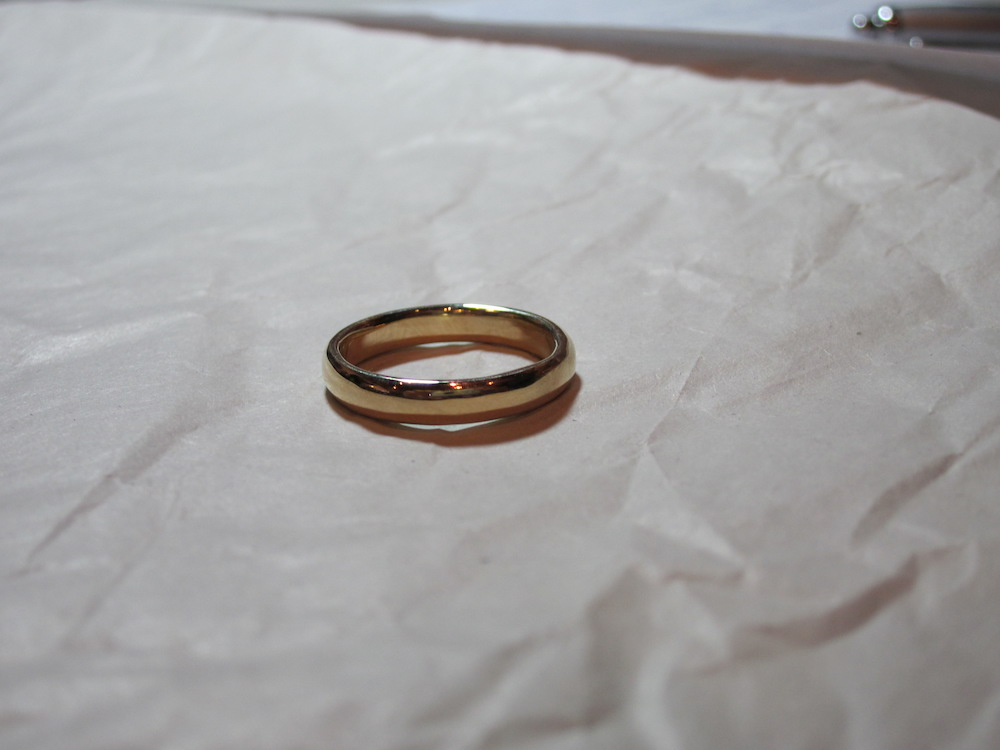

Over the past few days, I've written several posts describing some of the choices that we made as we prepared for our marriage. One of the best choices we made was to make wedding bands for each other. Neither of us had have worked with metal in any significant way before, but making a wedding ring was something that I've wanted to do ever since I was in high school, when my friend Cecily told me that her dad had 'tapped' her mother's ring. I remained vaguely interested in the process for several years, but for my first marriage, my ex-wife and I bought simple bands for each other from the jewelry section of a Fred Meyer (I remember that the salesman I worked with had a large, chronically inflamed, red and bulbous nose, and always seemed to smell faintly of alcohol), which is not something that I'd ever do again. As Laurel and I began to plan our wedding, I told her about my longstanding interest. I think initially she was a little skeptical that we'd have the skills necessary to make decent looking, durable rings, but she encouraged me to look into the process if it was something that felt good and interesting to me (so typically Laurel--and one of the biggest reasons why I feel so lucky to be married to her). I started by looking around online for places where you could make your own wedding rings and found a site called "[A Wedding Ring Experience](http://www.aweddingringexperience.com/)," whose web site promised us that we could "Create each others' wedding rings with your own hands, in your choice of metal and design, in the course of a leisurely 5 to 6 hours or so. Our master jewelers will guide and help you to a professional finish that will delight you - we guarantee it." I felt a little dubious--I don't generally trust companies who want to sell me an 'experience,' but I saw that they offered workshops in Chicago, so I emailed them an inquiry, asking about dates, price, and other relevant information. I got a friendly reply back within a couple of days with dates and a strong sales pitch and a quote that was quite a bit more money than we wanted to pay for our rings. I decided to hold off on the Wedding Ring Experience and look locally to see if there were any jewelers in town who'd be willing to teach us how to make rings for each other. Fortunately, Madison holds a bi-annual gallery night (organized by [MMoCA](http://mmoca.org/)), in which dozens of locations around town remain open late into the evening, hosting events and showcasing the art they make or sell. It's a really wonderful event, and it seemed like a perfect opportunity for us to visit several galleries after normal work hours with our inquiry to see if we could find a place that seemed like a good fit for us. Laurel's mom was in town that evening, so the three of us dropped in on a couple of different jewelers in town, met lots of really interesting artisans and entrepreneurs, and admiring all kinds of fine metalwork. By the end of the evening, however, one location seemed most promising: [HYART Gallery](http://hyartgallery.com/about-us/), located at 133 W. Johnson Street (near where Johnson intersects with State Street) and owned and operated by [Hiroko Yamada](http://www.zoominfo.com/#!search/profile/person?personId=1048548766&targetid=profile) and Marian Piekarczyk. HYART was actually the very first place I stopped in at, just before Gallery Night technically began and just before I met up with Laurel and her mother, so I was alone. I'd passed it several times before without really noticing it, and when I stopped in this time, I was struck by the invention and elegance manifest in several of the pieces on display, and particularly impressed with the strong lines and bold (frequently asymmetrical) designs manifest in much of [Hiroko's own work](http://hyartgallery.com/wp-content/uploads/2011/10/Custom-Rings1.jpg), especially her exquisite [mokume gane](http://en.wikipedia.org/wiki/Mokume-gane) rings, a metal-working technique that I had never seen before. Hiroko was in the store, and when I explained to her that I was getting married soon and wanted to know if she'd be able to teach us how to make our own wedding rings, she said sure and indicated that she often trained and mentored young metal workers, including a student who was then in high school, so she thought it would be no problem. She told me to get in touch in the next month or so, and we could discuss details and work something out. Laurel and I came back to the store the following month, and met Hiroko at greater length. We both loved her and felt really strongly that she was a jeweler that we very much wanted to work with, so we stopped looking for other rings or other ring makers as possible teachers. We exchanged emails through much of December and January, trying to find a date that worked well for both of us as Hiroko was particularly busy through the holiday season and then took a trip to Japan near the end of the year. We met for the first time on Sunday, February 5th. For the initial visit, we brought several gold heirloom rings that Laurel had received from her mother, which had belonged to various women in her family (mother, grandmother, and great grandmother), and Hiroko weighed the material, removed the stones from their settings, and helped us plan our designs for the rings. For my ring, I wanted a simple gold band of medium width. I don't have very large hands, and I don't often wear jewelry, so I wanted a ring which would feel light and not too bulky. For Laurel's birthday the year before, I had bought her a set of 5 thin bands made by an artisan metal worker, and she really liked the way they felt and the possibilities for combination that having multiple rings allowed. She settled on a design of three thinner bands, possibly with a stone set in the center band. As it happened, the gold that we brought in through the rings from Laurel's family was almost exactly the amount of gold that we needed for our designs, so we began on that first Sunday by melting those rings down. Hiroko weighed each of the rings and we calculated the weight that we'd need for each of our designs, and put the rings into a small ceramic crucible. Each of us took turns holding a jeweler's torch to the gold until it melted and returned to liquid (such an incredible sensation). Once the gold was melted we lifted the crucible with a pair of delicate metal tongs and poured the molten gold into a black graphite casting mold that shaped the gold into ingots when it cooled.

<figure class="align-left"><figcaption>One of the gold ingots in the graphite mold.</figcaption></figure>

<figure class="align-left"><figcaption>The two ingots just after they were removed from their molds.</figcaption></figure>

Once we had these ingots (they looked like little gold bullets!), we took them and passed them through a motorized set of wheels which had grooves which allowed us to flatten and lengthen the ingot. After every few passes, we coated the gold in a [boric acid flux](http://etsymetal.blogspot.com/2009/05/intro-to-using-boric-acid-flux.html) and annealed it (subjected it to intense heat so that the molecular structure would be sufficiently loose that we could mold the shape of the gold without breaking or tearing it).

<figure class="align-left"><figcaption>Laurel reaches into the boric acid flux container as she prepares to anneal the gold.</figcaption></figure>

<figure class="align-left"><figcaption>Laurel anneals the gold during the stretching process.</figcaption></figure>

<figure class="align-left"><figcaption>I anneal the gold I'll be using to make Laurel's bands. Note the extended length--the ingot has already be stretched quite a bit.</figcaption></figure>

For our rings, Hiroko showed us how to consult with a jewelry guide to determine the desired length and thickness for the ring sizes and width that we had in mind, and we stretched the gold until we reached a point where the strips were close to their desired size. This process took us about 4 hours, and was all the work we did on our first Sunday.

<figure class="align-left"><figcaption>The two ingots after stretching.</figcaption></figure>

We came back on the following Sunday (February 12th) to resume where we left off. Once the gold had been sufficiently stretched, we then cut the strips to the desired length. The long strip that you see in the image above became three shorter strips (for Laurel's rings), while we trimmed a little off the end of the shorter strip. Then we took pliers and bent the strips inward until they roughly took the shape of ovals--the most important part of the process was making sure that ends were flush and even.

<figure class="align-left"><figcaption>Laurel uses her might to bend the ring into a roughly circular shape.</figcaption></figure>

Once the ends were flush and tight, we soldered the rings closed with gold solder and a soldering torch. This was probably the most interesting part of the whole process. We mounted the rings in a little metal holder (it had pincers kind of like robot fingers!), took a couple of flakes of gold solder from the container where Hiroko stored it with tiny tweezers, and carefully placed it directly on top of the seam that we were trying to seal. Then we held a direct flame on the soldering material, which has a melting point just under that of gold. The soldering material got hotter and hotter until it suddenly turned from a solid into a liquid, pouring into and over the gold band and sealing up the seam.

<figure class="align-left"><figcaption>Laurel prepares to solder my ring.</figcaption></figure>

<figure class="align-left"><figcaption>I hold the soldering torch to one of Laurel's rings.</figcaption></figure>

Once it dried we had closed rings (though their shapes were still pretty irregular).

<figure class="align-left"><figcaption>Laurel's three rings, after soldering but before we made their shapes pretty.</figcaption></figure>

The next step involved shaping the rings. To shape them, we took the rough ovals and placed them onto a long metal dowel. Then we took a wooden mallet and tapped the rings, rotating the dowel as needed, until the rings formed more regular circles, there was no space between the gold and the dowel, and the ring had stretched to the target size (ring sizes were marked on the side of the dowel).

<figure class="align-left"><figcaption>I'm shaping one of Laurel's rings on the dowel.</figcaption></figure>

Once we had hammered the rings to their desired sizes, we took them off the dowel and tried them on to make sure that they fit properly. Laurel's rings were actually a little too snug, so we had to cut, resolder, and resize them. Thankfully we had Hiroko there to guide us through it all, or else I would have been in a lot of trouble. All told, we spent a little more than 3 hours there on the second work day.

<figure class="align-left"><figcaption>The rings fit!</figcaption></figure>

We came back on the following Sunday (February 19th) to finish the rings. We started by sanding the rings on large sheets of sandpaper, rubbing them until the edges were smooth and fairly even.

<figure class="align-left"><figcaption>Sanding the rings to smooth the edges.</figcaption></figure>

<figure class="align-left"><figcaption>Proudly holding our sanded rings. That's our teacher, Hiroko Yamada, standing behind us.</figcaption></figure>

Once the rings were flat, we then took files and shaped the edges so that they had a slight curve on the outside and inside edge.

<figure class="align-left"><figcaption>Laurel files the outside of my ring.</figcaption></figure>

<figure class="align-left"><figcaption>Laurel files my ring.</figcaption></figure>

<figure class="align-left"><figcaption>Learning to file with the magnifying visor.</figcaption></figure>

It took me quite a while to really get the hang of using the file to shape the ring's edges, and even longer to figure out how to use the magnifying visor I was wearing, but it ended up being one of my favorite parts of the whole experience because I could actually see the change in shape and curve that I was making with the file and I began to feel how changes in weight and pressure from my hand would manifest themselves in the gold that I was working with. It's easy to understand how metalworkers can get lost in their art, it's a very sensuous and rewarding embodied experience.

<figure class="align-left"><figcaption>Two of Laurel's rings, after filing.</figcaption></figure>

<figure class="align-left"><figcaption>Another view of two filed rings.</figcaption></figure>

Once the rings were filed and shaped, all they needed was a bit of polish to make them shine. Hiroko did this part for us (it involved a rapidly spinning brush and required a steady but delicate touch).

<figure class="align-left"><figcaption>Hiroko polishes one of our rings while I look on intently.</figcaption></figure>

<figure class="align-left"><figcaption>I'm holding the polished ring that Laurel made for me!</figcaption></figure>

<figure class="align-left"><figcaption>The finished ring Laurel made for me.</figcaption></figure>

Laurel also decided that she'd like a stone set in the center band, and picked out a setting that looked good and a modest gem-cut [Moissanite](http://en.wikipedia.org/wiki/Moissanite) (synthetic diamond) stone that Hiroko placed in a setting for us.

<figure class="align-left"><figcaption>Laurel models the center band and setting before the stone is added.</figcaption></figure>

Hiroko finished setting the stone in practically no time, and the rings were completely finished within three hours on our last day in the shop. We almost couldn't believe how beautifully the rings turned out, and were surprised and amazed to see the work of our own hands (we obviously had a master teacher). We went to Noodles for a celebratory meal (Indonesian Peanut Saute!) and took this photograph of all four finished rings:

<figure class="align-left"><figcaption>Finished rings in a jewelry box.</figcaption></figure>

All told we spent about 10 hours working on the rings, spread out over three working Sundays. We also arranged a work trade with Hiroko, who was extraordinarily generous with her time and expertise, so that we ended up paying much less than we ordinarily would have paid for comparable rings at any jeweler. I don't feel comfortable publishing the total cost of the rings, since I think that's a private matter between us and Hiroko, but I will say that Hiroko was an absolute dream to work with. She was patient, encouraging, and funny, and she let us do just about everything in the shop, even when we made mistakes and were doing things awkwardly (we broke a couple of saw blades and Laurel even sliced her finger at one point). All told, it was one of the best shared experiences Laurel and I have ever had, and so much of it was shaped and conditioned by Hiroko, who made us feel comfortable, empowered, and wholly involved in the processes of design and creation. We can't recommend Hiroko's work or her gallery highly enough. She is one of the best and most generous people we've ever known as well as the most gifted metal worker we've ever seen.
