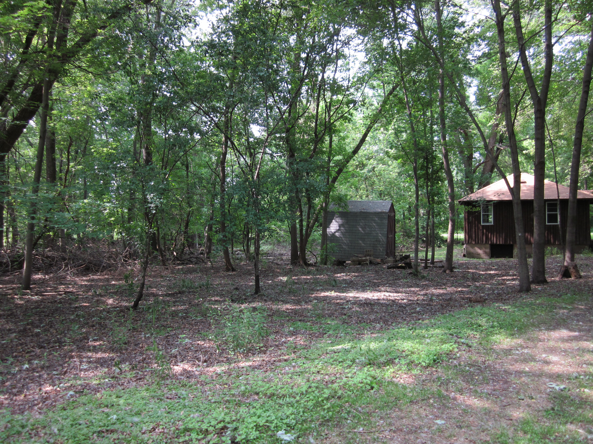
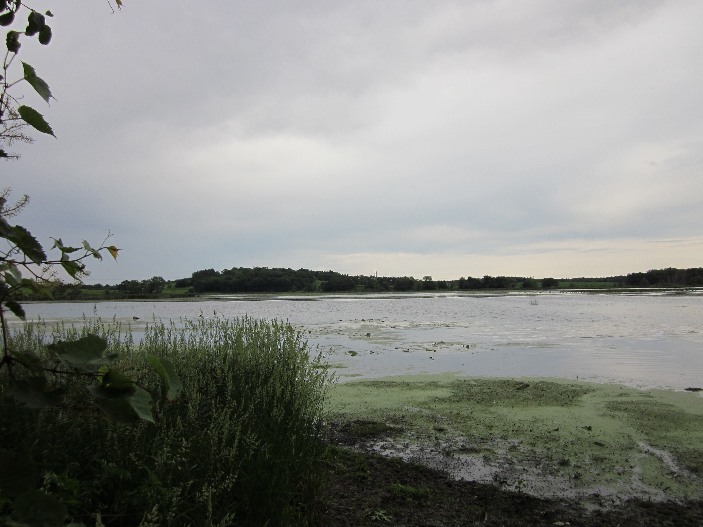
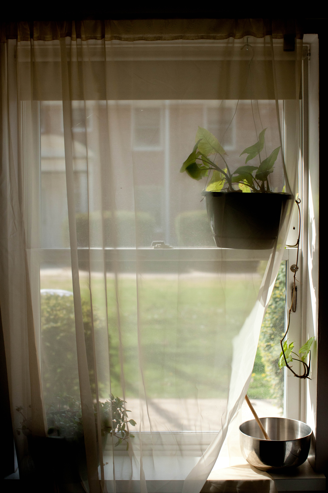
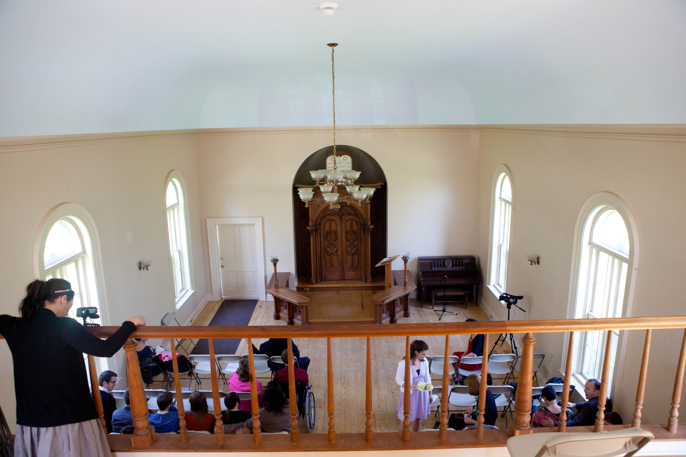
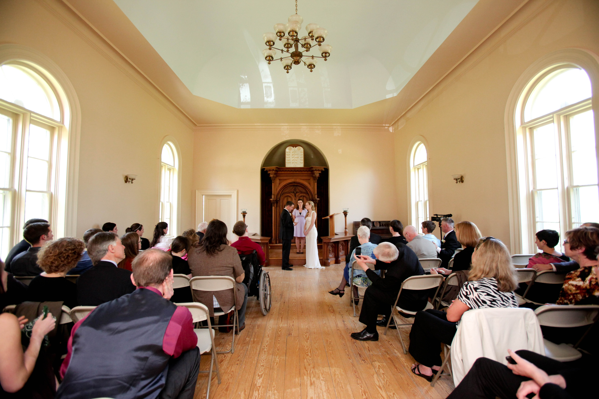
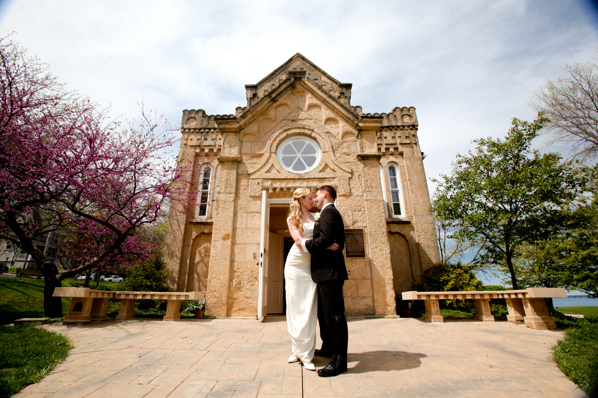

This is the first in a series of what I hope will be several posts looking at specific aspects of our wedding preparations. In this post I'll describe our decisions around the events of the weekend on which we got married and the venues where we decided to hold those events. The first and most important event for us to plan was the ceremony itself. In our earliest discussions, Laurel and I agreed that we wanted to have a small, intimate ceremony, with no more than 30-40 guests: immediate family, godparents, and close friends travelling from out of town. This wasn't meant to slight anyone, just to keep the ceremony at a human scale. We both agreed that we wanted to have a secular ceremony, as neither of us are currently active in a particular community of faith, and neither of us identified a local church or place of worship that we wanted to use for the ceremony. Laurel was the advance scout on wedding venues, and gathered information about several prominent sites in and around Dane County, several of which offered package deals for both a ceremony and reception. I think this was the first instance in which I experience sticker shock--I was surprised and a little sickened by the average price for many of the potential wedding sites, many of whom offered one rate for public events and gatherings and another, much higher, rate for weddings. At Madison's beautiful [Olbrich Gardens](http://www.olbrich.org), for example, a 3 hour reservation for a wedding ceremony costs either $470 or $750, while the reception room costs $510 or $665, depending on the time slot which it's being reserved for. Olbrich's atrium, the exact space which costs $470 for a three hour wedding reservation, can be reserved for as little as $120 for a four hour block on a weekday, while full-day (from 8 AM - 5 PM) and full-evening (from 5 PM - 11 PM) Saturday reservations [only cost $325](http://www.olbrich.org/rentals/roomrates_2012.cfm), nearly $150 less than the least expensive 3 hour wedding rental. We found this was fairly typical of wedding venues--the event itself allows venues to charge a premium quite outside of the ordinary market rates. Because we planned to have a small wedding and because we wanted to choose a place with special personal significance for both of us, we spoke about the possibility of having the wedding in Fort Atkinson, a nearby community that was important to us because it had been the home of Lorine Niedecker, a favorite poet, and the site of the poetry festival where we had reconnected at the beginning of our courtship ([more about that story](http://steelwagstaff.files.wordpress.com/2012/03/winter2012.pdf#page=3), if you're interested). I contacted Ann Engelman, the president of the Friends of Lorine Niedecker, and asked her whether it would be possible for us to hold our wedding ceremony outdoors at the site of Niedecker's cabin on Blackhawk Island, which is now privately owned. Ann suggested that we write the cabin's current owners to tell them a little about ourselves and our story, which we did, and told us that she'd check in with the owners, which she did. About a week later, Ann emailed to let us know that the owners had given their permission to use the site for a small wedding ceremony and that she'd also checked in with the sheriff's office about parking--and as far as she could see we could proceed with planning our wedding ceremony at the Niedecker cabin. Everyone was pretty excited, especially because as far as anyone knew would be the first time Lorine's cabin would host a wedding. Here's a photo of what the site looks like:

<figure class="align-left"><figcaption>Back side of Niedecker Cabin, viewed from near the banks of the Rock River</figcaption></figure>

As you can see, it's not particularly magical, but it was a place of special significance for us, and we thought that it would probably have been pleasant enough by April 21. We would have set up three dozen chairs in a semi circle near the cabin and had our officiant stand up near the three small trees visible just in front of the small shed. The biggest concern we had about using this site as our wedding location had to do with weather--we needed a site that offered some shelter and control of the elements in case it was particularly cold or rainy. Initially we reserved a large shelter in [Dorothy Cairnes Park](http://www.jeffersoncountywi.gov/jc/public/jchome.php?page_id=601&group=Parks&page_name=Dorothy%20Carnes%20Park), a large (514 acre) conservation park just outside of Fort Atkinson in Jefferson County--which incidentally, is gorgeous and would be a great spot for a wedding as well as being just a beautiful place for a day trip or nature trek (see image below). A few months before the wedding, however, we checked on the availability of the Gates of Heaven building in James Madison Park in Madison and discovered that a two-hour weekend rental for the building would cost just $110.

<figure class="align-left"><figcaption>View of Rose Lake from trail in Dorothy Carnes State Park</figcaption></figure>

Gates of Heaven was available on the morning or April 21st, so we reserved the building from 11 AM - 1 PM. Initially, I was a little concerned about the reservation, because the rental costs also lists what is described as a "wedding package"  for $500 (the package includes 2 hours of rehearsal time, 4 hours use of the facility on the day of the wedding and a park attendant for the 4 hours on the day of the wedding). We had no need of the extra features (or the extra costs) of the wedding package, but I was a little nervous about making the reservation, since several venues had previously refused to rent their spaces to me for shorter times and lesser rates once they knew the event was a wedding--many potential venues insisted that I had to rent their wedding package, even if another package seemed  like a better fit for our needs. Because Gates of Heaven was going to be our backup location, I was a little dishonest when they asked me what the reservation was for--I said it was going to be for a "family gathering"--which while technically true, also led the woman taking the reservation to believe that we'd be having a family reunion, not a wedding. As it turns out, I needn't have worried--the people I talked to at the City Parks Department Office were very cool, and none of them seemed to mind at all that we were planning to use the building for a wedding ceremony (and not a family reunion) during our 2 hour reservation, and at no point did anyone even attempt to upsell me to the $500 DELUXE WEDDING PACKAGE, for which I was really grateful. The weekend before the wedding was scheduled, Laurel and I traveled out to Fort Atkinson, where we met our officiant (Jen Gilmour, one of Laurel's oldest friends) who came in from Milwaukee and together the three of us scoped out the location at the Niedecker cabin and tried to visualize what we'd do for the wedding. The weather was a little grey, the ground was a bit soggy, and the current owners of the cabin were doing construction on another building closer to the water, which meant that the site was a little less appealing to the eyes--all reasons for slight concern. We left Fort Atkinson that afternoon a little unsure about the location--on the one hand, it really would have meant a lot to me to marry Laurel at Niedecker's cabin, but on the other hand, it would be more of a headache logistically getting our guests out to a slightly difficulty to find location in Fort Atkinson, where we'd be at the mercy of the weather, which would only add to our stress since it meant that we might be forced to call the wedding at the last minute and change locations. Laurel and I talked it over and slept on the decision, and then decided early in the week leading up to the wedding that as much as we loved the Niedecker cabin and its importance in our own story, it would be easier all around to hold the wedding at Gates of Heaven. We contacted our guests early that week to let them know about the venue change, and went ahead with our back-up plan.

<figure class="align-left"><figcaption>The view from our front window on the morning of April 21. Great weather!</figcaption></figure>

As it turned out, the weather on the 21st was gorgeous (despite what had been forecast earlier that week), which meant that an outdoor ceremony at the Niedecker cabin probably would have been lovely, though Gates of Heaven turned out to be such a fantastic location that we didn't regret changing the venue in the least. In terms of cost, beauty, size, ease of rental/use, and location I can't think of any venue in Madison that could possibly be better suited for a small non-denominational wedding. The interior of the building was spacious, full of natural light, simply adorned, and entirely tasteful. The building also features a small balcony at the rear which can hold overflow guests but also lends itself well as a place from which photographs can be taken or video can be filmed.

<figure class="align-left"><figcaption>View from balcony at Gates of Heaven (that's my sister Bonnie setting up a video camera in the left of the frame!)</figcaption></figure>

There were roughly 25 parking spots behind the building, which was far more than we needed, and the two hour rental gave us more than enough time (especially since no one was using the building before or after us--in fact, I had received a key to the building a few days before the wedding, so I could have even gone to set up chairs the night before after the last event had completed if I had wanted to).  Our ceremony itself took less than 25 minutes from the time that we approached the altar to the time we walked out of the building as a married couple, leaving us with plenty of time for set up before the wedding and lots of hugs, laughter, and photographs after the ceremony.

<figure class="align-left"><figcaption>Gates of Heaven seen from rear when filled with guests (roughly 40 people total)</figcaption></figure>

Besides the ceremony, we also decided to have a pizza party for friends and family the night before the wedding and a reception in the evening after the wedding ceremony. I was planning to write about those in this post, but this has already gone on far too long, so I'll save those for next time.

<figure class="align-left"><figcaption>Gates of Heaven, seen from front after our wedding</figcaption></figure>
