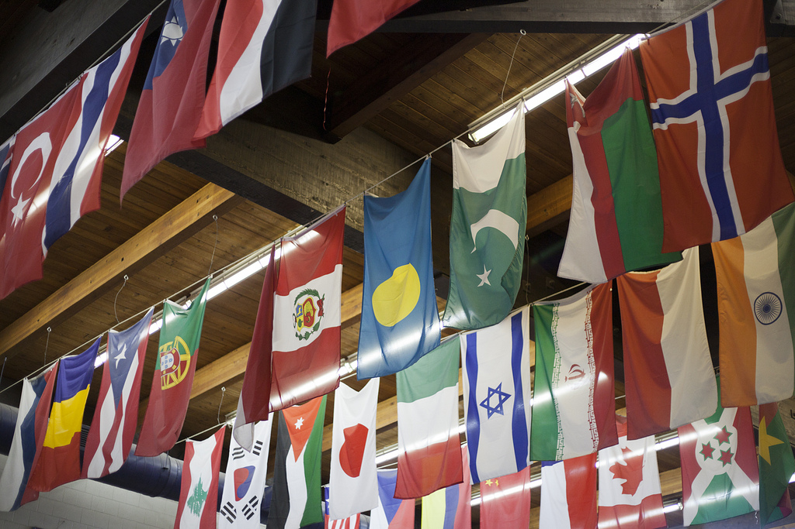
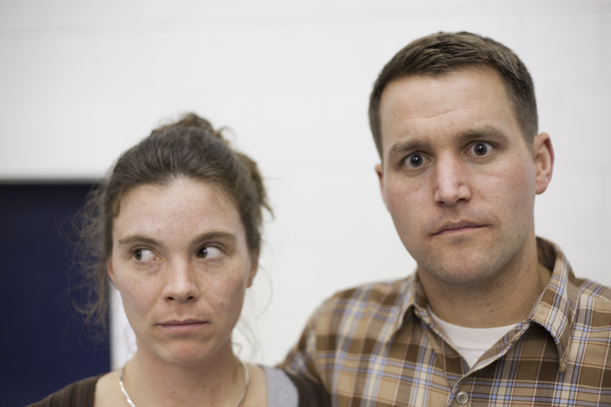
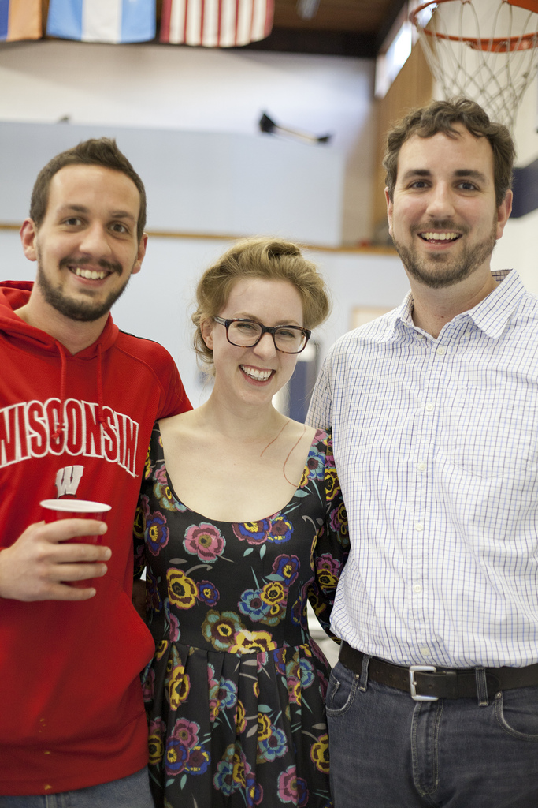
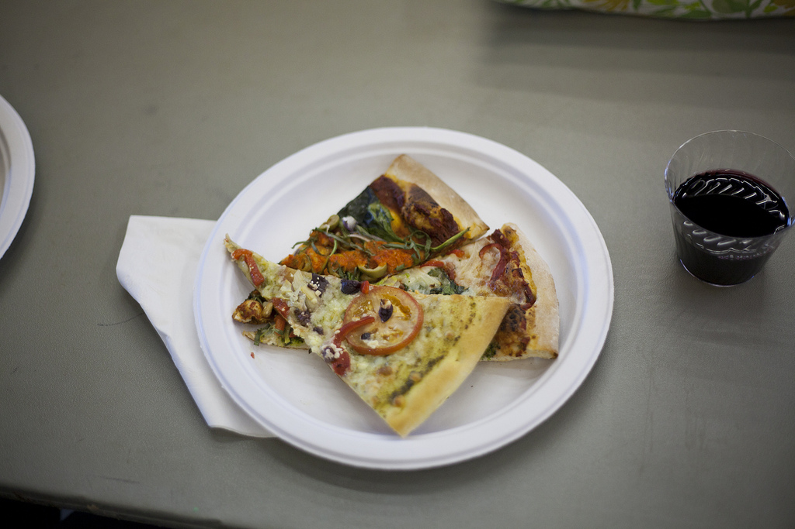
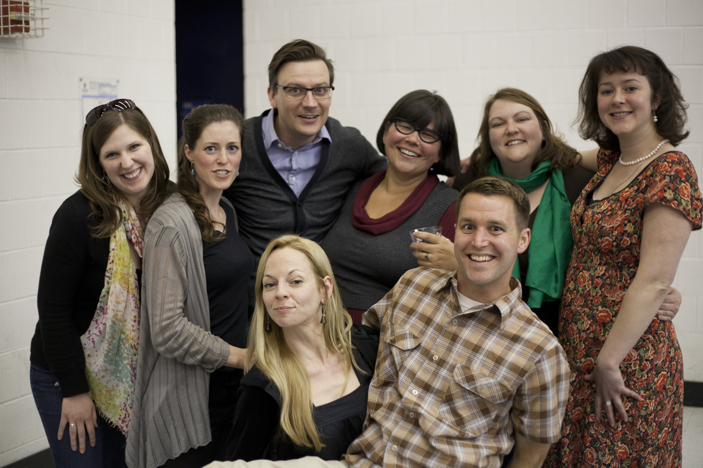
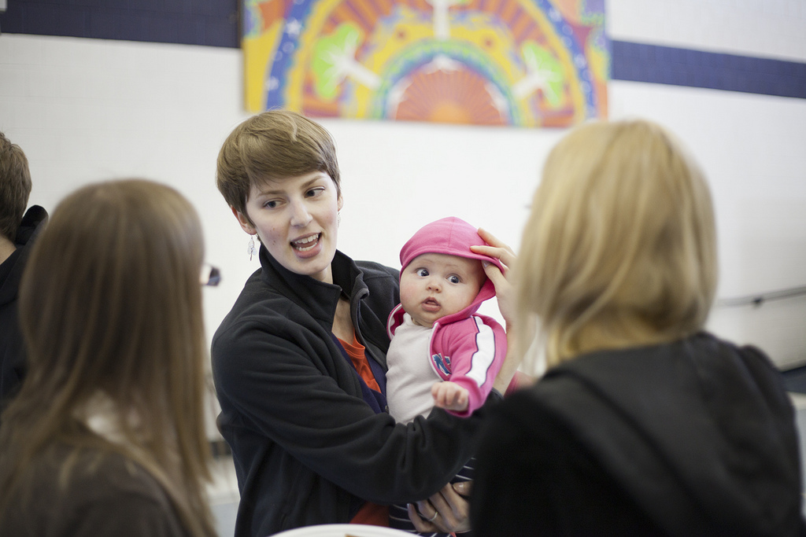
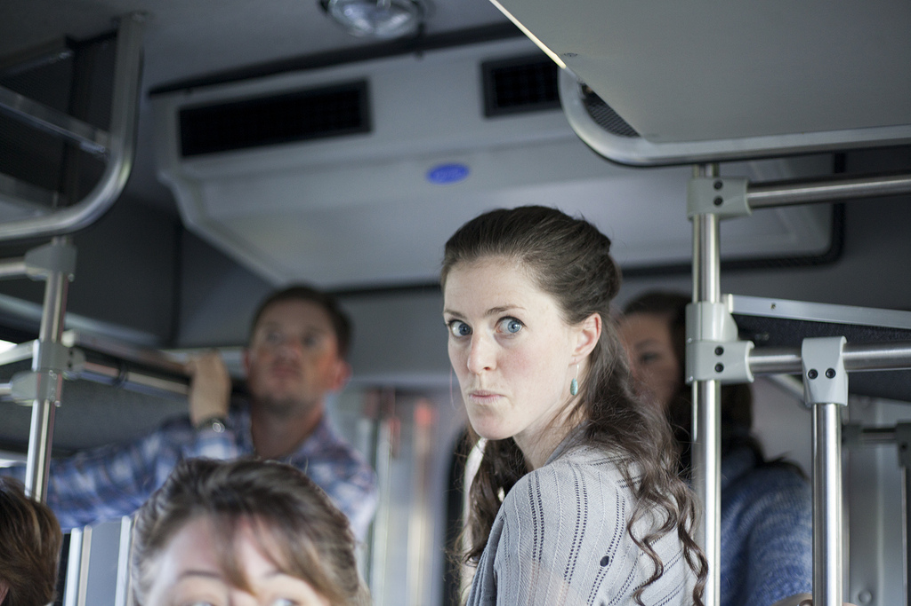
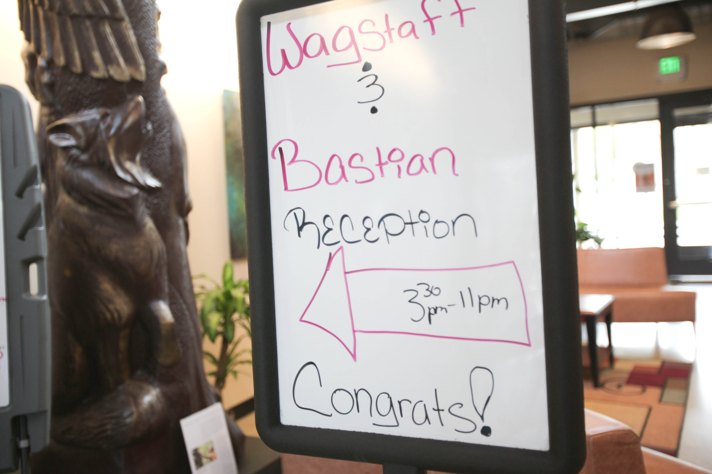
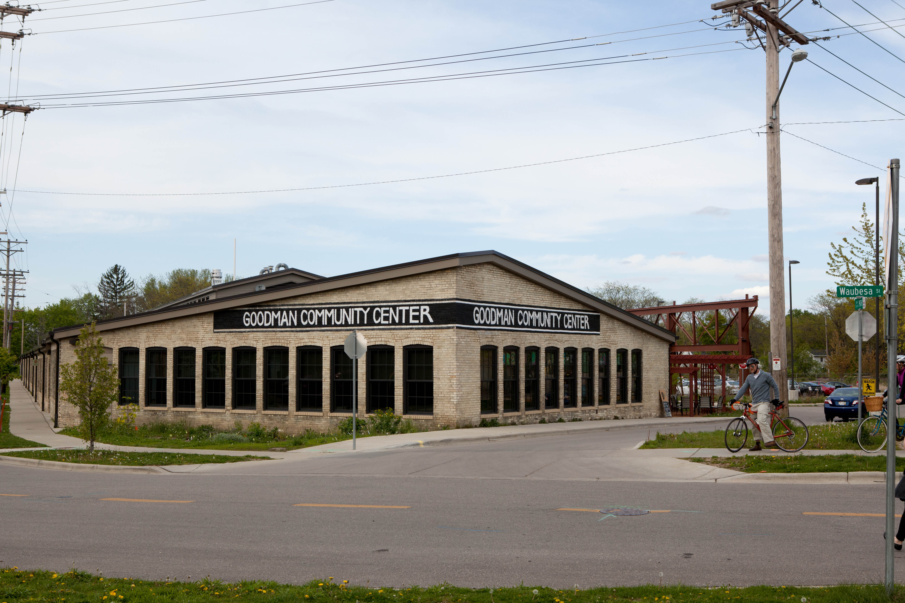
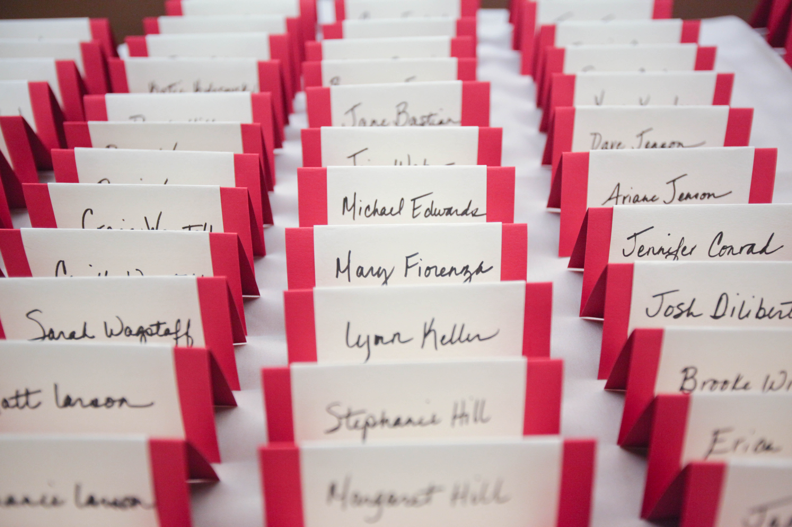

Yesterday I wrote about our wedding ceremony itself and our decision about where to hold it. Today I want to finish the post by writing about the two other events we held that weekend: a pizza party on Friday evening (the night before the wedding), and our wedding reception held later in the evening on the day our wedding was performed. **The Pizza Party:** 

<figure class="align-left"><figcaption>The ceiling of the community center's main gym is lined with flags from the native countries of several of the community's residents.</figcaption></figure>

We didn't have a wedding party--no best man or maid of honor, no groomsmen or bridesmaids, and the ceremony itself was brief and fairly simple, so we felt there was no need for a traditional rehearsal dinner. Instead of a rehearsal dinner, we thought it would be fun to have a relaxed, informal party the night before the wedding where we'd eat pizza and salad and let our family and any friends who were in town come and get to know each other a little before the wedding. We reserved the Eagle Heights Community Center (a large gym-like space in a community where I've lived for most of my time here in Madison) because it's walkable from our home, costs just $15/hour and had tons of space and a kitchen facility. While it's a great place to host parties and events like this, it can only be reserved 60 days in advance and I think it's can only be rented by residents of University Apartments which makes it a little tricky for people planning something similar in advance of a wedding. We didn't invite our photographer, but [Jennie](http://jenniferbastian.com/home.html), Laurel's younger sister, was there with her camera, so we have some great photos of the evening (she's a professional photographer).

<figure class="align-left"><figcaption>Jen Gilmour, our officiant and I combine our faces to make what might be my favorite picture of the night.</figcaption></figure>

It ended up being great--we ordered pizza from [Roman Candle](http://theromancandle.com/wp-content/uploads/2012/04/TRC_menu_middleton_2012_04.pdf) (they had the biggest range of vegetarian choices--we ended up ordering 3 16" pizzas in 6 different vegetarian varieties, which was incredible), spinach salad from Costco (we bought wayyyyy too much--for a second we forgot that our wedding was going to be in Wisconsin), Laurel bought organic red and white wines from Woodman's (I can't remember the label), and ordered a 1/2 keg of Spotted Cow from [Party Port](http://www.party-port.com/kegs.htm) (we ended up using it that evening, leaving it on ice overnight and then bringing it out the next night at the reception--and still had quite a bit left at the end of the evening). It was the first time that I'd ever reserved a keg of anything in my life, so I was glad to have Laurel's step-brothers on hand to tap it and get the libations flowing.

<figure class="align-left"><figcaption>The "beer gods"--Laurel's step-brothers Daniel and Patrick Hill, with Jennie Bastian, Laurel's sister in the center.</figcaption></figure>

I'm sure some guests were a little disappointed that we didn't have any animal flesh to consume, but they seemed to hide it well, and everybody looked happy and well fed by the end of the evening.

<figure class="align-left"><figcaption>Some of the pizza on offer. It was delicious.</figcaption></figure>

We also asked my old college roommates from Awesome City at BYU if they wanted to play some live music (they'd all been in college rock bands in Provo--_Zero to Nothing_ and _Vajra_ were the most prominent), which they did for the last hour or so of the party. It was a perfect evening--Laurel and I ate well, mingled and chatted with family and old friends, and all kinds of people met each other for the first time, reacquainted themselves with old friends, and exchanged stories, tall tales, and memories. We had the building reserved for fours hours (from 5-8 pm), but no one came to kick us out, so we ended up staying an extra 2 1/2 hours, laughing and rocking into the night (thanks Eagle Heights!). Total rental cost: $60

<figure class="align-left"><figcaption>Jessica Klaers, Sarah Wagstaff, Peter Meulenbroek, Janelle Pulczinski, Maureen Purcell, Colleen Lucey [back row, L-R] behind Laurel and Steel</figcaption></figure>

There were even a couple of super-cute babies there.

<figure class="align-left"><figcaption>Emeline Gardner holding her and Spencer's cute giant BABY Elsa!</figcaption></figure>

Many of our guests were staying at the nearby Best Western and Inntowner, which offered a free shuttle to and from the pizza party (because the Community Center is within a 2 mile radius from the hotel), so lots of our guests ended up traveling to and from the reception that way, which we were glad for (because they saved gas, had a fun social experience, and kept the roads safe since some of our guests drank alcohol that evening). It looked like a fun ride.

<figure class="align-left"><figcaption>My sister Sarah does her Zoolander face on the shuttle.</figcaption></figure>

**The Reception:**

<figure class="align-left"><figcaption>The staff (I think it was Bettye Johnson, but I'm not 100% sure) made a fun welcome sign to greet our guests at the entrance. Unless otherwise noted, all remaining photographs by Sarah Maughan of SLM Photography.</figcaption></figure>

The reception was obviously a little more complex to plan. As with the wedding itself, we wanted a small, relatively intimate event that would be memorable, personally significant, and consistent with our deepest values and greatest priorities. From the very beginning, Laurel wanted to hold the reception in the [Goodman Community Center](http://www.goodmancenter.org/about-center/mission-goals), a fantastic community center in the Atwood neighborhood on Madison's east side.

<figure class="align-left"><figcaption>The Goodman Center.</figcaption></figure>

In fact, this was the first reservation that we made--Laurel found out what dates the Goodman Center was available, and we planned our wedding around that timing (the main reason we got married on April 21st is because that was a Saturday in the spring where the Goodman Center was available). We did consider a few other locations for the reception, but I don't think we ever really seriously considered holding the reception anywhere but the Goodman Center, one of Laurel's favorite places (and organizations) in town. For the reception, we reserved the Evjue Community Room (where everyone was seated) and Merrill Lynch room (which held the bar, the buffet tables, and the dance floor).

<figure class="align-left"><figcaption>The Evjue community room, viewed from the Merrill Lynch room (there's an easily removable large sliding partition between the rooms that was open all evening for our event).</figcaption></figure>

<figure class="align-left"><figcaption>View of the Merrill Lynch and Evjue rooms from rear wall. My sisters Bonnie and Camille are apparently dancing by themselves while most guests finish their dinner.</figcaption></figure>

We made our [reservation arrangements](http://www.goodmancenter.org/services/reserving-rooms) through Kristi Kading, who also trained us on how to use the A/V equipment (the room has a projector and powerful stereo speakers) and helped us select the table settings.

<figure class="align-left"><figcaption>The large projection screen on the room's southernmost wall.</figcaption></figure>

We reserved the rooms from 3:30 PM - 11:30 PM, and the reception itself ran from 5-11PM, which gave us about an hour and a half to set up lights and decorations--it was enough time, but just barely. Laurel and I arrived around 4pm and helped organize several willing family members in preparing and decorating the room. We decided to hang Japanese lanterns, which looked beautiful, but were a little tricky in execution--fortunately Laurel's step-brothers are both over six feet tall and we had a tall ladder. Otherwise, our plan might not have come off so well.

<figure class="align-left"><figcaption>Erin Hill helps prepare the lanterns with Daniel and Patrick.</figcaption></figure>

<figure class="align-left"><figcaption>Lit lanterns set a table aglow.</figcaption></figure>

<figure class="align-left"><figcaption>Daniel strings the lanterns while Patrick directs.</figcaption></figure>

<figure class="align-left"><figcaption>Here's how the ceiling looked once the lanterns were all strung.</figcaption></figure>

For the name cards and table numbers, we went to [Artist & Craftsman](http://www.artistcraftsman.com/)in Madison and picked out two colors of cardstock paper that we thought would match our table settings, and then I cut them to size with an industrial cutter in the Art Department (I took a letterpress class in the semester leading up to our wedding--more on that when we write about the invitations). Laurel then hand wrote all the name cards and table numbers, and glued them together with help from her sisters. We arranged these in rows on a small table just outside the Evjue room, so that guests would see them and pick them up as they entered the reception room. They looked awesome (in my opinion).

<figure class="align-left"><figcaption>Laurel's sister Jennie arranges name cards.</figcaption></figure>

<figure class="align-left"><figcaption>Rows of name cards for table settings. Table numbers were written on the back.</figcaption></figure>

Just inside the reception room, we set up a long table which had our guest book and several pens and colored pencils. For the guest book, I bought a small (8 1/2" x 6") solid white [bare book](http://www.barebooks.com/books.htm) from Artists and Craftsman, and we asked guests to write us a note and draw us a picture. Laurel's cousin Stephanie Hill decorated the front cover for us and we got all kinds of amazing drawings (including cat dancers, microphone pants, flowers, stick figures, wedding tableaux, exploding pies and dancing babies and jackrabbits leading a patriotic dance dance revolution). It was a good guest book. While we didn't make a wedding registry and had asked our guests not to give us unneeded gifts, several of our guests brought cards and other generous offerings, which they left on this table, which also was home to our 'wedding favors'--the gift we wanted to give our guests: wedding poems, a folded letterpressed pamphlet with poems that Laurel and wrote for each other.

<figure class="align-left"><figcaption>Erin Hill, hard at work decorating the cover of our guest book.</figcaption></figure>

<figure class="align-left"><figcaption>Bev Buretta (Laurel's childhood next door neighbor and 'second mother') signs the guest book.</figcaption></figure>

In terms of seating, we had just under 100 total guests, seated at 13 circular tables (with 6-8 guests per table).

<figure class="align-left"><figcaption>What a finished table looked like before the floral centerpiece was added</figcaption></figure>

Laurel bought the flowers from a local grower in Milwaukee--largely tulips, daffodils, and narcissus--and arranged them beautifully, with a center piece at each table. More on this in a later post on decorations.

<figure class="align-left"><figcaption>Table #2 with floral centerpiece behind</figcaption></figure>

Laurel and I sat at a smaller table near the center of the room reserved just for us, which was lovingly adorned with flowers by Laurel's sisters and friends.

<figure class="align-left"><figcaption>Our table</figcaption></figure>

<figure class="align-left"><figcaption>Our table. Photo by Jennie Bastian.</figcaption></figure>

As for the program itself, we had invited guests to arrive at 5pm. Most did (some even came a little early!), and since we didn't have a formal reception line, we moved freely through the room, joining and leaving conversations, greeting guests as they arrived.

<figure class="align-left"><figcaption>My handwritten itinerary for the reception.</figcaption></figure>

We started the evening with appetizers (the evening's food was catered by [Working Class Catering](http://www.goodmancenter.org/services/working-class-catering), more about them in a later post on food). A buffet dinner with three vegetarian options was served around 6:30, followed by a short video of the wedding ceremony (since most of the wedding reception guests had not attended the wedding) and toasts from anyone who wanted to speak.

<figure class="align-left"><figcaption>Laurel and I laugh as Jennie toasts (or perhaps roasts?) us.</figcaption></figure>

After the toasts, we brought out the cupcakes (from our wonderfully talented neighbor Gale Shu--more on those in a later post) and then moved onto the dance floor, all tunes provided by the inimitable Mike Sherk of [Mandarin Dynasty](http://mandarindynasty.tumblr.com/) fame.

<figure class="align-left"><figcaption>In this rare, never before seen, behind-the-scenes shot, you can observe Mixmaster Michael Sherk as he carefully curates those very tunes which were later to blow our minds and free our booties.</figcaption></figure>

<figure class="align-left"><figcaption>Laurel and Mike discuss how and when exactly Mike plans to "drop the bass."</figcaption></figure>

The dancing began with Laurel and I taking the floor alone as Patti Griffin's song ["Not Alone"](http://grooveshark.com/s/Not+Alone/3o3SvD?src=5) played. It was beautiful. We wept.

<figure class="align-left"><figcaption>First dance.</figcaption></figure>

Laurel danced with her father for the second song, The Temptations' classic ["My Girl"](http://grooveshark.com/s/My+Girl/2v4W1I?src=5). Much jauntier--we all laughed and smiled. It was wonderful.

<figure class="align-left"><figcaption>Laurel and her father dance.</figcaption></figure>

For the third song, my mother and I danced to the Beatles' ["In My Life."](http://www.youtube.com/watch?v=T3wvUwb4p4Q) When I was a kid, growing up in Oklahoma, the Beatles' [_1962-1966_ (red album)](http://en.wikipedia.org/wiki/1962%E2%80%931966) was the first cassette tape I remember listening to in the car, and one of the only albums of music I ever remember my mom really enjoying--during car rides, she tended to prefer silence or very quiet talking (as the mother of four young children, can you really blame her?). Mom danced barefoot. It was great.

<figure class="align-left"><figcaption>I share a dance with mom.</figcaption></figure>

After that, things got real. I wish I had better photographic evidence of it, but the two men in wheelchairs were the most memorable and energetic dancers, breaking all kinds of stereotypes about the elderly and the so-called 'disabled.' Thanks Grandpa and Mattie for rocking the floor so hard (and an honorable mention to the lovely Jean Ellzey, who also wowed more than a few people with her nimble moves. While I may not have great photos of any of them leading the charge, I do have a couple of Laurel, who knows a thing or two about how to move.

<figure class="align-left"><figcaption>BOOM! Photo by Jennie Bastian.</figcaption></figure>

<figure class="align-left"><figcaption>Stepping out. Photo by Christine Hill.</figcaption></figure>

After the dancing ended (just before 11pm), we packed up the things we needed to take home (like the leftover cupcakes--hello box freezer!), gave away the lanterns and flowers, and went home. The Goodman Center takes care of final clean up and take down of the room, which was great, and also meant that we were out of the building by 11:45. Great evening, great experience, great venue. We couldn't recommend it more highly as a location for a wedding reception. Total Rental Cost: I can't remember the exact figure right now--I'll check our records and update this later. I think the building rental was around $800 plus a refundable $500 deposit, and the linens and table setting rental came to $365.
