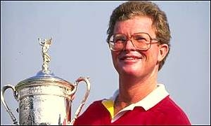
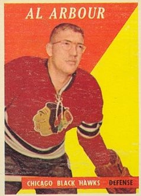
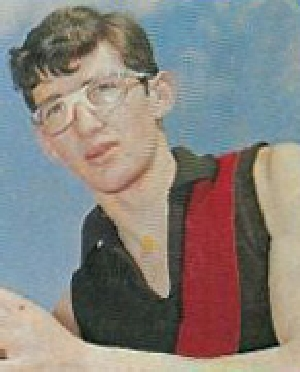

The weather has finally turned in Madison. It's still fairly cool here, but the snow is long gone and the grass is back, and the ground is hard enough for running and cutting and all the other things you need to do to play soccer outdoors. Finally. This week has been the first time I've been able to play soccer outdoors since last October, and it's been a long time coming. I played last night and had a great time, in no small part because one of the guys I was playing with was rocking full-on sports goggles, and they were so cool (and so rare) that it got me thinking about all the pro athletes who have sported goggles or glasses of some kind. I myself am severely ocularly challenged (I'm wearing spectacles at this very moment, for example), but I've always worn contact lenses whenever engaging in any kind of athletic activity. These stellar athletes haven't, however (each player's name links to an image of them booming some kind of radical eyewear).

Football

I remembered Eric Dickerson's rec specs right away, but was surprised to learn of several other players who used to play with glasses.

[gallery type="rectangular" link="file" ids="218,258,172,173,171,257" orderby="rand"]

Basketball

What's notable about this list is that all of the players listed were either power forwards or centers (with the exception of Caron Butler, who wore glasses briefly after an eye injury). Have any guards regularly worn glasses or goggles?

[gallery type="rectangular" link="file" ids="226,202,232,265,251,197,198,225,196,189,217,228,252,211,231,216,219,199" orderby="rand"]

Baseball

The first major leaguer to wear spectacles on the field was right-handed pitcher William "Whoop-La" White, 1877 – 1886. He later became an optician and founded the Buffalo Optical Company which is still in business today. I figure this is the kind of thing that Bill James is probably all over, but I don't have a copy of his Historical Abstract handy, so I'll have to make do with what I've got. UPDATE: There's this wikipedia page that seems pretty decent. Also, don't miss Lee "Specs" Meadows, the first 20th century major leaguer to wear glasses on the field, or George "Specs" Toporcer, the first major league infielder to wear glasses on the field.

[gallery type="rectangular" link="file" ids="191,255,205,253,192,227,229,268,206,190,170,201,200,193,256,203,208,194,195" orderby="rand"]

Soccer

Favorite story from this list: During the final leg of the 1970 Intercontinental Cup, Oscar Malbernat of Estudiantes tore Feyenoord defender Joop van Daele's glasses off, threw them on the grass and stomped on them. The broken glasses are now exhibited in Feyenoord's club museum.

[gallery type="rectangular" link="file" ids="222,169,212,230,213" orderby="rand"]

Track and Field

If you're going to check out just one of the glasses-wearing athletes on the page, make it Ato Boldon. Seriously, you will not regret it.

[gallery type="rectangular" link="file" ids="246,247,248" orderby="rand"]

Golf

I'm sure there's more, but since I don't really consider golf a sport, one will have to suffice.

<figure class="align-center"><figcaption>Tom Kite</figcaption></figure>

Hockey

<figure class="align-center"><figcaption>Al Arbour, who both wore glasses and played without a helmet!</figcaption></figure>

Aussie Rules Football

<figure class="align-center"><figcaption>Geoff Blethyn, Aussie Rules footballer</figcaption></figure>

Tennis

And, for the ladies, some terrific women's tennis players:

[gallery type="rectangular" link="file" ids="242,243"]

If there's anyone I'm forgetting or slighting (outside of baseball and golf), please let me know. I'm aiming for comprehensive coverage here.