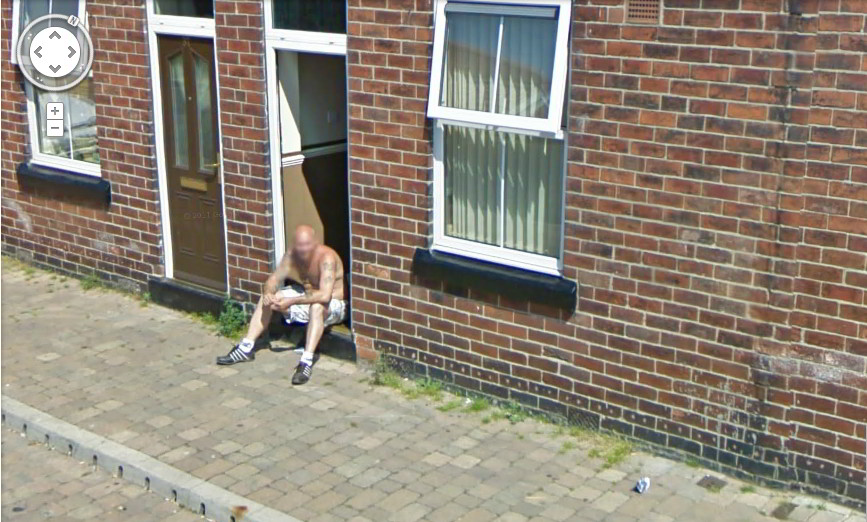

When I was 19 years old, just after completing my first year at [a large university](http://www.byu.edu) in the American West, I left school to spend two years as a Mormon missionary in the Northeast of England. When I arrived in Britain, I knew little to nothing about the present social or economic conditions of the cities that I would be living and working in. For the next two years I lived and worked in a string of devastated colliery and fishing towns whose economic centers had been ravaged by Thatcher-era political decisions, particularly the contentious privatization of Britain’s coal industry in the mid 1980s. My last assignment before returning home was in Barnsley, in South Yorkshire.

<figure class="align-none"><figcaption>Barnsley on a summers day. Photo by Jim Lucas.</figcaption></figure>

<figure class="align-right"><figcaption>National Union of Mineworkers (Great Britain) (Photo credit: Wikipedia)</figcaption></figure>

Barnsley is most famous as the setting for Ken Loach’s iconic film [_Kes_](http://www.criterion.com/films/27560-kes) and as the hometown of [Arthur Scargill](https://www.youtube.com/watch?v=5FPBMjFiPKc), the fiery Marxist leader of the National Union of Mineworkers (the principal union of coal miners in the UK) during the ill-fated [1984-5 strike](http://en.wikipedia.org/wiki/UK_miners'_strike_\(1984%E2%80%931985\))that culminated in the closure of a substantial percentage of Britain’s coal mines and the layoffs of thousands of workers in Britain’s coal mining communities. One day we received a media referral from a woman who had seen an advertisement on the television and called to get a free copy of a film made by the Church about Jesus’ life, death, and resurrection called the [Lamb of God](http://www.youtube.com/watch?v=winiZ1TZd8E). Her name was Anne Tyson, and the referral indicated that she lived at 34 Carlton St. in Grimethorpe, a nearby village. Neither of us had been to Grimethorpe, so we took the bus out late on a Thursday morning (it was August 14, 2003, just 3 days after my 21st birthday, actually) to see if we could find her in. When we arrived the city looked decimated. There were kids playing in what looked like a slag heap just across from the bus stop, throwing fragments of brick, glass bottles, and other rubbish at what remained of the streetlights. I’d seen some sad things on my mission, but this looked otherworldly. I felt as if I had entered into a forsaken place.

<figure class="align-none"><figcaption>Grimethorpe Colliery, 2000. Photo taken by Andy Bailey.</figcaption></figure>

I didn’t know it at the time, but Grimethorpe was infamous. Its [colliery brass band](http://grimethorpeband.com/) inspired the 1996 film [_Brassed Off_](http://www.youtube.com/watch?v=C8uoY9e5YVY), with Pete Postlethwaite & Ewan McGregor, but it was best known as one of the poorest and most deprived communities in all of Western Europe, with an unemployment rate that had hovered around 50% for much of the past decade.

<figure class="align-none"><figcaption>Grimethorpe Brass Band, 2012. Photo by David Geilby.</figcaption></figure>

Before we stopped at Anne’s address we spent some time knocking on doors in the village and stopping passersby in the streets, as was our practice. Most people were dismissive, as was their practice, but we got invited in to one home, I think, because it was raining heavily and they could tell by our accents that we were Yanks (which made a curiosity in a small provincial village like Grimethorpe). The people we spoke with talked about the crippling depression they felt to find themselves without work despite having two willing hands and a lifetime spent in the same occupation, of the despair they felt watching their community crumble and disintegrate, of their rage and frustration at being without work and without prospects for work, and of their feelings of betrayal at decisions made far from them and without their consent. When we finally got up to Anne Tyson’s street, it was mid-afternoon. We turned up Carlton Street and took a deep breath. It was in the middle of council estate, and it looked like total chaos. It was a long street of brick rowhouses, about 1/3 of which had their windows boarded up. Wild looking children were playing with a couple of dogs near the top of the street. One of them, a nasty looking bulldog, prattled past us, and I could literally see its skin bristle with fleas. The street was noisy, with several of the unboarded doors left open, with people drinking on the stoops. As we walked up the street we saw about half a dozen people running up and down the road and leaning out of upstairs windows in various states of undress, shouting profane things at each other and us. The kind of street we faced daily, but always dreaded, no matter how brave or openhearted we felt.

<figure class="align-none"><figcaption>Google Image street view of Carlton Street (just a few doors down from where Anne Tyson lived in 2003). This photo taken in 2009. The street looked much healthier--it seems Grimethorpe is healing.</figcaption></figure>

We knocked on the door at 34 Carlton St. It was answered by a youngish woman with peroxide bleached hair wearing a green tank top with a couple of dark, greasy looking stains. We introduced ourselves in the usual way and asked if she was Anne. “No,” she said, “I’m Melissa—well, Mel, axshly. Anne’s me mum.” Is she in, we asked? "Yeah," she said, "she’s juss inside." May we come in then, and deliver the film she ordered? “Lemme see,” she said, and turned her head and shouted over shoulder: “Maaaa, there’s some JoVo’s what’s here to give ya some Jesus thing. You wanna talk to ‘em?” We didn’t hear a response, but Mel looked back at us, and said "A’right, you can come in." Now the rules for us were that we had to have another male present (over the age of 12, I think) anytime we entered into a single woman’s home, or married women, or any women, really. So just before we step over the threshold I had to ask awkwardly, whether there’s a man in the home, explaining that I'm asking because it’s part of the rules that we have to live by as missionaries. “I dunno about a man,” Mel says, “but my bairn Ashley’s just outside.” She leaned past us, putting her head into the street and shouted, as big as you like, “Ash-ley! Ger’ in here. I need you for sum-itt.” Hearing Mel shout, a man a few houses down grabbed his crotch and hollered back, "Oy--Mel! I've got sum-itt for ya!" And several of the people drinking with him whistled and mocked and laughed. A few seconds later two kids appeared in the doorway next to us. One looked to be in his early teens, and the other must have been about 7 or 8. I hoped the bigger one was Ashley. “Ger’ inside Ashley,” Melissa said. “Keel, I’m not bovvered ‘bout you. These JoVo’s’re here to preach about God. You can do what you like.” The bigger kid bowed his head and vanished out of sight behind her into the living room. I felt relieved. Keel didn’t respond to Mel, but stood there on the doorstep for a couple of seconds staring hard at us. “Are you from ‘Merica?” he asked. “Yeah,” I said. “How 'bout you?” “No. I’m from Grimethorpe, me.” Deadpan. He slipped past Mel into the living room. Mel looked at us both and turned back inside. “Well, you comin’ in or wot?” We stepped over the threshold into Anne Tyson’s living room. The room was dark and thick with cigarette smoke so it took a few seconds for me to take in all the surroundings. Anne was a big woman, seated on an filthy old floral print couch that looked like it was made of slick velvet. It had dark discolorations all over it. She motioned for us to sit down. The only sound in the room was a deep wheezing that came from Anne’s respirator, a big silver oxygen tank just beside her at the far end of the couch, with tubes running to strategic places in her body. She was smoking, and had two 3-liter plastic bottles of [White Lightning cider](http://alcoholresearchuk.org/2012/02/01/white-cider-and-street-drinkers/) at her feet. We came in and taught the family. It was a good discussion, I suppose. Anne was earnest and curious, as I recall. I’m sure that many things were said or done during that conversation, and my journal and weekly records indicate that we returned at least once more to visit with Anne, but I don’t remember any of that. I remember only two things:

1.  Her grandson Ashley was tall for his age, of what the English call ‘mixed race’, and had long, sinewy arms. He had the look of a tremendous baseball pitcher. He was wearing a [burberry hat](http://www.avenue7.com/MakeThumbnail/400/400/ProductImages/GoodsPickedByShoppers/12942184688812627582740916-40e0-4630-b0b1-bff26b33dca2[D]jpg) and track suit bottoms. No shirt. He took his hat off when we began speaking, perhaps out of respect??? His hair was faintly red. The most striking feature about him, though, were brilliant green eyes, enormous and very earnest. At one point in our conversation he spoke quickly and with surprise about something someone had said, using some profane language. I don’t remember what he said, but I remember the immediate look of shock and embarrassment on his face, and that he looked at us as if he were about to cry and then apologized, unbidden. This was very, very unusual. I was shocked and touched. I felt immediately that he was a singular child, not as hard and cruel as many of the children we met in similar circumstances. I wrote later in my journal about my distinct feelings that he was one of “[the pure in heart](http://www.biblegateway.com/passage/?search=Matthew%205:1-10&version=KJV)” and worried about his future, about his life.
2.  At one point in our conversation, Anne belched just before she turned to speak to me. It was inadvertent, but she released her breath directly towards me. The smell of her breath in that moment was possibly the foulest thing I have ever smelled, a fetid mix of rot and death, cigarettes and cheap grain alcohol and almost 20 years of a closed colliery and abandoned mines. I nearly vomited and tried to turn away discreetly and catch my breath without being unkind. It is hard to say all the things that I felt (and feel) surrounding that smell, the fragrance, what knowledge it disclosed, what deep wounding it emanated from and transmitted. It was the most powerful smell I have ever experienced, and with the exception of the events surrounding my first marriage and subsequent divorce, probably the saddest moment of my life.

Two weeks later, I was on an airplane flying back across the Atlantic, heading home. My family greeted me at the airport, along with my friend Matt Larson.

<figure class="align-none"><figcaption>Photo taken in the Boise airport tunnel, minutes after my family and I saw each other for the first time in nearly two years. Sarah, Camille, Me, Craig, Patti, Bonnie [L-R]</figcaption></figure>

I understand that Mel and Ashley moved to Leeds shortly after I left Barnsley. I feel quite certain that Anne is dead, and that the video cassette we delivered did not long survive her. And I still cannot think of Grimethorpe without a surge of rage and helplessness in my throat.
