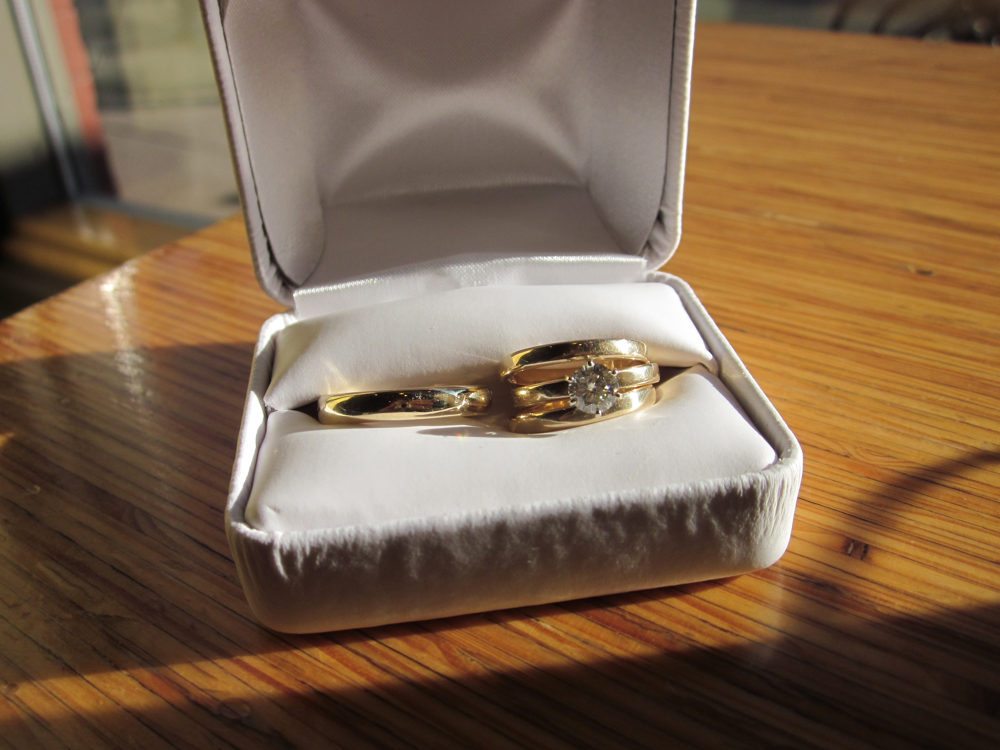

It's been a long while since I've posted anything here. I'm getting married next month, and much of the past several months has been filled with my preparations for the wedding--with doing things that will make the event more meaningful, memorable, and consistent with our values and ideals. 

As part of this process, we've made wedding rings for each other under the incredible tutelage of the wonderful Hiroko Yamada, master metalsmith and co-owner of the [HYART gallery](http://hyartgallery.com/about-us/) in Madison, and recently designed and printed our wedding announcements a Vandercook letterpress (super interesting! but more on this in a future post). Both experiences were fantastic, and we've learned a lot and grown in love and respect for each other and for the process of careful attention and craftsman(and -woman)-ship required to make beautiful things.

<figure class="align-none"><figcaption>A picture of the finished rings. The ring Laurel made for me is on the left, the rings I made for her are on the right.</figcaption></figure>

I'm also posting because I recently wrote part of our love story for _Solitary Plover_, the [Friends of Lorine Niedecker](http://lorineniedecker.org/)'s biannual newsletter. Ann Engelman, the president of the Friends and a really wonderful woman to boot, requested that Laurel and I write our story for their publication, since attending the Lorine Niedecker festival was an important event in our having grown to love one another. 

I wrote a brief account of the role that Lorine's poetry played in our current happiness called "Lorine Was Our Matchmaker", which you can read in the [Winter 2012 issue](http://www.lorineniedecker.org/documents/Winter2012.pdf#page=3) of the newsletter. In case you can't get the PDF to open correctly, [here's a locally hosted version](http://steelwagstaff.files.wordpress.com/2012/03/winter2012.pdf).
