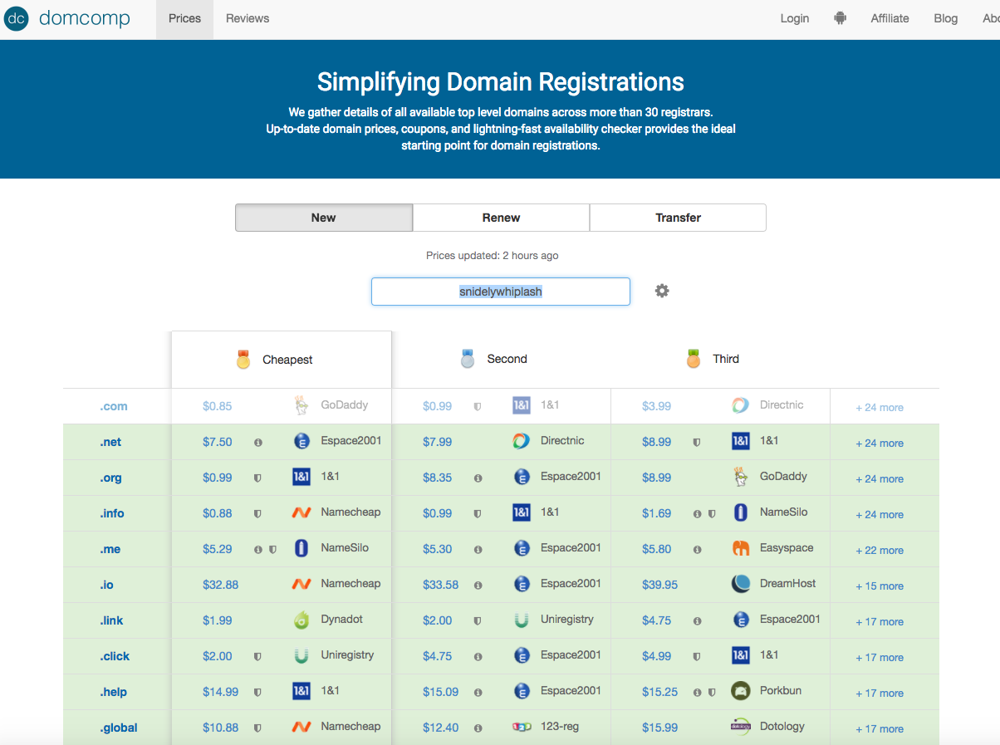
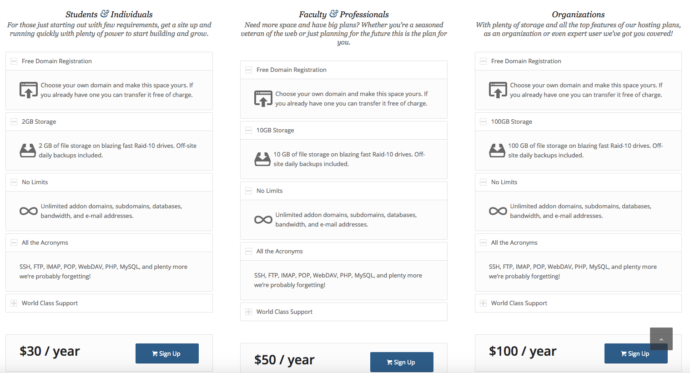

I currently work as an educational technology consultant at a large Midwestern research university. Most of the people I work with are humanities/social science grad students or faculty. One of the most common questions I get asked is how to build a website. I’ve heard it so often, helped so many friends [build quick, simple websites](http://steelwagstaff.info/design) by now, and seen enough capable-yet- overwhelmed-veering-on-desperate people overpay for something that’s relatively simple to do yourself that I figured it was time to write up my advice.((The ideas for much of what I’m presenting here originated in [a presentation for grad students in the environmental humanities](https://docs.google.com/document/d/10Gm3HsS6TJoB19GDSa6-FY9LNx9ijS_CetM0AELfnHI/edit?usp=sharing) I put together a couple of years ago along with my friend [Garrett Nelson](http://people.matinic.us/garrett/#about), who is now a postdoctoral geographer at Dartmouth.))

## What you need to make a website

To publish and maintain a website you will need three things:

1.  an address where your site lives \[**domain registration**\],
2.  storage space to put stuff \[**web hosting**\], and
3.  a method for writing, publishing, and editing your content \[**content management system**\].

Each of these elements can be obtained separately though one or more of them are often bundled together. Many web hosts, for example, will include one year’s worth of a domain registration in the price of creating an account, and some all-in-one content management systems (like Squarespace) will include both hosting and annual domain registration in their monthly price. I’m what follows, however, I’m going to take these three requirements in turn, describing a little more about these things commonly work and offering some recommendations. My recommendations will be biased towards low-cost, open source, DIY solutions, with privacy and ease of use as secondary considerations.

### TL;DR recommendations

If all you want to know is what you should do, here’s what I’d recommend as the best choice for the greatest number of people.

1.  Get a shared hosting account (and domain name) from [Reclaim Hosting](https://reclaimhosting.com/shared-hosting/). For $30 / year you can get 2GB of storage on a shared server and domain name all your own. This is all you need to build an attractive personal website.
2.  Install WordPress. If you use Reclaim as your host, they make this [very simple](https://portal.reclaimhosting.com/knowledgebase.php?action=displayarticle&id=2).
3.  Choose a theme((If you’re interested in the [Genesis Framework](https://www.studiopress.com/features/) or any of the [StudioPress themes](http://my.studiopress.com/themes/), I purchased their [Pro Plus package](http://my.studiopress.com/pro-plus/) a few years ago, which means that I’m able to install any of these themes on as many sites as I want pretty much forever. I’m happy to share. Let me know …)) and build your website.

**EDIT:** I’ve had some feedback on these recommendations since publishing. If you’re a Mac user who is willing to set up a GitHub account and learn to use a Command line interface, another excellent option is publish your site on GitHub pages using an excellent open source tool called [Jekyll](https://jekyllrb.com/). It’s totally free, and very powerful, though you will need do some slightly difficult technical things to get started. Here are two tutorials to help you get started on this route: [Amanda Visconti’s guide at Programming Historian](http://programminghistorian.org/lessons/building-static-sites-with-jekyll-github-pages) and [Barry Clark’s at Smashing Magazine](https://www.smashingmagazine.com/2014/08/build-blog-jekyll-github-pages/). [Audrey Watters](https://twitter.com/audreywatters), one of my favorite education and technology writers, uses Jekyll to power [her site (Hack Education)](http://hackeducation.com/), which is a good example of what you can do with the tool.

So, those are my recommendations. If you’re curious to know more about the general process of building a website, however, or want to know more about any part of these recommendations, please continue on.

* * *

## 1\. Obtaining an address for your website: Domain Registration

### Brief explanation of the internet \[skippable\]

The internet exists as a gigantic meta-network of connected networks made up of an enormous and ever-increasing number of different nodes. Internet connected objects (like computers and other connected devices) are able to be assembled into a common network because they share a common framework for communicating (they use a protocol called [TCP/IP](https://en.wikipedia.org/wiki/Internet_protocol_suite)). Machines and resources can be connected to the internet as clients (which request stuff) and/or servers (which respond to the requests, usually by providing what it thinks has been requested). Every device on the internet is typically issued a unique [IP number](https://en.wikipedia.org/wiki/IPv6), which can be used to identify and disambiguate a client or a resource connected to the network. When you use an internet browser, you usually enter a ‘web address’ and expect a website to load. What you’re typically entering in your address bar is a ‘domain name’ expressed using something called **h**yper**t**ext **t**ransfer **p**rotocol ([http](https://en.wikipedia.org/wiki/Hypertext_Transfer_Protocol)). Each domain name maps to a specific IP address. The IP address is the ‘real’ address of the website, and the domain name should be thought of as a more convenient, easy to remember nickname (if you’re curious to learn more, see [Paul Gil](https://twitter.com/AboutNetBasics)’s very [helpful explanation](https://www.lifewire.com/what-is-an-ip-address-2483314) of the difference between IP address and domain names at _Lifewire_).

### Registering a Domain Name

Because it’s incredibly difficult for individuals to buy individual IP addresses, most people who make websites start by registering a domain name (for a good primer on how domain names work, see Nikola Krajacic’s [article on the topic](http://domain.me/how-domain-names-work/) at domain.me). When you register a domain name, you’ll be picking an address with two parts separated by a period — most addresses look something like this: http://example.\[zzz\]. When you pick the name of your website, you have the ability to making two choices: the name of your domain \[the part before the period\] and the top-level domain you want your site to be registered with \[the part after the period\].

#### Part 1: The name of your domain

When picking your domain name, you have very few constraints. The biggest one will probably be competition with other internet users. For a personal website, you may want to register a domain name that is some variant of your name. If you have a common name, you may find that your desired domain name is unavailable because someone has already registered the domain name you want. If you have an uncommon name \[like mine\], your choices will probably be less constrained. As a rule of thumb, shorter domain names which are easy to remember and type without misspellings are preferable to those that aren’t.

#### Part 2: The Top-level domain \[or TLD\]

The second part of your web address will be the top-level domain of your site. Top-level domains, or TLDs, are the set of letters that follow the first period in your web address. Many TLDs (like .com or .info) can be considered open and generic, meaning anyone can register a domain name which uses them, though other common TLDs (like .edu, .gov, or .mil) are restricted to specific organization or entities. All TLDs are supposed to have descriptive significance, but these intended meanings are often unknown and frequently applied differently than their creators intended (like the popular [tech-related TLD .io](https://gigaom.com/2014/06/30/the-dark-side-of-io-how-the-u-k-is-making-web-domain-profits-from-a-shady-cold-war-land-deal/)). As of February 2017, there are [more than 1500 available TLDs](https://en.wikipedia.org/wiki/List_of_Internet_top-level_domains), though only the most commonly used TLDs will likely be familiar to most American internet users: .com, .org, .net, .edu, .gov, and perhaps .info or .io. The availability of so many TLD choices means that if you’re really attached to a particular domain name, you can almost certainly buy a variation on it provided that you’re willing to be flexible about the TLD. While you can use TLDs [creatively](https://www.smashingmagazine.com/2009/07/get-creative-with-your-domain-names/) \[smashi.ng would be an acceptable web domain, for example, as .ng is the TLD for Nigeria\], whether you’d actually want to have your website at YOURNAME.dk or some other lesser-known TLD is a different question, however.

#### Putting them both together

So, basically, what I’m saying is that you need to register a domain name for your website. The easiest way to do this is to use a domain registrar, which is a company that lets you reserve a specific domain name for a specified length of time. You rent a name, and that’s just about it. Some companies will try to upsell you a bunch of useless add-ons, which you should resist. In most cases, the only feature worth getting with your domain registration is WHOIS privacy, which allows you to shield your required registration information from marketers and other spam artists. Many registrars will even include this feature in the price of registration. Registering a domain name is not a particularly complicated process, and the service that various registrars offer is pretty much identical which means that domain registration is pretty much as close to a totally fungible commodity as you can get. And yet, the prices you’ll get charged for this can vary quite a bit. **Don’t overpay:** you should be able to register your domain for ~$10/year.

Note that if your domain registration and your hosting are purchased with different companies (totally common), all you should need to do is make sure that your ‘name servers’ are pointed at your host. Most hosts will have very simple instructions for this, but they’ll typically need to be set to something like ‘ns1.bluehost.com’ and ‘ns2.bluehost.com.’

## My domain registration recommendations:

If you’re simply building a single personal/professional website for yourself, and only need one domain, you may want to consider bundling your domain registration with your hosting (see my recommendations for shared web hosting below). If you’re going to be registering more than one domain, or plan to host with someone other than Reclaim Hosting, you should probably consider registering your domain separately from your web hosting, in part because while many hosts will give you a ‘free domain’ when you sign up for hosting, what they’re really giving you is one year of domain registration, and they’ll often charge you well above the market rate when you have to renew your registration at the end of the first year.

### For comparing prices and checking domain availability:

Use [domcomp](https://www.domcomp.com/), a very simple comparison website. You enter the name you’re thinking of, and it’ll show you which TLDs are available and who’s offering what price. Look at your registrar’s going renewal price as well (since you’ll likely want to renew your registration annually) — don’t simply jump for the company offering you the lowest new registration cost. If you already have a domain registered somewhere, you should also take a look at the transfer costs — transferring domain registrations is fairly easy, and if you find a good, low-cost registrar, will save you money in the long run (I’ve transferred all my domains to NameSilo, for example).

<figure class="align-none"><figcaption>Sample domcomp.com search for the domain ‘snidelywhiplash’. You can see that&nbsp;.com is already reserved, but&nbsp;.net,&nbsp;.org.&nbsp;.info, etc. are all available and what the going price&nbsp;is.</figcaption></figure>

### Domain Registrar:

I’ve registered domain names with probably a dozen different companies over the years, some good, and some terrible. I have three criteria that matter to me: price, WHOIS privacy, and absence of upselling/marketing. I currently use NameSilo, which satisfies all three requirements for me. I’ve created [an affiliate link](https://www.namesilo.com/?rid=013ae26vx) to allow anyone to get $1 off initial domain registrations (enter the coupon code ‘Medium’). Full disclosure: I will receive [a 10% commission](https://www.namesilo.com/account_affiliate_details.php) for initial purchases from new accounts if you use my affiliate link.

**Why I Like NameSilo:** All they do is domain registration and they’ve never sent me unwanted solicitations or tried to upsell me anything. Very good prices for all kinds of TLDs and registering, renewing and transferring domains with them is quick and easy. They include WHOIS privacy in the purchase price. Finally, they have an affiliate program which lets me create $1 off coupons and earn a small commission on referrals (I don’t really care that much about this, but maybe you will).

## 2\. Storage Space to Put Stuff: Web Hosting

The second thing you need to have a website is space to store the material that people will see when they visit your domain. The most common solution to this is to rent space on someone else’s web server (a hard drive connected securely to the internet). Renting server space is commonly referred to as buying web ‘hosting.’ For a personal website, you will generally be just fine with what’s called a ‘shared hosting’ account, which means that your files will be stored on a server (hard drive) alongside the files of several other renters. Think of purchase shared web hosting as being like renting a storage unit — you all have units at the same property, but each of you has your own storage units with your own locks, so they can’t see and mess with your stuff, and you can’t see and mess with their stuff. There are all kinds of extra fancy things that web hosts offer (and will try to sell you), but most of them are unnecessary. You really only need space and bandwidth, and those generally are quite cheap.

## My Hosting Recommendations:

### For Personal Websites for Academics or Academic Organizations:

I strongly recommend buying hosting from [Reclaim Hosting](https://reclaimhosting.com/). They’re a small company founded in 2013 that grew out of the University of Mary Washington’s [A Domain of One’s Own](https://reclaimhosting.com/domain-of-ones-own/) service, which was & is awesome, and not just because it paid homage to Virginia Woolf.

**Why I like Reclaim:** their basic hosting services are fantastic, their customer service [is legendarily good](https://reclaimhosting.com/what-people-are-saying/), and their prices are unmatched. They offer three [shared hosting packages](https://reclaimhosting.com/shared-hosting/), which are identical, except for how much space they give you on the server. “Students & Individuals” gives you 2GB for $30/year, “Faculty & Professionals” gives you 10GB for $50/year and Large “Organizations” gives you 100GB for $100/year. If you’re just going to be hosting a simple personal website, 2GB should be more than enough space.

<figure class="align-none"><figcaption>The three <a href="https://reclaimhosting.com/shared-hosting/" target="_blank">shared hosting packages</a> offered by Reclaim Hosting.</figcaption></figure>

### Hosting for Registered Nonprofit Organizations:

If you work for a registered nonprofit organization, I’d recommend applying for [Dreamhost’s free shared hosting account](https://help.dreamhost.com/hc/en-us/articles/215769478-Non-profit-discount). You have to provide documentation that you’re a registered 501(c)3 organization, but if you provide that, you’re eligible for a single shared hosting account, which should do everything you need to host a simple organizational website. I’ve helped a handful of nonprofits use this service, and have been impressed with Dreamhost’s hosting and customer support (and the price is literally unbeatable!). Registered non-profits can also get free or heavily discounted access to a number of other great technology tools, like [Slack](https://get.slack.help/hc/en-us/articles/204368833-Slack-for-Nonprofits) and [Airtable](https://airtable.com/shr9DxhP6lU9slZE6), to name just two.

### If you need something bigger/better:

I’ve had good shared hosting experiences with both Bluehost and Dreamhost. I currently have a Bluehost Plus account ([introductory price](https://my.bluehost.com/cgi/help/price)$5.45/mo for 36 months, following which the standard price is $10.99/mo). Dreamhost’s [base price is $10.95 / month](https://help.dreamhost.com/hc/en-us/articles/215560437-What-types-of-hosting-plans-are-available-), but discounts kick in if you sign up for a longer duration up front. If you buy 3 years of hosting upfront, your monthly cost will be just $7.95/mo, for example, and if you buy 10 years, the monthly price drops to $5.95/mo. If I needed more server space than Reclaim offered and wanted to set up a shared hosting account right now, I’d choose bluehost if I thought the site would only exist for 3 years or less, and Dreamhost if I envisioned it being around for longer.

## 3\. A method for writing, publishing, and editing your content: Content Management System

Once you’ve got a domain \[an address\] and web hosting \[space to put stuff\], the last thing you’ll need is a system for writing, editing and publishing the content you want to appear at your domain. You can (and maybe should!) [learn to write HTML5, CSS3, and javascript yourself](https://dash.generalassemb.ly/) and hand code your site (that’s where I got my start and how I built my first several sites), but most you probably have other places where you’d like to spend your time. Fortunately, there are a number of Content Management Systems \[CMSes\] which you can use to produce and display dynamic web content. The three most commonly used CMSes on the web today are WordPress \[58.7% of sites that use a CMS, according to [February 2017 data from W3Techs](https://w3techs.com/technologies/history_overview/content_management)\], Joomla \[7.1%\], and Drupal \[4.7%\]. Each is free and open source software, and all can be used to build beautiful websites.

You can also use all-in-one website builder tools which bundle design with domain registration and hosting from companies like Squarespace, Wix, or Weebly. Many users find these tools easy to use and they let people build attractive, template-based sites for a reasonable fee (they’re usually not much more expensive than typical shared hosting accounts). Downsides are that they are more expensive that using a self-hosted open-source CMS (free!) and that it can be very difficult to get your content out once you’ve put it in, which means that you’re essentially locking yourself in to being a long-term customer of the company. If they raise their rates, you’re often pretty much stuck, unless you want to rebuild your site somewhere else. For these reasons, I recommend installing an open-source CMS on your own self-hosted site.

## My CMS Recommendation:

For almost everyone who is new to web development and wants to build a basic information site (with the ability to blog), I’d recommend using WordPress, which you can [download from their website](https://wordpress.org/download/) and install in just a few minutes ([they promise a 5-minute install](https://codex.wordpress.org/Installing_WordPress), but that may be a little optimistic for most first time users). Many people are already familiar with WordPress through wordpress.com, which is a commercial software-as-a-service instance of WordPress where users can build basic free websites and let someone else handle hosting and server configuration. After I became curious about CMSes after a few years of building my own websites with pure HTML/CSS, I started on the .com version of [WordPress](https://steelwagstaff.wordpress.com/) before eventually moving on to the WordPress-powered self-hosted site that I now maintain at [http://steelwagstaff.info](http://steelwagstaff.info./). Wordress.com is certainly a nice gateway for new website builders, but going the self-hosted WordPress.org route provides you with lots more flexibility and no additional costs (apart from hosting and domain registration). Here’s a quick comparison of the two methods:

#### WordPress.com

You go to wordpress.com, register an available second-level domain (EXAMPLE.wordpress.com) and build your website. Wordpress.com is actually a big multisite network administered by someone else, so you’re constrained in what you can install and change. They have a bunch of already installed and configured tools and plugins that you can use to make your site look the way you want it to, but if you want to move beyond the fairly narrow range of themes and configuration options, you’ll have to begin paying for a premium account, and some things just aren’t permitted or allowed because of how the multisite is configured.

**Pros:** Someone else handles hosting and server configuration. You can make a free site quickly and beautifully with easy to use tools, provided you don’t mind having a .wordpress.com domain and can live within the constraints of the free plan.

**Cons:** Your domain has to end with wordpress.com (doesn’t always convey the right professional image). If you want to do more than a few basic customizations, you have to start paying.

#### WordPress.org

You download the WordPress software and install on your web host. Once you’ve set up your database and configured the installation, you can then create content, select a theme, and install and configure plugins. The range of possibilities with WordPress is quite vast.

**Pros:** This is free, open-source software, so you only have to pay for hosting (unless you want to buy premium themes or plugins). Plugins exist for almost anything you can imagine. You can make your site look however you want, almost. You can make all kinds of decisions and do things yourself!

**Cons:** You have to make decisions and do things yourself.

**Note for friends:** If you decide you want to go the self-hosted WordPress route, I purchased the [ProPlus package](http://my.studiopress.com/pro-plus/) from StudioPress a few years back, which means that I have the ability to install the Genesis Framework and any of their child themes on as many sites as I want for the rest of time. The [Genesis framework](http://my.studiopress.com/themes/genesis/) is really nice, and [their themes](http://my.studiopress.com/themes/) are generally quite good. If one of those looks good to you and you want to use it — let me know, and I’ll happily help you out.

## Postscript: Learning More about Web Development

### Want to learn more about HTML/CSS + Javascript?

Try [Dash](https://dash.generalassemb.ly/), a browser-based learning tool from General Assembly. [Lynda.com](https://kb.wisc.edu/page.php?id=21984)has a number of great video tutorials which may be free to you (if your institution provides a subscription — my university provides students and faculty with access through their NetIDs), or you may want to try a freemium service like [Codecademy](https://www.codecademy.com/).

### Want to learn more about advanced features and general design?

You’ll probably want to know about [Stack Overflow](http://stackoverflow.com/tags), an enormous online forum where questions about programming are asked and answered. I’d also recommend [Smashing Magazine](https://www.smashingmagazine.com/2008/01/10-principles-of-effective-web-design/), Jeffrey Zeldman’s [A List Apart](http://alistapart.com/), and [Codrops](http://tympanus.net/codrops/). If you care about beautiful web typography, check out [Typewolf](https://www.typewolf.com/), [Typeconnection](http://www.typeconnection.com/), and [The Elements of Typographic Style Applied to the Web](http://webtypography.net/)for some good ideas and starting points.

Strange as it sounds, books on graphic & web design and on programming languages \[HTML5, CSS, Javascript, and PHP are the most important for web publishing\] are a good idea. If you want digital books, your university or local public library likely offers access to at least some useful eBook collections. My employer, for example, provides students and staff with access to several large [eBook collections](https://databases.library.wisc.edu/browse/e-book-collections), one of which, [Safari Books Online](https://search.library.wisc.edu/database/UWI12534), contains most titles published by O’Reilly Books, a leading technology publisher.

### Want to take a course in web design/development?

On my campus, the best place for this is in our School of Library and Information Studies \[newly rebranded as the [iSchool](https://slis.wisc.edu/)\]. If you’re in or near Madison, one of my heroines, [Dorothea Salo](http://dsalo.info/), regularly teaches a [Code and Power course](http://dsalo.info/pdfs/uploads/2016/01/640CodePowersyll2015.pdf) \[LIS 640\] which offers a good introduction to HTML/CSS code (and a lot more).

Online, there are LOTS of short, self-paced free & open courses available: see lists [here](https://www.mooc-list.com/tags/web-development?static=true) \[MOOC List\], [here](https://www.class-central.com/subject/web-development) \[Class Central\], and [here](https://www.coursera.org/browse/computer-science/mobile-and-web-development?languages=en) \[Coursera\]. Featured image by [gothick\_matt](http://www.flickr.com/photos/41308227@N00/15273343947) 
