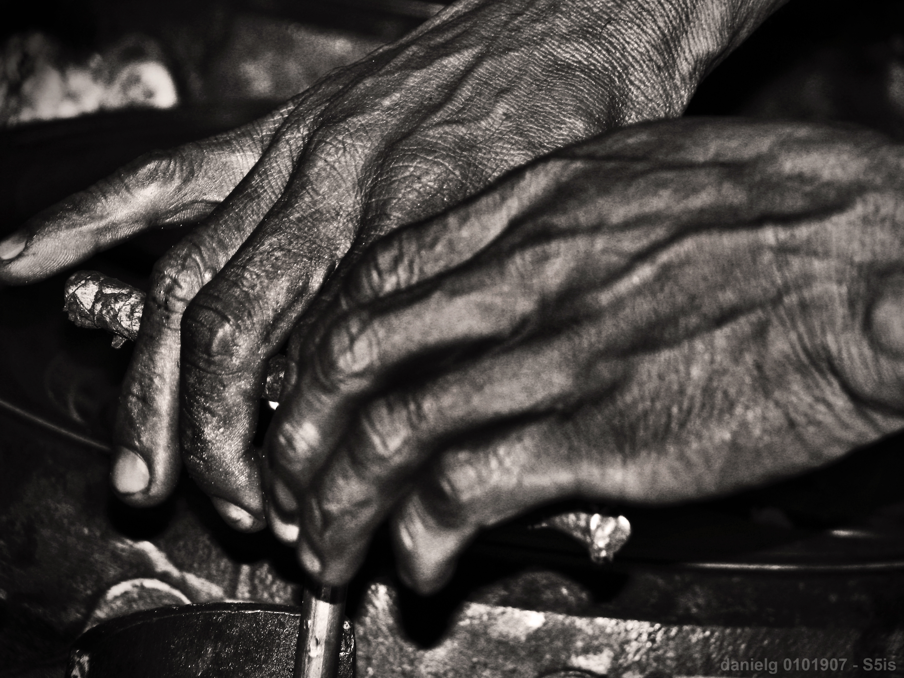
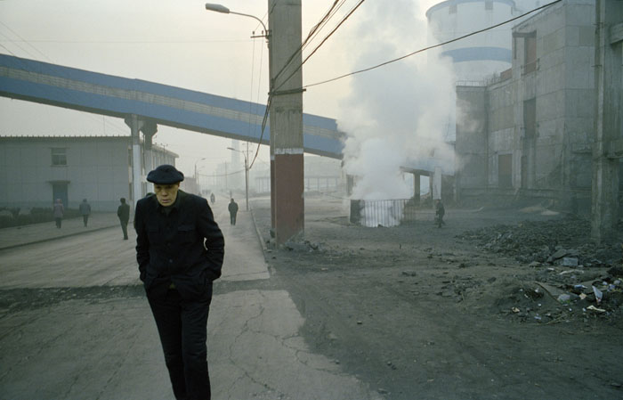

So, among other things, I'm going to start on ongoing series of features on this blog, one of which will be posts about my favorite artists, called, appropriately enough, "My Favorite People Series." This post is the first in what I hope will be a long line of posts about all kinds of people that I admire and respect. The first artist (documentary poet, social critic, labor activist, blogger) I want to write about, Mark Nowak, is someone that I would class as a friend, in addition to being one of my favorite poets. In fact, I interviewed Mark over the holiday break in January 2010 for _[Contemporary Literature](http://uwpress.wisc.edu/journals/journals/cl.html)_, and [that interview](http://steelwagstaff.files.wordpress.com/2011/05/nowak_interview.pdf) was my first publication in an academic journal, so it's fitting that I start this series with a feature on Mark.

<figure class="align-right"><figcaption>Mark Nowak</figcaption></figure>

If you can't be bothered to read [the interview](http://steelwagstaff.files.wordpress.com/2011/05/nowak_interview.pdf) (and I really think you should), here's a brief bio: Mark was born and raised in a working-class, predominantly Polish neighborhood in Buffalo, New York and as a teenager hoped to make a living fronting a local punk band, before slowly gravitating toward poetry. He earned his MFA at Bowling Green State University (where he studied with [Ted Enslin](http://www.conjunctions.com/webcon/enslinbertholf07.htm), another one of my favorite artists), taught for several years at [St. Catherine University](http://www.stkate.edu/pages/aboutstkates/history.php) in Saint Paul, Minnesota, and is now the director of the [Rose O’Neill Literary House](http://lithouse.washcoll.edu/) and Associate Professor of English at [Washington College](http://visit.washcoll.edu/centersofexcellence.php) in Chestertown, Maryland. Mark has written three books of poetry, all published by Coffee House Press: _[Revenants](http://www.amazon.com/Revenants-Mark-Nowak/dp/1566891078)_ (2000), _[Shut Up Shut Down](http://books.google.com/books?id=e1_jlo8jj5EC&printsec=frontcover&dq=mark+nowak&hl=en&ei=siO-TfaHLsfa0QHe99DUBQ&sa=X&oi=book_result&ct=result&resnum=1&ved=0CDAQ6AEwAA#v=onepage&q&f=false)_ (2004), and _[Coal Mountain Elementary](http://www.amazon.com/Coal-Mountain-Elementary-Mark-Nowak/dp/1566892287)_ (2009) and edited Theodore Enslin’s _[Then and Now: Selected Poems 1943-1993](http://www.bookfinder.com/search/?ac=sl&st=sl&qi=xQ3KGHOcraXzov40ldo.G0sWxhU_2095010535_1:1:3&bq=author%3Dtheodore%2520enslin%26title%3Dthen%252C%2520and%2520now%2520selected%2520poems%25201943-1993)_ (National Poetry Foundation, 1999) and co-edited, with Diane Glancy, the anthology _[Visit Teepee Town: Native Writings After the Detours](http://books.google.com/books?id=y7NwHxsRFLwC&printsec=frontcover&dq=mark+nowak&hl=en&ei=CSS-Tf3PBqaB0QGOooDgBQ&sa=X&oi=book_result&ct=result&resnum=4&ved=0CD4Q6AEwAw#v=onepage&q&f=false)_ (Coffee House, 1999). Mark's essays and critical writings have been published in _The Progressive_, _Virginia Quarterly Review_, and _[Goth: Undead Subculture](http://books.google.com/books?id=hSsrj_B3E-4C&printsec=frontcover#v=onepage&q&f=false)_ (Duke UP, 2007). Mark is the founding editor of the journal [XCP: Cross Cultural Poetics](http://xcpcrossculturalpoetics.wordpress.com/) and has been active on the web as both a contributor to the Poetry Foundation’s [Harriet Blog](http://www.poetryfoundation.org/harriet/author/mnowak/) and as the operator of the [Coal Mountain](http://coalmountain.wordpress.com/) blog, which serves as an international clearinghouse for news about labor and safety conditions in resource extraction industries around the world. In recent years Nowak has facilitated a series of “poetry dialogues” between Ford autoworkers at plants in St. Paul, Minnesota, and Port Elizabeth and Pretoria, South Africa. His work in South Africa has led him to edit a special [double issue](http://www.xcp.bfn.org/index.html) of _XCP_ on South African literature and social movements as well as a section on late-apartheid worker poets in a forthcoming anthology from Wesleyan University Press. As I explain in the _Contemporary Literature_, I first read Mark's work quite by accident, while I was browsing through Claudia Rankine and Lisa Sewell's  _American Poets in the 21st Century: The New Poetics_ in the library. I saw his work (excerpted from _Shut Up, Shut Down_) and was both fascinated and really impressed. I wanted to read more of his work, which I did, and once I had I wanted to meet him. Fortunately, I had been asked not long before that to co-curate the [FELIX reading series](http://felixreadingseries.wordpress.com/) by my friend Hai-Dang, and in our next meeting, I expressed interest in bringing Mark to read for our series. Hai was similarly enthusiastic, and Mark came to read for FELIX along with another poet/scholar I admire a great deal, [Philip Metres](http://www.philipmetres.com/).

<figure class="align-right"><figcaption>Photograph from the Flickr group "Hands at Work": http://www.flickr.com/groups/1166515@N25/</figcaption></figure>

When Mark came to read, my task was to introduce him. As I was preparing for my introduction, I tried to read up on Mark and what has already been written and said about his work, so that I didn’t say anything too stupid.  In doing so, I came across an interview where someone asked him about his first book, _Revenants_, and its concerns with social class and Buffalo taverns (the final section of the book features a number of photographs of various taverns in Buffalo).  Mark responded: “I remember giving a reading at a university in California.  The poet who introduced me said, “When asked which visiting writer I wanted to introduce, I knew it would be Mark Nowak.  I was reading his book _Revenants,_ and was just so taken by the photographs and poems of ‘dive bars’ in there...”  Well, the photos in those books aren’t ‘dive bars.’  They are the places my grandfather went to meet his co-workers after his bus ride home from the steel mill, where my other grandfather went after he retired from the mechanics’ shop at the railroad, where I went after work for the eight years I fried hamburgers at Wendy’s.” For me, Mark’s response to the question demonstrated the kind of earnestness, the kind of sincerity, the concern, the love that forms the intellectual (and ideological) structure for the poetry that he produces. Sometimes I feel like there is a certain cool in our age and particularly among intellectually-inclined members of my generation that if it manages to resist partisan ideology tends to go the other direction and eschews sincere political commitment altogether. Too many of us, I fear, seem to treasures irony over earnestness and privilege a view of the world as possessing a kind of social and political complexity that leads to desperation, despair, and paralysis, that leads to the abandonment of ideals, principles, and sincerity.  Mark's poetry doesn't do that, and that is one reason why I liked it so much. His reading with Phil was fantastic, and I was really pleased to discover after the reading that I liked him as much as a person as I did as a poet. We continued to communicate after his reading, and several months later I asked him if he'd be interested in being interviewed for _Contemporary Literature_, an important scholarly journal in our field that often publishes interviews with significant authors. He agreed, and we conducted the interview. Although I wasn't able to publish the full background explaining my interest in Mark and his work in _CL_ (it wasn't a forum for personal backstories), I did mention there that my personal history contributed to my appreciation of Mark's work. Here's a longer version of my introduction to that interview that I wrote but later cut from the published interview that explains part of why I was (and am) drawn to Mark and sympathetic to his concerns and political motivations.

<figure class="align-right"><figcaption>"Working Hands" by Daniel Go</figcaption></figure>

By way of explaining my interest in Mark Nowak, let me share two brief stories:

1.  In 1943, fresh from completing his surgical residency at Minnesota’s Mayo Clinic, JD Mortensen becomes the town doctor in [Stibnite](http://www.ruralnetwork.net/~yptimes/page11.html), a tiny [mining community](http://www.scribd.com/History-of-the-Stibnite-Mining-Area-Valley-County-Idaho/d/12828207) in [Idaho's Sawtooth Mountains](http://www.pbase.com/hunky/scans_stibnite_cinnabar). The town has nearly 400 residents, all there to support the nearby bauxite mines, where the ore obtained will be used to color the paint of American battleships for the ongoing war. Full of ambition and initiative, Mortensen undertakes a comprehensive physical examination of all of the town’s residents, many of whom come in with various complaints and ailments connected to their labors in the mine. Eight are convinced they’ve got cancer. None of the eight were correct, but malignant cancers are discovered in seven others, and Mortensen’s final Stibnite report discloses 534 unsuspected ailments in the 391 mineworkers and dependents examined, averaging out to just under one and a half afflictions per individual (children included). Almost two hundred of the people Mortensen examined had multiple medical problems. Sadly, such a story would probably not surprise most anyone who has lived or worked in a mining community, where the dangers and health risks are too often understood as part of the job. Mortensen's work was the subject of a brief [feature story](http://www.time.com/time/magazine/article/0,9171,936119,00.html) in a 1953 issue of _Time_ magazine, but the only reason I’ve even heard about Stibnite is that Dr. Mortensen was my grandfather.
2.  <figure class="align-right"><figcaption>Arthur Scargill, president of the National Union of Mineworkers</figcaption></figure>
    
    When I was 19 years old, just after completing my first year at a large university in the American West, I left school to spend two years as a Mormon missionary in the Northeast of England. When I arrived in Britain, I knew little to nothing about the present social or economic conditions of the cities that I would be living and working in, and I was marked and changed by my experiences in a string of devastated colliery and fishing towns, old industrial centers ravaged by Thatcher-era political decisions and the privatization of Britain’s coal industry. My last assignment was to Barnsley, in South Yorkshire. Barnsley is most famous as the setting for Ken Loach’s memorable 1970 film _[Kes](http://en.wikipedia.org/wiki/Kes_\(film\))_ and as the hometown of Arthur Scargill, the head of the National Union of Mineworkers (the principal union of coal miners in the UK) during the [ill-fated](http://news.bbc.co.uk/onthisday/hi/dates/stories/march/3/newsid_2515000/2515019.stm) [1984-5 strike](http://news.bbc.co.uk/onthisday/hi/witness/march/12/newsid_2809000/2809239.stm) that culminated in the [closure of a substantial percentage of Britain’s coal mines](http://news.bbc.co.uk/onthisday/hi/dates/stories/march/12/newsid_3503000/3503346.stm) and the layoffs of thousands of workers in Britain’s coal mining communities. The resulting economic and social devastation was still visible nearly 20 years later throughout much of northeastern England, as I saw whole communities still struggling to recover the dignity, self-respect, and income that employment in the mines had provided. I can still recall travelling by bus out to Grimethorpe, a small colliery village just outside of Barnsley (this community gained some prominence after the 1996 film _[Brassed Off](http://en.wikipedia.org/wiki/Brassed_Off)_, which told the story of the [community's brass band](http://en.wikipedia.org/wiki/Grimethorpe_Colliery_Band) and their struggle to survive the closure of the mine). Signs of poverty, suffering, drug and alcohol abuse were rampant, and the streets and public places were littered with broken glass and other waste. I felt as if I had entered a community that had been utterly forsaken and abandoned. I didn’t know it at the time, but Grimethorpe was one of the poorest communities in the European Union, with an unemployment rate that had hovered around 50% for much of the past decade. Years later, I was shocked to see Grimethorpe [highlighted](http://www.pbs.org/wgbh/commandingheights/hi/story/ch_f01_18.html) in the fantastic PBS documentary _[Commanding Heights](http://www.pbs.org/wgbh/commandingheights/)_, a film which helped me gain a better sense for the community's past, but at the time I had no context that could help me understand why I was seeing the deprivation and suffering that I was seeing. The people that we met there spoke, almost without exception, of the crippling depression they felt to find themselves without work despite having two willing hands and a lifetime spent in the same occupation, of the despair they felt as they saw their community crumbling and disintegrating, of their rage and frustration at being so long without any solid prospects for work, and of their feelings of betrayal and bewilderment at decisions made far from them and without their consent. My first trip to Grimethorpe was one of the saddest and most emotionally devastating days of my life, and I still cannot think of that day or any of my subsequent visits without feeling a surge of rage and helplessness rise in my throat.

I first read Mark Nowak’s poetry by accident, but I felt an instant and deep affinity for his writing. In part, I think my attraction was ideological. My time in the Northeast of England had marked me, made me more tender hearted towards the victims of globalization, and predisposed me towards interest in work that investigates the cost of global extractive industries, a concern which Nowak begins exploring in the last section of _Shut Up Shut Down_ (and to which he devotes the entirety of _Coal Mountain Elementary_). My personal history certainly explains in part why Mark Nowak’s poetry appeals so powerfully to me. And yet, I think there is something more than just loyalty and shared affections that has drawn me to Nowak's writing, that there are some values there that must be noted and accounted for even if one does not have the same background of experiences that I and other appreciative readers have had. After reading the excerpts in the _American Poets_ anthology, I came away intrigued by more than just Nowak’s political engagement. His verse was formally innovative and experimental, and yet his writing had a certain clarity, intensity, and righteousness that I found striking and frankly, quite refreshing. His poems carried the flavor of the real despair, rage, and good natured humor of the several individuals he spoke for and with. But what was most impressive to me in reading these poems for the first time was that while they constantly afflicted my sense of justice and enraged my sensibilities, they led me ultimately towards neither quietude nor despair. While they did in many instances present wrenching accounts of quietly desperate lives, these poems were not without hope, nor were they assembled by a strident or bitter cynic, but by an author who seemed to have understood the classical story of Pandora quite well—namely, that even after all of the great evils have been loosed upon the world there still remains some hope for human lives here and now, in our neighborhoods, wherever they may be. In _Revenants,_ Nowak writes “believe it or not, we cannot / lay hold / of all things // and make them theorems,” a maxim I find to be as useful as an ecological ethic as it is a warning against the practical dangers of totalizing ideologies (71). I wrote earlier that ideology was not the only reason why I felt solidarity when first reading Mark Nowak, and it is true. I have never been employed in a mine, nor have I been repeatedly exposed to serious danger at any point in my working life, two facts which I am reminded of repeatedly while reading Nowak’s books. And yet his poetry compels and stirs me not out because of liberal guilt but largely through its appeal to human sympathy, through its guileless presentation of the material facts that exist in the various industries and communities he documents with his poems and photographs. In many respects, Nowak’s intention is to use his writing to produce an “appreciation / of social life / as constituted by ongoing, fluid processes,” an appreciation which can only be formed by “close, continuing participation / in the lives of others” (_Revenants_ 92). More than ideology, it is this commitment to “close, continuing participation” that I find most notable and praiseworthy about Nowak’s writing. In _Revenants_, his first book, Nowak works to discover and understand “what the world is for us” by examining the roots of feeling which link him to the traditions of his old World ancestors, as well as the bonds of labor which bind him to his family’s home in Buffalo. While the first section of the book bears several traces of the influence of Charles Olson (open parenthesis, and several asides addressed to the polis, among other stylistic features), rather than focusing on Gloucester’s fishing past or inhabiting the persona of an ancient Greek philosopher, Nowak chooses to excavate his Eastern European (Polish) heritage, finding the Carpathian Mountains “a place at which to begin” and “a spine that connects / her \[an elderly Rumanian friend that appears in one of the poems\] house and mine” (41). Despite this feeling of connection, and the hopefulness that flashes through in places, as when the _piosenka_ \[song\] is invited in and heard, “suggest\[ing\] a center, a place to return” (32), or the winter’s first snow attempts to cling to the earth and “let the sky again, begin again, again” (57), or even how “at harvest time the corn like the women and men / return / to their houses” (58) the same concerns and obsessions that mark Nowak’s later work obsessions are already visible in these early poems, and the overriding sense of community and place is not one of stability and rootedness, but loss, dissolution, and ghostliness. We are introduced primarily to families whose “past in this place // does not quite belong,” whose stories cannot quite be told straight, whose present is haunted in some way by their relationship to histories, both mythical and mundane (16). The titular revenants that appear throughout the collection are felt most strongly in Nowak’s depiction of a Polish village in which “nearly everyone from the neighborhood” has vanished, leaving only “yards where tomatoes rot, and cabbage rots. / Each nearly empty, or as if to be silenced” (65). These early poems present a bleak account of what seems to be among the most persistent version of the human experience, the gradual decay and destruction of the home place, the erosion of the hearth, the degradation of the environment, and the setting out in search of something new and full of promise (figured in American history as the frontier). In one poem, Nowak relates the too-familiar story in which “There was a river, … except, except… // Things happened, / unnameable things, / happened. / The fish, well, / there were fish in the river. // Now there are none… \[and\] it is forbidden / to even mention the former / tributaries of this river.” (72). The ploughed field that was once visible across the river too is shown to belong to “another time,” so that “now the field is an abandoned factory, and the river, well / even an old man wouldn’t recognize himself there, an old man / would look at his hands and say, “Who’s there?” (78). The danger Nowak is demonstrating, of course, is that this alienation from both place and history leads to also to an alienation from community and from self. As he puts it in another poem: “Place, as term: what good is it to think “Mille Lacs” / & not know where it is?” (21). The search for a place which we belong to and in which we belong is one that is at the heart of _Revenants_ is an obsession that recurs in the rest of Nowak’s work. While his subsequent books have not preserved the same lyric voice, his concern for working people and their communities, their place in the world, has never waned. Nowak presents an account of human lives in which the dream of the frontier and its promise of plenty is shown to be a painful illusion, a promise all too often unfulfilled. In one poem, we’re told that “there’s a basket at the other end \[of the sky\],” and though that basket is “not our own … yet we want what’s there, so we stretch our hand / beyond the edge of the table because we’ve heard there’s some better fruit / to be had. / And we have been.” (70). Nowak’s books are filled with men and women who’ve “been had,” who have bought into the American dream, the promise of peace and prosperity, who have given their lives and bodies in laboring, only to be betrayed, disappointed, used up and then coldly disposed of. _Shut Up Shut Down_ melds and samples a dizzying and dazzling array of voices and source texts to document the true story of deindustrialization in the United States during the 1980s and 90s. Throughout the book, Nowak refuses to let us forget just what the stakes were and are for workers affected by layoffs and corporate greed, as the book’s opening poem documents one man’s insistence that “it wasn’t just losing a job in the steel industry, but your entire life, the place that you grew up in was going to be gone” (11). The book documents and illuminates the effect of corporate and government policies on several different communities, from the closure of the Lackawanna Steel plant owned by the Bethlehem Steel Corporation, to Ronald Reagan’s ruthless breaking of the Professional Air Traffic Controllers Organization (PATCO) strike, to the closure of several taconite plants in the Minnesota’s Iron Range. His most recent book, _Coal Mountain Elementary_, weaves color photographs from mining communities in the US and China among elementary school lessons developed by the American Coal Foundation, news accounts of mining accidents in China, and testimony collected from survivors of the 2006 Sago Mine Disaster in West Virginia to document and explore the cost of the global extraction industry.

<figure class="align-right"><figcaption>This is my favorite image from Coal Mountain Elementary. Photograph by Ian Teh.</figcaption></figure>

Another thread that emerges in Nowak’s first book and remains consistent through all of his work is his fidelity to the voices of others. In _Shut Up Shut Down_ and _Coal Mountain Elementary_, the poetic texts are assembled from an eclectic scattering of source material, with Nowak operation much less in the tradition of the lyric poet than in the tradition of the DJ, sampler, re-mixer, and turntablist. While the texts are by turns infuriating, heartbreaking, ironic, and movingly evocative, the overwhelming feeling is that Nowak has approached his sources with both a shrewd eye and a generous heart. Despite corporate efforts to conceal the true consequences of ‘deindustrialization,’ these process has hardly been smooth or painless, and Nowak’s poetry has been singular in both its refusal to bow to sentimentality and its insistence on attesting to the human suffering and social cost of economic decisions made in the distant spheres of upper management.
