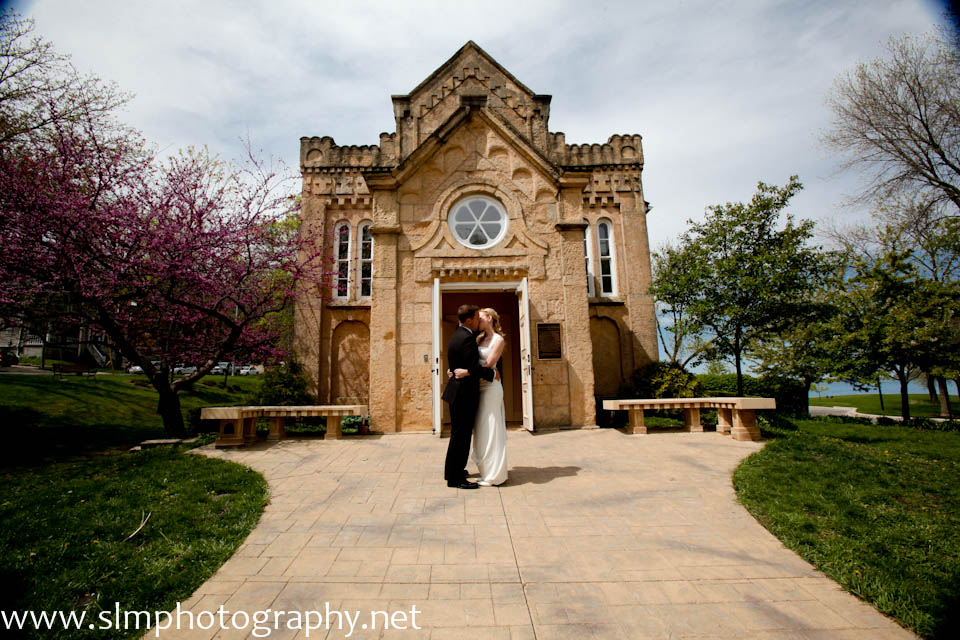
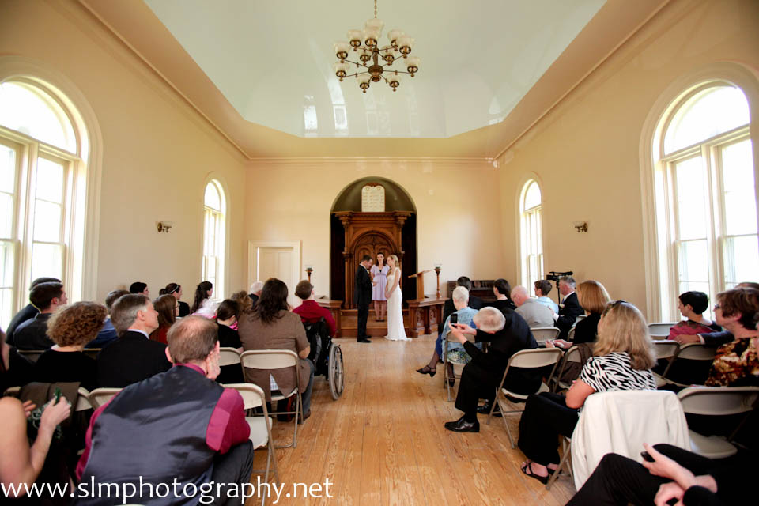

Last month, on April 21, I married my best friend [Laurel Bastian](http://laurelbastian.com/) in the presence of our families and a few very close friends. It was the happiest day of my life. We held the ceremony at the [Gates of Heaven](http://www.cityofmadison.com/parks/parks/reservableShelter.cfm?id=35), a former synagogue now owned and operated by the City of Madison Parks department. The building itself, a beautiful old stone structure, was placed on the National Register of Historic Places in 1970 and moved to its current location in James Madison Park in 1971. Here's what it looks like today:

<figure class="align-none"><figcaption>Gates of Heaven from exterior. Photo by SLM Photography.</figcaption></figure>

Here's a shot of the interior:

<figure class="align-none"><figcaption>Interior of Gates of Heaven. Photo by SLM Photography.</figcaption></figure>

I wanted to wait until after our wedding preparations were completed and we had some time to reflect on the ceremony, reception, and overall experience, but now that more than a month has passed, I thought I'd share a series of blog posts detailing some of the choices we made leading up to our wedding. This isn't meant to be a place to brag or an effort to judge or criticize the choices that others have and are making, but a place to describe what we chose to do, why we chose the things we chose, and how we felt about those choices. In part, I write this because it seems that weddings are in the air--Laurel and I are of an age now when many of our peers are marrying or considering marriage--and in part because, quite frankly, we found many components of the marriage industry wholly insane. Our hope is that these posts might be of interest for others who are contemplating marriage or something like it, and are looking for ideas about how to have a memorable, meaningful experience within a fairly limited budget. Here are the posts I have in mind, though if any readers have suggestions or questions, I'd be delighted to alter or expand my plans:

1.  Planning the Wedding Events and Venues (pre-wedding party, ceremony, and reception)
2.  Designing and Making Invitations
3.  Designing and Making Rings
4.  Planning Meals \[Food and Drink\]
5.  Planning and Preparing Decorations
6.  Choosing a Photographer/Videographer
7.  Wedding Clothing
8.  Choosing an Officiant & Getting a Marriage License
9.  Planning and Selecting Music
10.  Writing the Ceremony/Vows

I don't know how quickly I'll be writing these, but look for a post every couple of days over the next month or so.
