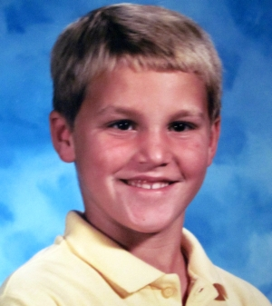
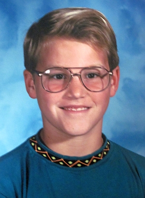

I play basketball on Wednesday nights. Pick-up games, at a church building in Madison, five on five, really nice courts. So it's on my mind today. 

I've played basketball ever since I was a kid. I've always been into sports, and have always liked playing them more than watching them. Commercials don't help--I abhor them, and televised sporting events are filled with them, with the glorious exception of soccer, which is the sport I watch the most of these days, but I've never been much of a live sports aficionado either. 

Mostly I think it's because whenever I'm watching other bodies run and move and play, I wish I was doing it myself. I'm not much of a "true fan" in the traditional sense, either. I don't understand people who root passionately for the same team ever year. It seems as dumb as nationalism, or brand lust, or any number of other prejudices. I identify 100% with Chuck Klosterman when he writes 

> I absolutely do not understand why you believe geography should have any significance on which teams you are somehow "obligated" to support. That will always strike me as the most irrational reason for liking anything. There is no inherent regional quality to pro sports, beyond the imaginary relationship created by fans. I remember when I lived in Akron, Ohio, during the late 1990s, and it was suddenly announced that the Browns were returning to Cleveland. People in Northeast Ohio immediately began insisting that the Browns were their favorite team; this was before the expansion draft. People were buying Browns' jerseys before they had acquired any players. They didn't even have a coach or a GM. It was a wholly theoretical franchise. So -- essentially -- these people were rooting for (a) an incorporated municipality with a shared tax base, and (b) a color best-described as "burnt orange." 
 
> These things have nothing to do with football, and you should never like any specific team more than you like the sport itself. ... Basically, I am an intense fan of sports, but I am able to detach from the insane tendency of just rooting for any given team out of habit. And I'll never understand why so many smart people refuse to think critically about sports. ... I don't see why it would be "honorable" to support anything unconditionally. That kind of thinking has been the source of almost every significant problem in the entire world, except for maybe the hurricanes.

Like Klosterman, I like sports, not teams--though I'll occasionally try to pick a 'favorite' team in whatever sport I'm following and try to track their success, though I can rarely muster any sustained enthusiasm about it, and always feel slightly frightened when I talk to anyone who identifies as a "true fan" of whatever team I've chosen. I usually feel like they're crazy, which I guess is kind of the point, but it's really easy to forget that "fan" is short for "fanatic" when I'm not talking to one. 

I'm convinced that the reason why I both like sports but not teams and enjoy playing but not watching sports is because my dad was in the Air Force. We moved a lot when I was a child--by the time I graduated from high school, I had attended 13 different public schools, which had two sports related consequences: 1) I never really developed and shared a deep regional attachment to any professional franchise and 2) I gravitated towards sports as a means of adaptation into new social environments. 

For me, sports were the easiest way to socialize and become accepted by other young boys when I arrived at a new school. So I played them, and my success and skill at them helped to normalize and ingratiate me among my new classmates. It helped that I liked them, mostly.

<figure class="align-left"><figcaption>Steel Wagstaff, Third Grader</figcaption></figure>

From 2nd until 4th grade, I was the fastest kid in my school, which won me a lot of respect, especially since I was white--what's striking to me in recalling this now is realizing the degree to which most of us children had already absorbed, accepted, and had begun policing and maintaining racially suspect theories of innate athletic ability. 

Being fast certainly did more for me with my peers than winning the school spelling bee (which I did, but was so nervous at the district spelling bee that I misspelled my first word: "strength." At the time, I actually considered my early exit fortunate because I had peed my pants a little while I was standing at the microphone trying to spell out the word. It wasn't a full-on puddle, and I was fortunate to be wearing black trousers, but it definitely would have been both visible and conspicuous in later rounds. It should be obvious at this point that I was not what you'd generally class as "cool".).

<figure class="align-right"><figcaption>Steel Wagstaff, Fourth Grader</figcaption></figure>

In 4th grade, I started at a new school, Cordova Gardens, which which required my being bused off the Air Force base where we lived and into a rougher part of Rancho Cordova. My first day there we had an early morning recess, and I joined a group of boys playing football.

The fastest kid there was Willie, and he had moves. I remember two unusual things about him: 1) that he had a jheri curl, and 2) that he played without shoes on--I can still see his long white socks flashing and flailing in the air as he danced and juked, trying to evade would-be tacklers. He was electric--the most athletic 4th grader I had ever seen--not very big, but incredibly quick--like a DeSean Jackson or a Darren Sproles. At some point in the game he broke free, and looked sure to score a long touchdown run. I chased him, caught him, and tagged him down. He kept on running and began celebrating his touchdown, but I shouted "I tagged you back here, you're down."

He looked shocked that I would dare make such a ridiculous claim. His first impulse was to protest the tag's legitimacy, claiming I had only got him with one hand. My teammates all insisted the tag was good: "Nah Willie, he got you with both hands."

So he was down, the touchdown was off, and Willie's team had to run another play from where I had made the tag. Willie was visibly angered--this kind of thing had never happened to him before in these school yard games. I was starting to build a bit of buzz--the new kid who caught Willie from behind--the new white kid who caught Willie from behind.

Willie didn't like this change in his reputation. At our second, longer lunch recess I decided to play basketball. There wasn't a football game going, I didn't yet know anyone at the school, and basketball is an easy sport to play alone. I was shooting by myself at a basket when I felt a tap on my shoulder. It was Willie. "Lemme have your ball," he said.

I was a little surprised--there was a whole rack of balls against a brick school wall maybe 50 yards away--what did he need mine for? I told him "No--go get your own, they're right over there." He turned like he was going to get a ball, and then reared back and punched me hard--right in the mouth. He was wearing some kind of ring on his right hand, and it split my lip. 

I was stunned. It was the first time I had ever been punched in the face. I dropped my ball, and Willie scooped it up and started shooting baskets. He wasn't just a football prodigy. Whereas I had stood awkwardly, pushing the ball with both hands towards the basket, struggling just to get the ball to the rim while shooting, Willie had exquisite form on his jumper. He lined up, planted both feet, and just let the ball sail out of his hand, smooth as can be. I had never seen anything like it before from anyone my age. I stood near half court staring, transfixed by the grace of his game. Within a minute a teacher was on the scene--some kids had seen the punch, reported it to her, and she had come to investigate. My mouth was already starting swell up, and my split lip was oozing a little blood. "What happened here?" she asked.

I stammered a bit before saying "I was just playing basketball and then he came up [I still didn't know his name was Willie yet] and asked me for my ball. I told him no and then he punched me in the mouth."

Before she could say anything, another kid that I had never seen before came up and spoke, "Nuh-uh Miss, that ain't true. Willie was just minding his business, and this white boy came up and hit him first and then Willie punched him back. He was just defending hisself."

Miss obviously knew this boy, because she called him by name: "Thank you, Donald. So you saw the fight?"

""Yes, ma'am." The way he talked to Miss was sickeningly deferential.

Miss turned to me. "Is that true?"

"No, no it isn't. I didn't hit anybody. I don't even know this boy. Either of them." I was near tears and my lip was thick and throbbing. It felt like dull meat when I rubbed my teeth over the fat part.

Miss knew the other boy, too and she called to him. "Willie, come over here."

Willie dropped the ball and walked over to where we were standing, glaring at me as he came near. "What?"

"I need you to come with me."

The four of us started walking. I didn't know where we were going or what was happening, but I felt like I was going to be in trouble, like this teacher believed the only eyewitness she had, and that something unjust was about to happen. Donald was the first one to speak. "You taking us to the principal's office? Cuz I already told you, Willie didn't do nothing. That other boy hit him first and he was just defending himself."

Miss didn't answer. We kept walking for another minute, leaving the playground altogether and coming inside the school. She stopped. We stopped. She looked at both of us, me with a fat lip and Willie with his angry, impenetrable face. It was clear to all of us that Willie was not going to speak unless forced to. She finally spoke. "Willie, are you hurt?"

He shook his head. "And you," she nodded in my direction, "do you need to go to the nurse?"

I gulped and tongued my puffy lip. "I don't think so. I think I'll be fine. Is it bleeding?"

She looked casually at my lip, "No--just swollen. OK--Donald you can go."

Donald hung around for a couple of seconds. "But I saw the whole thing. I can be an eyewitness."

Miss was firm. She fixed her eyes on him. "I said, you can go."

He left. It was just me and Willie and Miss. We weren't walking anymore, and we didn't seem to be close to the principal's office. My impression of Miss was mostly that she didn't seem to talk much. Looking back, I think she was the kind of teacher who knew how to use silence as a way of opening disobedient kids up, the kind of woman who wasn't ever in any big hurry, but who made damn well sure she got to where she was going once she started going somewhere. 

I was starting to get a little panicky as the enormity of what I was involved in began to settle in on me. It was my first day at a new school and I had already been in a fight. Now we were going to go to the principal's office, and the principal was going to call my mom, and she would not be happy. I wasn't supposed to be getting into fights. I didn't get into trouble. I was taught to be a peacemaker.

Miss spoke to Willie first. "Willie, I don't care why you hit him or what he did to you. I don't ever want to see you fighting with this boy again. Do you understand me?"

He nodded.

"You can go. I better not hear about you getting in another fight today. Alright?" Her voice as she asked this last question was stern, and her eyes looked fierce, strong.

Willie acknowledged this last question by popping his chin up slightly, setting his lower jaw and pinching his lips together. He turned and sauntered off.

Miss waited until neither of us could see Willie. Her voice changed and she spoke to me with surprising kindness: "Let me see that lip."

I pursed my lips and leaned forward. She bent close and poked at it. "It's swollen, and he split it pretty good, but it's not going to be too bad. Let's get you some ice."

We turned and walked back towards the door we had entered, and turned down another hallway. I guessed that we were heading to the nurse's office. She spoke to me, "I know you didn't hit Willie first. Donald was lying. I know that. I didn't take you two to the principal's office because the school rules say that anyone who hits another student gets suspended. Willie spends more time out of school than he does in school. Another suspension isn't going do any good for anybody. You think you can go the rest of the day without fighting with anyone else?"

I told her I could, we got some ice, and I finished the day. I don't have any other memories of Willie, or Donald, and remarkably few other memories of the rest of that year. I remember a whole school assembly where one of the teachers got out a guitar, stood up in front of the whole auditorium, asked us all to come down in front of the stage and sit on the floor and then taught the whole school the lyrics to the 59th Street Bridge Song. I have no idea what pedagogical purpose this could possible have served, but I still remember just about the whole song. The very thought of the lines "I'm dappled and drowsy and ready to sleep." and "Slow down, you move too fast / You've got to make the morning last, / Skipping down the cobble stones, / Looking for fun and feeling groovy" still fills me with a kind of thrilling nostalgia. 

I remember another time when a local police officer came (his visit was almost certainly part of a D.A.R.E. program at my school) and covered a whole table with all manner of illegal drugs and terrified me with horror stories of what drug users do to themselves and others. I had never seen anything on the table before, but I could hear several of my classmates pointing and whispering to each other "My mom has one of those" or "My mom's boyfriend used to leave that on the table sometimes."

[caption id="attachment_59" align="alignright" width="300" caption="How I imagined a gang fight, circa 1989."][/caption]

The last memory I have of going to school there is of a day when the bus taking me home after school was cancelled and I had to wait to get a ride from one of the teachers. We didn't leave school for more than an hour after school got out and she explained on the ride home that the bus couldn't come that day because there had been a gang fight between the Crips and the Bloods that started at high school football game nearby but spilled out and was roving through the streets. She added other salacious details, I'm sure, and I remember picturing hundreds of teenage kids in letter jackets (some blue and some red) hitting each other with lead pipes and brass knuckles and one of those dust cloud tornadoes that you see when cartoons fight, or when Pigpen walked around in Peanuts.

So I starting by talking about sports and then I got distracted. All this to say, I'm playing basketball tonight, and I'm excited. I've started playing regularly with my friend Josh Kalscheur, a poet from Beaver Dam who is just finishing his MFA here at the UW-Madison. He's got a great basketball poem called "Throwdown" over at Linebreak about a dunk attempt at a pickup game in Micronesia that includes these beautiful lines:
                                                                                                                     ... he dribbles
twice to his left and loops a no-look pass to himself, and if there’s a word
for the curves he made, the arc and degrees of space in his wake, lost
in the launch of it all, there was enough jump under the palms of his feet
for all the rolling eyes, all the bandannas flapping when he rushed break-
neck to the basket, the rock grinding to a halt on the touch before take-off,
the overcast background by his head, higher than any man, poster-high,
ladder-high, higher than their fathers’ hands, cupped on his forearm
and cocked like a neck about to bite, the ball ripping over the rim
with sprays of rust-flecks and rotted wood, and a reverb of grunts
makes its way in waves, and all the boys stand up, and all
the almost-dunkers, all the finger-tip rim touchers, the stilted wrists
and lead feet, all the stomping ones, the finesse boys with not-enough
ups or the right kicks, all the tall ones with no hops, all the jammed-thumbs,
they all watch the ball’s slow roll in the gravel, ...

I think every athlete and even most spectators recognize the awe and grace in the moment Josh describes in this poem. I'm not a dunker--nobody at any of the pickup games I play in is, actually, but their is no paucity of moments of wordlessness in which bodies carry the "arc and degrees of space in [their] wake." Even without dunk attempts, there's something about the social aspect of the game that appeals to me deeply, something about the fluidity of five players shifting and cutting, finding lanes and posting up, calling for the ball, driving hard to the rim or pulling up, something about the ball spinning in its beautiful arc towards the bottom of the net that is inescapably poetic. 

There's another basketball poem that I love written by another Madison poet, Dennis Trudell. It's called "The Jump Shooter" and is the last poem in his book Fragments in Us: Recent & Earlier Poems, which was selected by Philip Levine as the winner of the 1996 Felix Pollak Prize in Poetry. Here it is:

The way the ball
hung there
against the blue or purple

one night last week
across town
at the playground where

I had gone to spare
my wife
from the mood I'd swallowed

and saw in the dusk
a stranger
shooting baskets a few

years older maybe
thirty-five
and joined him didn't

ask or anything simply
went over
picked off a rebound

and hooked it back up
while he
smiled I nodded and for

ten minutes or so we
took turns
taking shots and the thing

is neither of us said
a word
and this fellow who's

too heavy now and slow
to play
for any team still had

the old touch seldom
ever missed
kept moving farther out

and finally his t-shirt
a gray
and fuzzy blur I stood

under the rim could
almost hear
a high school cheer

begin and fill a gym
while wooden
bleachers rocked he made

three in a row from
twenty feet
moved back two steps

faked out a patch
of darkness
arched another one and

the way the ball
hung there
against the blue or purple

then suddenly filled
the net
made me wave goodbye

breathe deeply and begin
to whistle
as I walked back home.

Once again, there's a wordlessness and a sociality embedded in the memory of basketball, one that I find quite beautiful and true to my own experience. I played in a recent weekend tournament and the first team we faced was made up of a bunch of old men, mostly, some of whom resembled the protagonist in this poem, fellows who were: "too heavy now and slow / to play / for any team," but to our chagrin, we discovered that even the fattest ones "still had // the old touch seldom / ever missed." Despite our clear athletic advantage, we lost the game. 

Afterwards, my teammate Sam Crowfoot reminded me that you never know with old guys, you've got to watch out for them, even if they don't look they've got anything left, because with old ballers the jumper is always the last thing to go. He said this with the knowing grin of a stone cold shooter, told me that the legs go quick, the belly usually follows soon after, but the jumper can stay sweet and pure for years.

At last Wednesday's game I took a elbow to the mouth hard, and my mouth got all swollen and bloody inside. It's mostly healed now, but I can still feel it, and it reminds me of Willie. I don't know where he's at, or what he's doing, or how, but I hope he's still got those moves, still shifty, still juking, still fresh & electric. I hope Willie can still pull up and rain down, that he's still got the touch. 

I don't imagine that Willie's had an easy life, and I wouldn't be surprised if most of the 4th grade magic and freedom he once had has long vanished from his life. And even though he punched me right in the face with a ring on his hand the first day we ever met, I don't hate him. He had a beautiful gift, and because I love the game, I'm happy to honor it, no matter how cankered or cruel the vessel may have been. In thinking about Willie, I really do hope that's Sam's right, that the jumper really is the last thing to go.